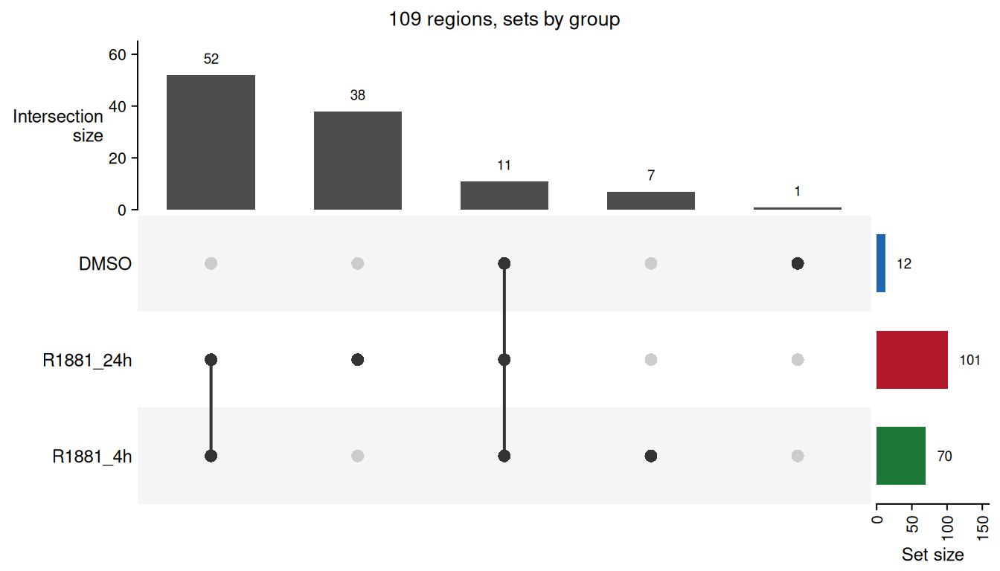
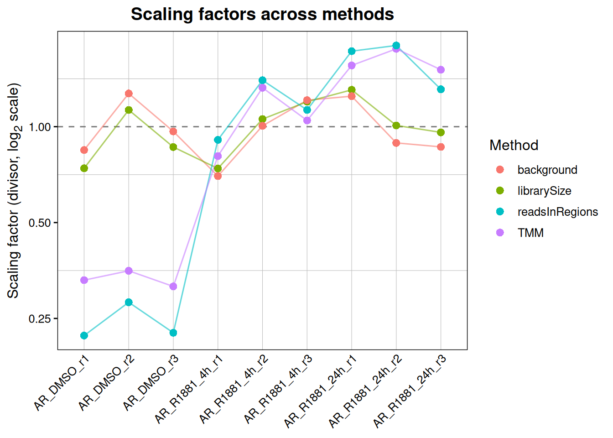
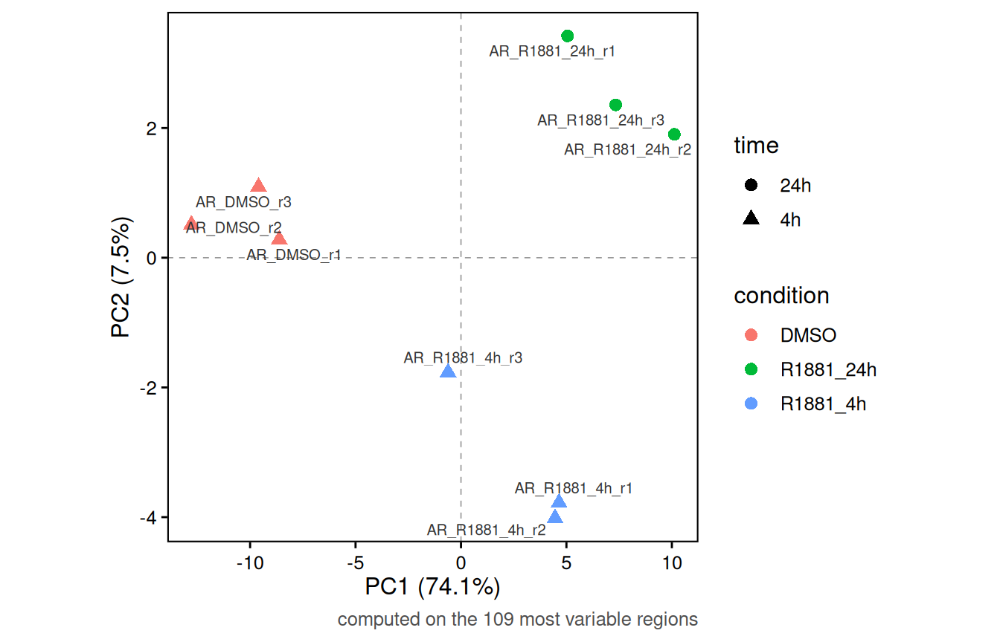
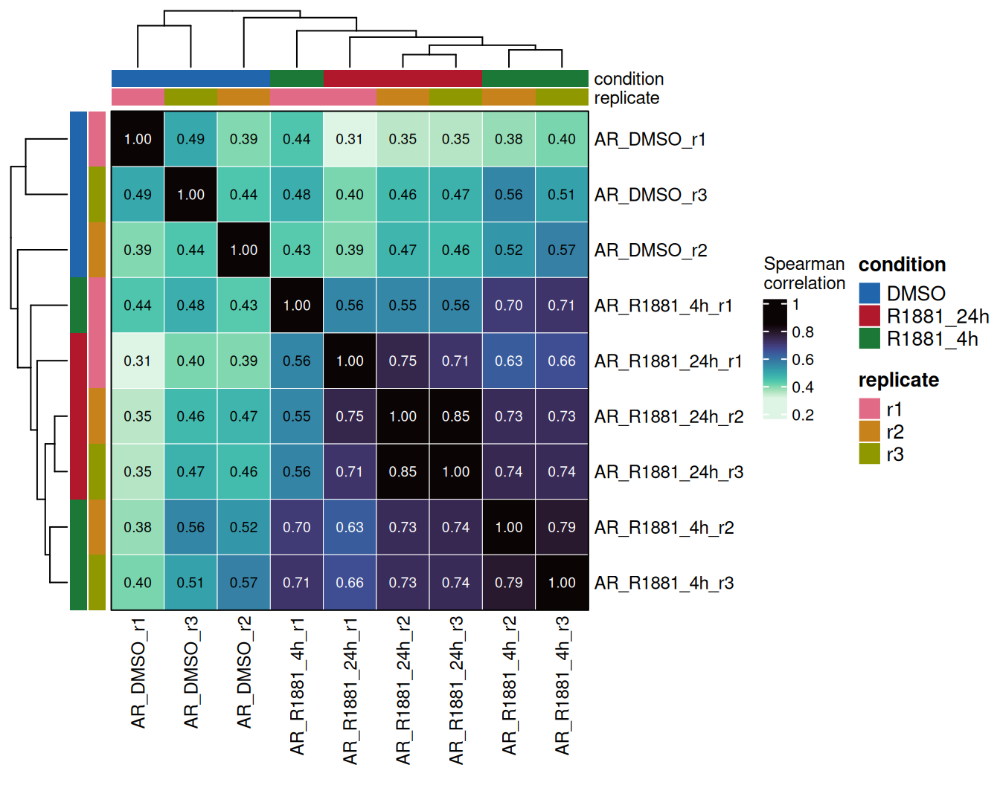
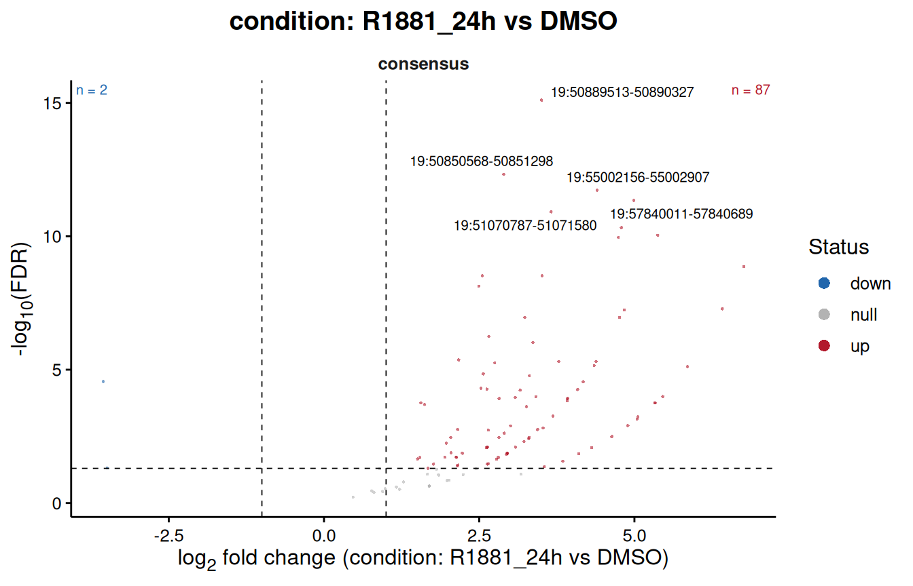
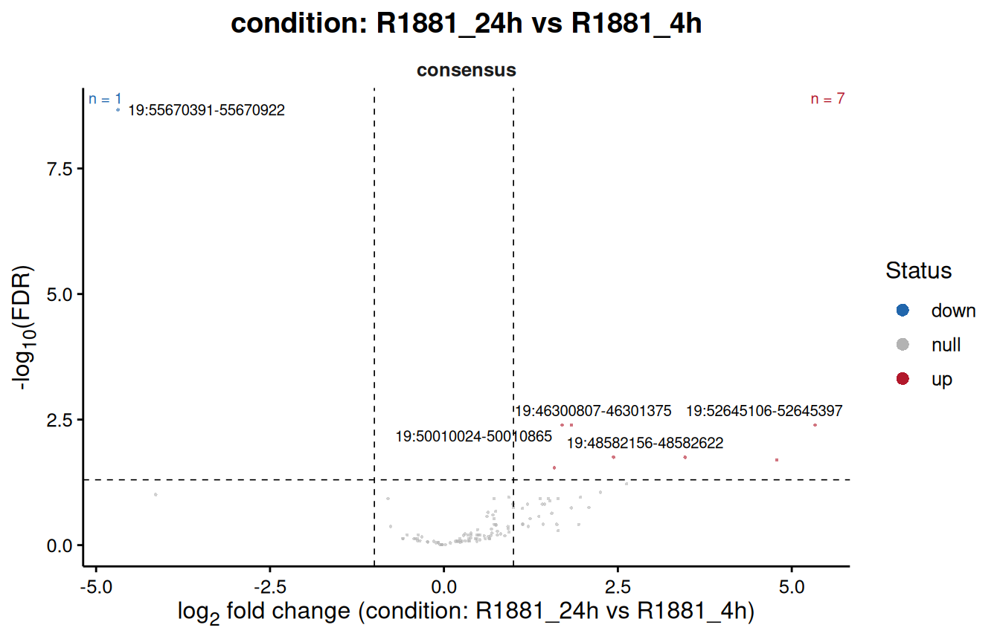
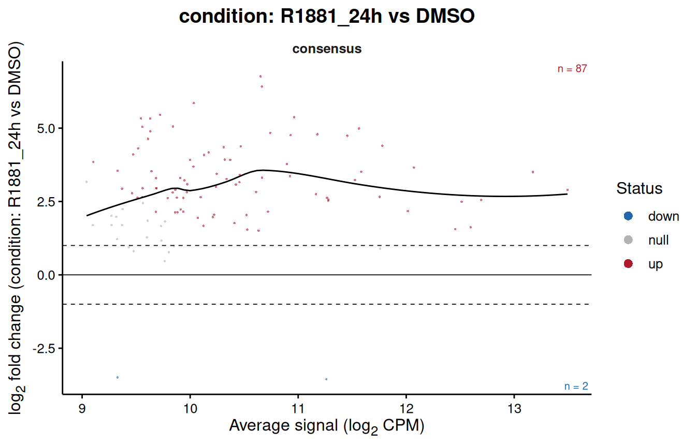
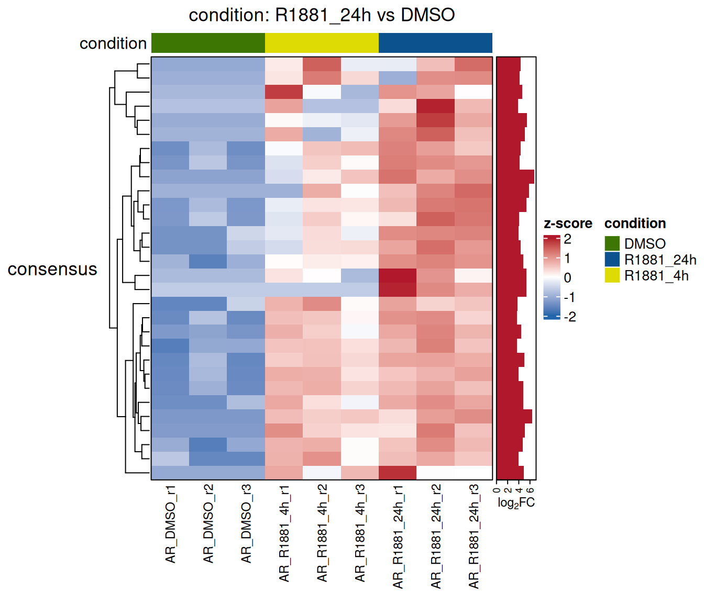
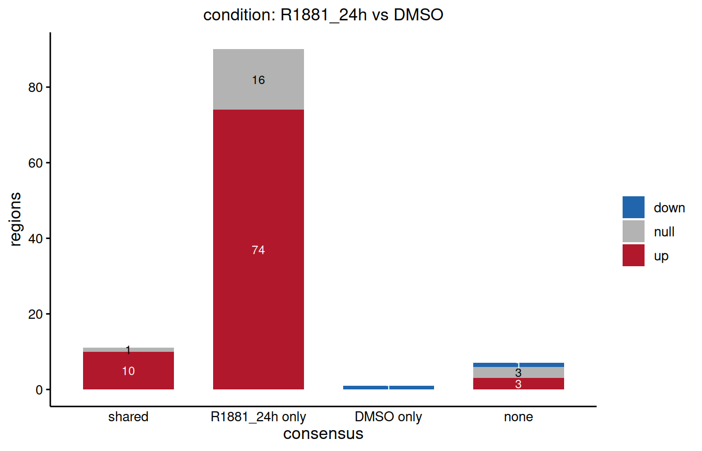

# \*RegionSetDE\*: from peak calls to differential binding

------------------------------------------------------------------------

## **Introduction**

The [main
vignette](https://sebastian-gregoricchio.github.io/RegionSetDE/articles/RegionSetDE.vignette.md)
starts from regions you already have and asks whether the signal over
them changes. This one starts a step earlier, from the output of a peak
caller, and covers the path that *DiffBind* users will recognise: a
sample sheet, a consensus of the peak calls, a count matrix over that
consensus, and a differential test.

The two differ in what they take as given. When the regions come from an
annotation, they are the same in every sample and the question is only
about signal. When they come from peak calls, the regions themselves
carry information: a site called in one condition and not in the other
is a fact about the experiment, and it is worth keeping next to the
statistics rather than discarding it once the consensus is built.
Everything below keeps track of which samples and which groups called a
peak on each region, and the occupancy stays attached through the
counting, the fit and the results table.

  

------------------------------------------------------------------------

## **The example dataset**

Androgen receptor (AR) ChIP-seq in LNCaP prostate cancer cells, from
[GSE284522](https://www.ncbi.nlm.nih.gov/geo/query/acc.cgi?acc=GSE284522)
([Eickhoff *et al.*, *Communications Biology* **8**, 1043,
2025](https://doi.org/10.1038/s42003-025-08449-2)). The cells were
hormone deprived and then treated with DMSO, or with the synthetic
androgen R1881 for four or twenty-four hours, three biological
replicates each, with one input library. Peaks were called with MACS2 in
`BAMPE` mode through
[SPACCa](https://github.com/sebastian-gregoricchio/SPACCa), on GRCh38.

AR sits in the cytoplasm until it binds a ligand, so this is an
experiment where the number of bound sites goes up several fold rather
than shifting between locations. That makes it a good illustration and a
good trap, for reasons the normalisation section gets to.

The alignments shipped here are a slice: a window of chromosome 19,
subsampled to 12 % of the read pairs, with the sequences, the qualities
and the read names removed. Counting needs the position and the CIGAR
and nothing else, so the counts are the real ones scaled by a known
factor and every ratio is preserved. The peaks, on the other hand, are
the calls of the complete libraries, filtered to the same window, so
they carry the depth the caller actually had.
`system.file("extdata", "lncapAR", "SOURCES.md", package = "RegionSetDE")`
records exactly what was done, and `inst/scripts/make-example-bams.sh`
holds the commands.

  

------------------------------------------------------------------------

## **The sample sheet**

Everything starts from a table with one row per library.
[`loadSampleSheet()`](https://sebastian-gregoricchio.github.io/RegionSetDE/reference/loadSampleSheet.md)
reads it, recognises the columns whatever they are called, and turns the
relative paths into absolute ones, resolved against the folder of the
sheet.

``` r
sampleSheet <- loadExampleData("peakSheet")

sampleSheet %>%
  dplyr::select(sample, condition, treatment, time, replicate)
>            sample condition treatment time replicate
> 1      AR_DMSO_r1      DMSO      DMSO   4h        r1
> 2      AR_DMSO_r2      DMSO      DMSO   4h        r2
> 3      AR_DMSO_r3      DMSO      DMSO   4h        r3
> 4  AR_R1881_4h_r1  R1881_4h     R1881   4h        r1
> 5  AR_R1881_4h_r2  R1881_4h     R1881   4h        r2
> 6  AR_R1881_4h_r3  R1881_4h     R1881   4h        r3
> 7 AR_R1881_24h_r1 R1881_24h     R1881  24h        r1
> 8 AR_R1881_24h_r2 R1881_24h     R1881  24h        r2
> 9 AR_R1881_24h_r3 R1881_24h     R1881  24h        r3
```

The `sample`, `bam`, `peaks` and `input` columns are the ones the
package looks for. Names used by *DiffBind* are understood as well, so a
sheet written for it can be read without editing: `bamReads` is taken as
`bam` and `bamControl` as `input`. Anything else in the table is
metadata, kept as it is and available later to the design formula and to
the annotations of the plots.

``` r
colnames(sampleSheet)
> [1] "sample"    "bam"       "peaks"     "input"     "input.id"  "condition"
> [7] "treatment" "time"      "replicate"
```

A sheet carrying only peaks is enough to build a consensus. The BAM
files are needed from the counting onwards, and every one of them must
be indexed; a BAI or a CSI index both work.

  

### Paired-end, single-end, or both

Nothing has to be declared about the layout.
[`countReads()`](https://sebastian-gregoricchio.github.io/RegionSetDE/reference/countReads.md)
takes `pairedEnd = "auto"` by default and reads the flags of the first
records of every file, so each library is counted the way it was
sequenced. A paired-end fragment is rebuilt from the first mate of each
proper pair and counts once; a single-end read is extended to
`fragmentLength`, 150 bp by default, and counts once as well.

Libraries of both kinds can therefore sit in the same analysis. Each one
ends up with one count per sequenced fragment, which is the scale the
model needs, and the layout the counting settled on is stored in the
`paired.end` column of the sample table so that it can be checked
afterwards. The two mistakes this avoids are worth knowing, because they
fail in opposite directions: a paired-end file forced through the
single-end path counts each mate on its own and almost doubles its
values, while a single-end file forced through the paired-end path finds
no pair and returns a column of zeros. A test of the package counts one
of the libraries below next to a single-end copy of itself, and the two
agree to within one per cent.

  

------------------------------------------------------------------------

## **Artefact regions**

Some stretches of the genome collect reads in every experiment whatever
the antibody: satellites, collapsed repeats, the ends of chromosomes,
regions whose copy number the cell line has multiplied. A peak called
there is real in the sense that the reads are there, and meaningless in
every other sense. Two kinds of list take them out.

  

### Blacklist

A blacklist is a fixed list per assembly, the same for every experiment.
The ENCODE lists for the common assemblies are installed with the
package, together with the exclusion set of T2T-CHM13 and the CUT&RUN
and CUT&Tag lists of de Mello *et al.*, so no download and no hub are
needed.

``` r
availableRegionLists(genome = "hg38")
>        type genome  assay  source version n.regions covered.bp
> 1 blacklist   hg38    any  ENCODE      v2       636  227162400
> 2 blacklist   hg38 cutrun deMello      v1       832   10133493
> 3 blacklist   hg38 cuttag deMello      v1      2020    9183890
> 4 greenlist   hg38 cutrun deMello      v1       869    1725126
> 5 greenlist   hg38 cuttag deMello      v1      2767    3811775
>                                           reference
> 1  Amemiya, Kundaje and Boyle (2019) Sci Rep 9:9354
> 2 de Mello et al. (2024) Brief Bioinform 25:bbad538
> 3 de Mello et al. (2024) Brief Bioinform 25:bbad538
> 4 de Mello et al. (2024) Brief Bioinform 25:bbad538
> 5 de Mello et al. (2024) Brief Bioinform 25:bbad538
```

``` r
blacklist <- loadBlacklist("hg38", seqlevelsStyle = "Ensembl")
blacklist
> GRanges object with 636 ranges and 1 metadata column:
>         seqnames            ranges strand |               name
>            <Rle>         <IRanges>  <Rle> |        <character>
>     [1]       10           1-45700      * |    Low Mappability
>     [2]       10 38481301-38596500      * | High Signal Region
>     [3]       10 38782601-38967900      * | High Signal Region
>     [4]       10 39901301-41712900      * | High Signal Region
>     [5]       10 41838901-42107300      * | High Signal Region
>     ...      ...               ...    ... .                ...
>   [632]        Y   4343801-4345800      * | High Signal Region
>   [633]        Y 10246201-11041200      * | High Signal Region
>   [634]        Y 11072101-11335300      * | High Signal Region
>   [635]        Y 11486601-11757800      * | High Signal Region
>   [636]        Y 26637301-57227400      * | High Signal Region
>   -------
>   seqinfo: 24 sequences from hg38 genome; no seqlengths
```

`seqlevelsStyle = "Ensembl"` names the chromosomes the way the peaks and
the alignments do. The package would reconcile the two styles on its own
when the list is applied, but loading it in the right style from the
start keeps what you look at identical to what gets used.

  

### Greylist

A greylist is specific to one experiment. It comes from the input
library, and flags the places where the input carries far more fragments
than the rest of its own genome leads to expect: amplifications of the
cell line, repeats the assembly collapsed, regions that stick to any
immunoprecipitation. Those are artefacts of this sample rather than of
the assembly, so no fixed list catches them.
[`makeGreylist()`](https://sebastian-gregoricchio.github.io/RegionSetDE/reference/makeGreylist.md)
follows GreyListChIP, the procedure *DiffBind* uses: the genome is cut
into overlapping windows, a negative binomial is fitted to the counts of
the input, and the windows above its 99th percentile are flagged and
merged.

``` r
greylist <- makeGreylist(sampleSheet)

S4Vectors::metadata(greylist)$thresholds
>   input                                                                  file
> 1 input /home/runner/work/_temp/Library/RegionSetDE/extdata/lncapAR/input.bam
>   fragments       mean      size threshold windows flagged.windows regions
> 1      5353 0.09351198 0.1836287         2  114488             362     161
>   greylisted.bp
> 1       1054720
```

This is where the example earns its place. The input shipped here is a
subsampled slice, about five thousand fragments spread over 12 Mb, so a
1 kb window holds 0.09 fragments on average and the threshold the fit
arrives at is **2**. Any window with two fragments is flagged, and about
9 % of the region is thrown out, including several genuine AR sites. The
greylist is estimated from the depth of the input, and an input this
shallow has no depth to estimate it from. The `thresholds` table is the
place to catch it, and the fix is a window wide enough to hold a few
fragments each.

``` r
greylist <- makeGreylist(sampleSheet, binSize = 10000)

S4Vectors::metadata(greylist)$thresholds %>%
  dplyr::select(input, fragments, mean, threshold, regions, greylisted.bp)
>   input fragments      mean threshold regions greylisted.bp
> 1 input      5353 0.9131696        15       2         25000
```

On a complete input library the default windows are the right choice.
What transfers from this example is the habit: look at the threshold
before trusting the list.

  

### Taking them out

The two lists go in together, before the consensus is built, through
`excludeRegions`. Removing the peaks first is better than removing the
consensus regions afterwards: an artefact next to a genuine peak would
otherwise be merged with it into one region, and the region would then
be either kept with the artefact inside or thrown away with the peak.

``` r

artefactRegions <- c(GenomicRanges::granges(blacklist), GenomicRanges::granges(greylist))
```

[`granges()`](https://rdrr.io/pkg/GenomicRanges/man/genomic-range-squeezers.html)
drops the annotation columns, which differ between the two lists and
would otherwise stop [`c()`](https://rdrr.io/r/base/c.html). Once the
regions are built,
[`applyBlacklist()`](https://sebastian-gregoricchio.github.io/RegionSetDE/reference/applyBlacklist.md),
[`applyWhitelist()`](https://sebastian-gregoricchio.github.io/RegionSetDE/reference/applyWhitelist.md)
and
[`applyGreylist()`](https://sebastian-gregoricchio.github.io/RegionSetDE/reference/applyGreylist.md)
do the same job on the region set itself, and record what they removed
in the object.

  

------------------------------------------------------------------------

## **From peak calls to a consensus**

[`loadConsensusPeaks()`](https://sebastian-gregoricchio.github.io/RegionSetDE/reference/loadConsensusPeaks.md)
reads the peak files, removes the peaks in the artefact regions, builds
a consensus inside every group, and pools the groups into one region
set.

``` r
consensus <- loadConsensusPeaks(sampleSheet,
                                groupBy = "condition",
                                excludeRegions = artefactRegions,
                                seqlevelsStyle = "Ensembl")

consensus
> ### RegionSetDE object ###
> Genome assembly:   not declared
> Chromosome style:  Ensembl
> Region sets:       1
> 
>   consensus  109 regions  (54,721 bp)
> 
> Blacklist:  not applied
> Whitelist:  not applied
> 
> Consensus:  9 samples in 3 groups (consensus mode), 109 regions in the total consensus
> (see consensusData() for the details)
```

In this window neither list touches a peak, which is what one hopes; the
`n.excluded` column below says so for every sample. On a whole genome
the blacklist alone typically takes a few per cent of the peaks of a
transcription factor.

`groupBy` names the column that decides which samples have to agree with
each other. Choosing it is the one decision that matters here: a
consensus built over all nine samples at once would demand agreement
between conditions that are not supposed to agree, and a site bound only
after treatment would be thrown away before the test ever saw it.
Grouping by condition asks for reproducibility between replicates and
nothing more, and the union of the groups is what gets counted.

  

### The rule a peak has to pass

The consensus inside each group is built by
[*consensusRegions*](https://github.com/sebastian-gregoricchio/consensusRegions),
and it is not a plain overlap count. Every peak is first placed in one
of three classes by its p-value: stringent below `stringencyThreshold`
(1e-8), weak up to `weakThreshold` (1e-4), background above it. A peak
then needs overlapping peaks in enough of the other replicates, and the
evidence of all of them, combined by Stouffer’s method, has to clear a
threshold. Two consequences follow. A weak peak can be rescued by strong
support in the other replicates, which a plain intersection would lose;
and a peak present in two replicates out of three can still be dropped
when the evidence in both is poor.

How many replicates must hold the peak is `minReplicates`, which counts
the replicate the peak came from. The default asks for one supporting
replicate, so **two out of three** here. It takes a count, a proportion
or a percentage:

``` r
strictConsensus <- loadConsensusPeaks(sampleSheet,
                                      groupBy = "condition",
                                      excludeRegions = artefactRegions,
                                      seqlevelsStyle = "Ensembl",
                                      minReplicates = 3,
                                      verbose = FALSE)

data.frame(group = names(consensusData(consensus)$groups),
           twoOfThree = lengths(consensusData(consensus)$groups),
           threeOfThree = lengths(consensusData(strictConsensus)$groups))
>               group twoOfThree threeOfThree
> DMSO           DMSO         12            9
> R1881_4h   R1881_4h         70           53
> R1881_24h R1881_24h        101           77
```

Asking for all three replicates drops about a quarter of the sites in
every group. `minReplicates = 0.66` or `"66%"` write the same thing as a
share, which is the more natural way to put it when the groups differ in
size. One replicate alone is refused: a peak nobody else confirms is not
a consensus. Any other argument of
[`consensusRegions::buildConsensus()`](https://rdrr.io/pkg/consensusRegions/man/buildConsensus.html)
is passed through the same way, for instance `stringencyThreshold`,
`combinationMethod`, `minOverlapFraction` or `mergeMethod`, and
[`?consensusRegions::buildConsensus`](https://rdrr.io/pkg/consensusRegions/man/buildConsensus.html)
describes them.

The rescue of weak peaks needs weak peaks to work with. The calls
shipped here were made at the MACS2 default of *q* \< 0.05, and 96 % of
them are already stringent, so moving the thresholds changes nothing on
this dataset. *consensusRegions* is designed for permissive input,
around *p* \< 1e-3, and on calls made that way the thresholds matter.

  

### Chromosome names

`seqlevelsStyle` is worth setting deliberately. The peak files here name
the chromosome `19`, the way Ensembl does, and so do the BAM files, so
`"Ensembl"` leaves everything alone. `NULL` does the same by keeping
whatever the files hold. Asking for `"UCSC"` renames the peaks and the
consensus to `chr19` together.

Mixing the two styles is the classic silent failure of this kind of
analysis: an overlap between `chr19` and `19` is not an error, it is
simply empty, so a blacklist removes nothing and an occupancy column
counts nobody. The package reconciles the styles at every junction
instead of trusting them to agree, and stops when it cannot:

| Meeting | What happens |
|:---|:---|
| regions and BAM or bigWig files | the regions are converted to the style of the files for the counting; the object returned keeps its own |
| regions and a blacklist, whitelist or greylist | the list is converted to the style of the regions, and a list sharing no chromosome is refused |
| peaks and the consensus built from them | both follow `seqlevelsStyle` |
| greenlist and BAM files | the greenlist is converted to the style of the files |
| background bins and the counted regions | the bins follow the regions |
| `excludeChromosomes` | read in either style, with a warning when a name reaches no chromosome |

Assemblies are checked separately and more strictly: a list built for
another genome is refused rather than overlapped, since rat chr1 and
human chr1 share a name and nothing else.

  

### What the object holds

``` r
consensusInfo <- consensusData(consensus)

consensusInfo$samples %>%
  dplyr::select(sample, group, n.peaks, n.excluded)
>            sample     group n.peaks n.excluded
> 1      AR_DMSO_r1      DMSO      13          0
> 2      AR_DMSO_r2      DMSO      13          0
> 3      AR_DMSO_r3      DMSO      13          0
> 4  AR_R1881_4h_r1  R1881_4h      67          0
> 5  AR_R1881_4h_r2  R1881_4h      80          0
> 6  AR_R1881_4h_r3  R1881_4h      68          0
> 7 AR_R1881_24h_r1 R1881_24h     101          0
> 8 AR_R1881_24h_r2 R1881_24h     117          0
> 9 AR_R1881_24h_r3 R1881_24h      97          0
```

Thirteen peaks without ligand against roughly a hundred after a day of
it: the treatment is doing what a nuclear receptor agonist does, and the
experiment would be hard to interpret if it were not.

The per-group consensus and the peaks of each sample are kept as well,
so nothing has to be recomputed to look at where the groups agree.

``` r
lengths(consensusInfo$groups)           # the consensus of every group
>      DMSO  R1881_4h R1881_24h 
>        12        70       101
length(consensusInfo$total)             # the pooled region set that will be counted
> [1] 109
```

Every region carries one logical column per group, plus the number of
groups and of samples that called a peak on it.

``` r
as.data.frame(S4Vectors::mcols(regionRanges(consensus)$consensus)) %>%
  dplyr::select(dplyr::starts_with("peak.")) %>%
  head(4)
>   peak.DMSO peak.R1881_4h peak.R1881_24h peak.groups peak.samples
> 1     FALSE          TRUE           TRUE           2            5
> 2     FALSE          TRUE          FALSE           1            2
> 3     FALSE          TRUE           TRUE           2            6
> 4     FALSE          TRUE           TRUE           2            5
```

[`plotPeakUpset()`](https://sebastian-gregoricchio.github.io/RegionSetDE/reference/plotPeakUpset.md)
shows how the groups overlap before any counting happens.

``` r

plotPeakUpset(consensus)
```



Most of the sites are shared by the two R1881 time points, and nearly
all of those found without ligand are found with it too. Only one region
is specific to DMSO.

  

------------------------------------------------------------------------

## **Counting**

[`countReads()`](https://sebastian-gregoricchio.github.io/RegionSetDE/reference/countReads.md)
counts fragments over the consensus. Given the sheet it finds the BAM
files itself, and takes the sample names and the metadata from the same
table.

``` r
counts <- countReads(consensus,
                     sampleSheet = sampleSheet)

counts
> class: RegionSetDE.counts 
> dim: 109 9 
> metadata(2): signal.type count.like
> assays(1): counts
> rownames(109): consensus|19:46089709-46090037
>   consensus|19:46182368-46182658 ... consensus|19:57823636-57824055
>   consensus|19:57840011-57840689
> rowData names(8): region.set region.id ... peak.groups peak.samples
> colnames(9): AR_DMSO_r1 AR_DMSO_r2 ... AR_R1881_24h_r2 AR_R1881_24h_r3
> colData names(11): sample bam.file ... paired.end library.size
```

Duplicates are dropped and reads below `MAPQ` 20 are ignored, both of
which can be changed through `removeDuplicates` and `minMapq`.
`excludeChromosomes` leaves chromosomes out of the library sizes, the
mitochondrial genome in ATAC-seq above all, and accepts the names in
either style. The files are read one after the other here, the slices
being small; on whole-genome BAMs `nThreads` spreads them over several
workers.

  

Every region is counted whole here, one row per region, which is the
right choice for a transcription factor whose peaks are a few hundred
base pairs wide and change as a block. Counting in tiles, and recentring
the regions on the summits, are the two alternatives, and [their own
section](#tiles) says when each is worth it.

  

### The count table

[`countTable()`](https://sebastian-gregoricchio.github.io/RegionSetDE/reference/countTable.md)
pulls the values out of any counts, fit or results object, raw or
normalised, in three shapes.

``` r
countTable(counts) %>%
  head(3)
>                                region.set            region.id seqnames
> consensus|19:46089709-46090037  consensus 19:46089709-46090037       19
> consensus|19:46182368-46182658  consensus 19:46182368-46182658       19
> consensus|19:46300807-46301375  consensus 19:46300807-46301375       19
>                                   start      end width peak.DMSO peak.R1881_4h
> consensus|19:46089709-46090037 46089709 46090037   329     FALSE          TRUE
> consensus|19:46182368-46182658 46182368 46182658   291     FALSE          TRUE
> consensus|19:46300807-46301375 46300807 46301375   569     FALSE          TRUE
>                                peak.R1881_24h peak.groups peak.samples
> consensus|19:46089709-46090037           TRUE           2            5
> consensus|19:46182368-46182658          FALSE           1            2
> consensus|19:46300807-46301375           TRUE           2            6
>                                AR_DMSO_r1 AR_DMSO_r2 AR_DMSO_r3 AR_R1881_4h_r1
> consensus|19:46089709-46090037          0          0          0              1
> consensus|19:46182368-46182658          0          0          0              2
> consensus|19:46300807-46301375          0          1          0              2
>                                AR_R1881_4h_r2 AR_R1881_4h_r3 AR_R1881_24h_r1
> consensus|19:46089709-46090037              4              2               0
> consensus|19:46182368-46182658              3              1               1
> consensus|19:46300807-46301375              6              7              13
>                                AR_R1881_24h_r2 AR_R1881_24h_r3
> consensus|19:46089709-46090037               3               3
> consensus|19:46182368-46182658               1               2
> consensus|19:46300807-46301375              20              21
```

The wide format gives the coordinates, the occupancy of every region,
and one column per sample. `format = "matrix"` keeps the values only,
with the regions as row names, which is what `ComplexHeatmap` or any
other tool expects:

``` r
countTable(counts, format = "matrix")[1:3, 1:4]
>                                AR_DMSO_r1 AR_DMSO_r2 AR_DMSO_r3 AR_R1881_4h_r1
> consensus|19:46089709-46090037          0          0          0              1
> consensus|19:46182368-46182658          0          0          0              2
> consensus|19:46300807-46301375          0          1          0              2
```

`format = "long"` gives one row per region and sample with the sample
annotation attached, ready for `ggplot2`:

``` r
countTable(counts, format = "long") %>%
  dplyr::select(region.id, sample, condition, counts) %>%
  head(4)
>              region.id     sample condition counts
> 1 19:46089709-46090037 AR_DMSO_r1      DMSO      0
> 2 19:46182368-46182658 AR_DMSO_r1      DMSO      0
> 3 19:46300807-46301375 AR_DMSO_r1      DMSO      0
> 4 19:46313848-46314455 AR_DMSO_r1      DMSO      2
```

On a tiled object `level` chooses between one row per tile and the tiles
summed back into their regions. The same function returns the normalised
values, once the normalisation has been run,
[below](#normalised_counts).

  

### Library summary

[`libInfo()`](https://sebastian-gregoricchio.github.io/RegionSetDE/reference/libInfo.md)
puts the reads of every file next to the ones in the regions.

``` r
libInfo(counts, annotationColumns = "condition")
>            sample condition paired.end bam.reads bam.mapped library.size
> 1      AR_DMSO_r1      DMSO       TRUE      7913       7913         3588
> 2      AR_DMSO_r2      DMSO       TRUE     12038      12038         5469
> 3      AR_DMSO_r3      DMSO       TRUE      9185       9185         4183
> 4  AR_R1881_4h_r1  R1881_4h       TRUE      7836       7836         3582
> 5  AR_R1881_4h_r2  R1881_4h       TRUE     11205      11205         5121
> 6  AR_R1881_4h_r3  R1881_4h       TRUE     12693      12693         5806
> 7 AR_R1881_24h_r1 R1881_24h       TRUE     14080      14080         6326
> 8 AR_R1881_24h_r2 R1881_24h       TRUE     10793      10793         4889
> 9 AR_R1881_24h_r3 R1881_24h       TRUE     10332      10332         4651
>   reads.in.regions   FRiP
> 1              147 0.0410
> 2              187 0.0342
> 3              150 0.0359
> 4              605 0.1689
> 5              931 0.1818
> 6              751 0.1293
> 7             1149 0.1816
> 8             1197 0.2448
> 9              872 0.1875
```

The columns measure different things and are not expected to agree.
`bam.reads` and `bam.mapped` come from the index of each file, so they
cost nothing to read, and they count alignment records: a paired-end
fragment is two of them. `library.size` is the number of fragments that
went through the filters of the counting, each fragment once, which on
paired-end data makes it about half of `bam.mapped`, less the duplicates
and the reads of low mapping quality. `reads.in.regions` counts the
fragments falling in the consensus, and the FRiP is its share of
`library.size`.

Three to four per cent of the fragments fall in the consensus without
ligand, against thirteen to twenty-five per cent after it. This is the
enrichment the experiment produced, and holding on to it through the
normalisation is the whole difficulty of the next section.

  

### Background bins

[`countBackground()`](https://sebastian-gregoricchio.github.io/RegionSetDE/reference/countBackground.md)
counts the same libraries over wide bins covering everything, and stores
the result inside the counts object. It is needed for background
normalisation and for the diagnostics that compare one normalisation
against another.

``` r

counts <- countBackground(counts, binSize = 10000)
```

  

------------------------------------------------------------------------

## **Normalisation**

This is the section that matters for this dataset.

The methods that come from RNA-seq, TMM, RLE and upper quartile, rest on
one assumption: most features do not change, so the middle of the
distribution of ratios between two samples is the technical difference
between them and can be divided out. Across a transcriptome that usually
holds. Here it does not. The ligand brings the receptor to chromatin,
the number of bound sites goes up several fold, and most regions really
did change in the same direction. Handing that distribution to TMM means
telling it that the biology is a loading artefact.

[`plotNormComparison()`](https://sebastian-gregoricchio.github.io/RegionSetDE/reference/plotNormComparison.md)
puts the methods side by side before any of them is committed to.

``` r

plotNormComparison(counts,
                   methods = c("librarySize", "background", "TMM", "readsInRegions"))
```



The consequence is easiest to see by running the same test several times
and changing nothing but the normalisation.

``` r
normalisationEffect <-
  lapply(c("librarySize", "background", "TMM", "RLE", "readsInRegions"),
         function(method) {
           normalised <- normalizeCounts(counts, method = method, verbose = FALSE)
           fitted <- fitRegions(normalised, design = ~ condition, engine = "edgeR", verbose = FALSE)
           tested <- resultsTable(testRegions(fitted,
                                              contrast = c("condition", "R1881_24h", "DMSO"),
                                              verbose = FALSE))

           data.frame(method = method,
                      up = sum(tested$diff.status == "up"),
                      down = sum(tested$diff.status == "down"),
                      median.log2FC = round(median(tested$log2FC), 2))
         })

dplyr::bind_rows(normalisationEffect)
>           method up down median.log2FC
> 1    librarySize 78    2          2.55
> 2     background 87    2          2.82
> 3            TMM  8    3          0.78
> 4            RLE  8    4          0.60
> 5 readsInRegions  3    5          0.34
```

Same counts, same design, same engine. Library size and background
normalisation find the androgen response. TMM and RLE remove most of it.
`readsInRegions`, which scales every library by the reads falling inside
the consensus, removes it entirely and turns it upside down: that is the
scheme that starts by declaring the total signal in the peaks to be
equal in every sample, which is precisely the quantity this experiment
changed.

The rule this dataset illustrates is worth stating plainly. **If the
treatment is expected to change the global amount of binding, the
normalisation must not be computed from the bound regions.** What is
comparable between the samples is the background, so that is where the
factors should come from. When there is no reason to expect a global
change, the RNA-seq methods are fine and often better, because they are
less sensitive to differences in signal-to-noise between libraries. The
point is not that TMM is bad; it is that the assumption behind it is a
statement about the experiment, and it should be checked rather than
inherited from a default.

  

### Greenlist normalisation

This dataset is ChIP-seq and is normalised on its background below. The
greenlist is for the case where that is not possible, and the code of
this section is shown, not run.

**What a greenlist is.** A set of genomic bins whose background is
consistent across CUT&RUN or CUT&Tag experiments, whatever the antibody:
regions of steady, low noise, kept at least 5 kb away from genes so that
no target is expected to bind there. Since the reads over them do not
depend on the target, the differences between samples over them are
technical, which makes them a reference built into every library. The
lists come from de Mello *et al.* ([*Briefings in Bioinformatics*
**25**, bbad538, 2024](https://doi.org/10.1093/bib/bbad538)), who picked
the bins by their Shannon entropy across hundreds of public libraries.

**When to use it.** CUT&RUN and CUT&Tag without a spike-in, or with a
spike-in that cannot be trusted. Those assays have almost no background,
so the wide bins `"background"` normalisation is estimated from hold
only a handful of reads, and the region-based methods, TMM or RLE, carry
the same assumption that fails in the example above: no global change.
The greenlist sits away from the regions of interest and keeps its noise
whatever the treatment does to the target, so it holds up when the
target changes globally. It is not meant for ChIP-seq, where the
background is abundant and does the same job with far more reads behind
it.

**How.** Three steps: load the list for the assembly and the assay,
count the libraries over it with the same filters as the regions, and
normalise.

``` r

greenlist <- loadGreenlist("hg38", assay = "cuttag")

counts <- countGreenlist(counts, greenlist = greenlist)
counts <- normalizeCounts(counts, method = "greenlist")
```

Lists are installed for hg38 CUT&RUN and CUT&Tag and for mm39 CUT&RUN,
and `availableRegionLists(type = "greenlist")` prints them.
[`countGreenlist()`](https://sebastian-gregoricchio.github.io/RegionSetDE/reference/countGreenlist.md)
stores its counts inside the object, where
[`normalizeCounts()`](https://sebastian-gregoricchio.github.io/RegionSetDE/reference/normalizeCounts.md)
finds them. By default the factors are the median of ratios, the size
factor DESeq2 computes and the one the greenlist paper used;
`greenlistEstimator = "TMM"` or `"sum"` change that. Counts collected
with another tool go in through `greenlistCounts`, as a total per sample
or a matrix.

Before trusting the factors, look at how much the greenlist actually
holds in every library:

``` r

greenlistCounts <- SummarizedExperiment::assay(S4Vectors::metadata(counts)$greenlist, "counts")
colSums(greenlistCounts)
```

The factor of a library is only as steady as the number of fragments
behind it. A library holding a handful, which happens on shallow
libraries or with a list built for another assay, gets a factor that is
mostly noise, and one holding none gets no factor at all.

  

### Factors from elsewhere

When the factors come from outside the data, a spike-in counted with
another pipeline, deepTools, or a previous analysis, `method = "manual"`
takes them as they are. `factorType` says how they apply: `"division"`
for size factors the counts are divided by, as DESeq2 writes them,
`"multiplication"` for scale factors the counts are multiplied by, as
deepTools and most spike-in protocols write them. Named factors are
matched to the samples by name and may cover samples absent from the
object.

``` r
backgroundCounts <- normalizeCounts(counts, method = "background", verbose = FALSE)

backgroundFactors <- setNames(sampleInfo(backgroundCounts)$scaling.factor,
                              colnames(backgroundCounts))
round(backgroundFactors, 2)
>      AR_DMSO_r1      AR_DMSO_r2      AR_DMSO_r3  AR_R1881_4h_r1  AR_R1881_4h_r2 
>            0.84            1.27            0.97            0.70            1.01 
>  AR_R1881_4h_r3 AR_R1881_24h_r1 AR_R1881_24h_r2 AR_R1881_24h_r3 
>            1.21            1.25            0.89            0.86

manualCounts <- normalizeCounts(counts,
                                method = "manual",
                                scalingFactors = backgroundFactors,
                                factorType = "division",
                                verbose = FALSE)

all.equal(countTable(manualCounts, normalized = TRUE, format = "matrix"),
          countTable(backgroundCounts, normalized = TRUE, format = "matrix"))
> [1] TRUE
```

The factors of the background normalisation, handed back by hand, give
the same normalised values. Getting `factorType` backwards inverts every
factor, which on a spike-in experiment turns the largest global change
into the smallest; the direction the source writes its factors in is
worth checking before anything else.

When the spike-in was aligned separately, `method = "spikeIn"` takes the
number of reads each sample put on the exogenous genome, through
`spikeInCounts`, and turns them into factors itself.

  

### The choice for this dataset

``` r

counts <- normalizeCounts(counts, method = "background")
```

  

### Normalised counts

The factors are stored in the sample table of the object, and the
normalised values next to the raw ones.
[`sampleInfo()`](https://sebastian-gregoricchio.github.io/RegionSetDE/reference/sampleInfo.md)
returns the sample table, the annotation of the sheet together with what
the package added to it, from a counts object, a fit or the results
alike; `columns` keeps only the ones named.

``` r
sampleInfo(counts, columns = c("sample", "condition", "library.size", "scaling.factor"))
>            sample condition library.size scaling.factor
> 1      AR_DMSO_r1      DMSO         3588      0.8447824
> 2      AR_DMSO_r2      DMSO         5469      1.2714786
> 3      AR_DMSO_r3      DMSO         4183      0.9664067
> 4  AR_R1881_4h_r1  R1881_4h         3582      0.6997805
> 5  AR_R1881_4h_r2  R1881_4h         5121      1.0060053
> 6  AR_R1881_4h_r3  R1881_4h         5806      1.2113487
> 7 AR_R1881_24h_r1 R1881_24h         6326      1.2467688
> 8 AR_R1881_24h_r2 R1881_24h         4889      0.8893384
> 9 AR_R1881_24h_r3 R1881_24h         4651      0.8640907
```

[`countTable()`](https://sebastian-gregoricchio.github.io/RegionSetDE/reference/countTable.md)
returns the normalised values with `normalized = TRUE`, in any of its
three formats.

``` r
countTable(counts, normalized = TRUE) %>%
  head(3)
>                                region.set            region.id seqnames
> consensus|19:46089709-46090037  consensus 19:46089709-46090037       19
> consensus|19:46182368-46182658  consensus 19:46182368-46182658       19
> consensus|19:46300807-46301375  consensus 19:46300807-46301375       19
>                                   start      end width peak.DMSO peak.R1881_4h
> consensus|19:46089709-46090037 46089709 46090037   329     FALSE          TRUE
> consensus|19:46182368-46182658 46182368 46182658   291     FALSE          TRUE
> consensus|19:46300807-46301375 46300807 46301375   569     FALSE          TRUE
>                                peak.R1881_24h peak.groups peak.samples
> consensus|19:46089709-46090037           TRUE           2            5
> consensus|19:46182368-46182658          FALSE           1            2
> consensus|19:46300807-46301375           TRUE           2            6
>                                AR_DMSO_r1 AR_DMSO_r2 AR_DMSO_r3 AR_R1881_4h_r1
> consensus|19:46089709-46090037          0  0.0000000          0       1.429020
> consensus|19:46182368-46182658          0  0.0000000          0       2.858039
> consensus|19:46300807-46301375          0  0.7864859          0       2.858039
>                                AR_R1881_4h_r2 AR_R1881_4h_r3 AR_R1881_24h_r1
> consensus|19:46089709-46090037       3.976122      1.6510523       0.0000000
> consensus|19:46182368-46182658       2.982092      0.8255262       0.8020733
> consensus|19:46300807-46301375       5.964183      5.7786831      10.4269534
>                                AR_R1881_24h_r2 AR_R1881_24h_r3
> consensus|19:46089709-46090037        3.373294        3.471858
> consensus|19:46182368-46182658        1.124431        2.314572
> consensus|19:46300807-46301375       22.488629       24.303004
```

A normalised value is the raw count divided by the scaling factor of its
sample, so it stays on the scale of counts rather than of counts per
million. `format = "matrix"` gives the values alone, for a heatmap or
any other tool, and `format = "long"` puts them in a `norm.counts`
column next to the sample annotation. The fit and the results carry the
same object, so `countTable(fit, normalized = TRUE)` and
`countTable(results$R1881_24h_vs_DMSO, normalized = TRUE)` return the
same values later on; the second needs the results to have been built
with `carryCounts = TRUE`, which is the default.

What is used for the test is not this table. The model is fitted on the
raw counts with the factors as offsets, which keeps the count nature of
the data that the negative binomial relies on. The normalised table is
for looking at, plotting and exporting.

  

------------------------------------------------------------------------

## **Quality control**

Two questions, asked once the normalisation is in place: do the
replicates look like each other, and does the structure of the data
match the design. They come after the normalisation because an
ordination reads distances between samples, and a factor per sample
moves every one of those distances; a PCA on raw counts shows the depth
of each library as much as its biology. Both functions use the
normalised values by default, and `useOffsets = FALSE` switches to the
raw ones for comparison.

``` r

plotRegionPCA(counts, colourBy = "condition", shapeBy = "time")
```



The first component carries most of the variance and separates treated
from untreated; the second separates the two durations. Replicates sit
together. A component that lines up with the batch instead, or a
replicate landing in the wrong group, is worth knowing about before it
turns into a dispersion estimate.

``` r

plotSampleCorrelation(counts,
                      annotationColumns = c("condition", "replicate"),
                      method = "spearman")
```



Any column of the sheet can annotate the heatmap, and the dendrogram is
built on one minus the correlation. Rank correlations barely move with
the normalisation, since a single factor per sample cannot change the
order of the regions within it; the PCA is the one that needs it.

  

------------------------------------------------------------------------

## **Differential binding**

The design is an ordinary formula over the columns of the sheet.

``` r

fit <- fitRegions(counts, design = ~ condition, engine = "edgeR")
```

`engine` takes `"edgeR"`, `"DESeq2"` or `"limma"`. The scaling factors
computed above enter the fit as offsets, so the model sees the raw
counts with the normalisation applied where it belongs rather than a
matrix of adjusted values.

  

### One contrast

A single comparison is written as a vector of three strings: the column
of the sample table, the group of interest, and the group it is compared
against.

``` r
resultsEarly <- testRegions(fit,
                            contrast = c("condition", "R1881_4h", "DMSO"),
                            FDR = 0.05,
                            log2FC = 1)

resultsEarly
> An object of class 'RegionSetDE.results'
>   contrast        : condition: R1881_4h vs DMSO 
>   engine          : edgeR 
>   regions         : 109 
>   counts carried  : 9 samples
>   thresholds      : FDR < 0.05 | |log2FC| > 1 
>   changing regions:
>     consensus: 59 up, 0 down
```

The fold changes read as the second element over the third, so a
positive `log2FC` means more signal after four hours of R1881 than in
DMSO; swapping the two groups flips every sign and changes nothing else.
The groups are written as they appear in the column, and the design does
not need to have been set up with either of them as the reference.

  

### Every contrast at once

Three conditions give three pairwise comparisons, and they come from the
same fit.
[`pairwiseContrasts()`](https://sebastian-gregoricchio.github.io/RegionSetDE/reference/pairwiseContrasts.md)
writes them out from a column of the sample table.

``` r
contrasts <- pairwiseContrasts(fit, column = "condition")
contrasts
> $R1881_4h_vs_DMSO
> [1] "condition" "R1881_4h"  "DMSO"     
> 
> $R1881_24h_vs_DMSO
> [1] "condition" "R1881_24h" "DMSO"     
> 
> $R1881_24h_vs_R1881_4h
> [1] "condition" "R1881_24h" "R1881_4h"
```

Each level is compared against the ones before it, in the order they
appear in the sheet, so DMSO is the reference whenever it is involved
and the fold changes read as gains under treatment. `levels` changes the
order, and `reference = "DMSO"` would write only the two comparisons
against the vehicle. A named list of contrasts runs all of them in one
call:

``` r
results <- testRegions(fit,
                       contrast = contrasts,
                       FDR = 0.05,
                       log2FC = 1,
                       carryCounts = TRUE)

results
> An object of class 'RegionSetDE.resultsList'
>   contrasts       : 3 
> 
>                   name                         contrast n.regions up down
>       R1881_4h_vs_DMSO      condition: R1881_4h vs DMSO       109 59    0
>      R1881_24h_vs_DMSO     condition: R1881_24h vs DMSO       109 87    2
>  R1881_24h_vs_R1881_4h condition: R1881_24h vs R1881_4h       109  7    1
```

`FDR` and `log2FC` set the cut-offs a region has to pass to be labelled
`up` or `down`: an adjusted p-value below 0.05 and a fold change beyond
two in either direction. They label the regions and do not touch the
test; `lfcThreshold` is the argument that moves the fold change inside
the test itself. `carryCounts = TRUE` keeps the counts inside the
results, which is what lets the plots below draw signal without being
handed the counts object again. The multiple testing correction is
applied within each contrast, never across them, so every added contrast
adds its own share of false positives.

Four hours of androgen already recruit AR to most of its sites, and the
second day adds a few more and loses one. The rest of this section uses
the twenty-four hour comparison, and shows how to reach the others.

  

### The results table

One contrast is taken out of the list by name, and
[`resultsTable()`](https://sebastian-gregoricchio.github.io/RegionSetDE/reference/resultsTable.md)
returns its table:

``` r
resultsLate <- results$R1881_24h_vs_DMSO

resultsTable(resultsLate) %>%
  head(3)
>   region.set            region.id tile.id seqnames    start      end width
> 1  consensus 19:46089709-46090037      NA       19 46089709 46090037   329
> 2  consensus 19:46182368-46182658      NA       19 46182368 46182658   291
> 3  consensus 19:46300807-46301375      NA       19 46300807 46301375   569
>     log2FC average.signal average.signal.DMSO average.signal.R1881_4h
> 1 4.104330       9.473017            8.822609                9.803347
> 2 3.549098       9.327084            8.822609                9.698435
> 3 5.376463      10.962974            9.040266               10.484667
>   average.signal.R1881_24h      stat stat.distribution df1 df2      p.value
> 1                 9.576701  6.785618                 f   1 654 9.398431e-03
> 2                 9.303106  4.478715                 f   1 654 3.469669e-02
> 3                11.914385 49.176538                 f   1 654 5.849435e-12
>            FDR diff.status peak.DMSO peak.R1881_4h peak.R1881_24h peak.groups
> 1 1.422818e-02          up     FALSE          TRUE           TRUE           2
> 2 4.347057e-02          up     FALSE          TRUE          FALSE           1
> 3 9.108406e-11          up     FALSE          TRUE           TRUE           2
>   peak.samples
> 1            5
> 2            2
> 3            6
```

| Column | Content |
|:---|:---|
| `region.set`, `region.id` | the set the region belongs to, and its identifier |
| `seqnames`, `start`, `end`, `width` | its coordinates |
| `log2FC` | the log2 fold change, first level of the contrast over the second |
| `average.signal` | the average abundance of the region over all the samples; for edgeR the log2 counts per million |
| `average.signal.<level>` | the same, over the samples of one condition only |
| `stat` | the test statistic of the engine: the quasi-likelihood F for edgeR |
| `stat.distribution`, `df1`, `df2` | the distribution `stat` follows under the null, and its degrees of freedom |
| `p.value`, `FDR` | the p-value, and its adjustment across all the regions of the contrast |
| `diff.status` | `up`, `down` or `null`, from the `FDR` and `log2FC` cut-offs of [`testRegions()`](https://sebastian-gregoricchio.github.io/RegionSetDE/reference/testRegions.md) |
| `peak.<group>`, `peak.groups`, `peak.samples` | the occupancy, carried over from the consensus |

The per-condition averages come for every level of the column the
contrast compares, all three of them here, so every contrast of the list
has the same columns and the stacked table below lines up. `signalBy`
names another column of the sample table to average over instead, and
`signalBy = FALSE` leaves them out. Read side by side, they say what a
fold change is made of: the same log2FC of 3 can be a site going from
absent to present, or from bound to more bound, and the averages tell
the two apart.

[`resultsTable()`](https://sebastian-gregoricchio.github.io/RegionSetDE/reference/resultsTable.md)
on the whole list stacks the contrasts, which is the form to filter with
`dplyr`. The `contrast` column in front holds the same names the other
functions take, and `contrast.description` says what each one compares:

``` r
resultsTable(results) %>%
  dplyr::filter(diff.status != "null") %>%
  dplyr::count(contrast, diff.status)
>                contrast diff.status  n
> 1     R1881_24h_vs_DMSO        down  2
> 2     R1881_24h_vs_DMSO          up 87
> 3 R1881_24h_vs_R1881_4h        down  1
> 4 R1881_24h_vs_R1881_4h          up  7
> 5      R1881_4h_vs_DMSO          up 59
```

[`topRegions()`](https://sebastian-gregoricchio.github.io/RegionSetDE/reference/topRegions.md)
sorts and trims, and takes the contrast by name:

``` r
topRegions(results, contrast = "R1881_24h_vs_R1881_4h", n = 5) %>%
  dplyr::select(region.id, log2FC, FDR, peak.R1881_4h, peak.R1881_24h)
>              region.id    log2FC          FDR peak.R1881_4h peak.R1881_24h
> 1 19:55670391-55670922 -4.685281 2.136961e-09          TRUE          FALSE
> 2 19:52645106-52645397  5.334727 4.066820e-03         FALSE           TRUE
> 3 19:46300807-46301375  1.832773 4.066820e-03          TRUE           TRUE
> 4 19:50010024-50010865  1.697581 4.066820e-03          TRUE           TRUE
> 5 19:48582156-48582622  2.437200 1.778736e-02          TRUE           TRUE
```

The strongest change between the two time points is a loss: a site bound
after four hours and released by twenty-four, which the comparisons
against DMSO alone would not have shown.

  

### For a power analysis

The statistic, its distribution and its degrees of freedom are in the
table so that the test can be carried further, into a power or sample
size calculation with
[power4peaks](https://github.com/sebastian-gregoricchio/power4peaks) for
instance.
[`contrastInfo()`](https://sebastian-gregoricchio.github.io/RegionSetDE/reference/contrastInfo.md)
gathers the rest of what such a calculation needs, one row per contrast:
the engine, the two groups and how many samples each holds, and the
degrees of freedom summarised over the regions.

``` r
contrastInfo(results)
>                contrast             contrast.description engine    column
> 1      R1881_4h_vs_DMSO      condition: R1881_4h vs DMSO  edgeR condition
> 2     R1881_24h_vs_DMSO     condition: R1881_24h vs DMSO  edgeR condition
> 3 R1881_24h_vs_R1881_4h condition: R1881_24h vs R1881_4h  edgeR condition
>      group1   group2 n.group1 n.group2 stat.distribution df1 df2 n.regions
> 1  R1881_4h     DMSO        3        3                 f   1 654       109
> 2 R1881_24h     DMSO        3        3                 f   1 654       109
> 3 R1881_24h R1881_4h        3        3                 f   1 654       109
```

The statistics themselves are the `stat` column of each contrast,
`resultsTable(results$R1881_24h_vs_DMSO)$stat`. The distribution is the
one of the engine: an F with `df1` and `df2` degrees of freedom for
edgeR, a chi-squared with `df1` when the dispersion was fixed, a t with
`df1` for limma, voom and dream, a standard normal for DESeq2. The
degrees of freedom of 654 here are not a mistake: on these regions edgeR
estimates an infinite prior, every region borrowing all its variability
from the others, and caps the total at the residual degrees of freedom
of all the regions together, 109 regions times 6.

  

### Volcano and MA plots

Every plot takes the contrast by name, and asks for one when the object
holds several. The dashed lines mark the cut-offs given to
[`testRegions()`](https://sebastian-gregoricchio.github.io/RegionSetDE/reference/testRegions.md):
the horizontal one the FDR, the two vertical ones the fold change on
either side of zero.

``` r

plotVolcano(results, contrast = "R1881_24h_vs_DMSO", labelTop = 5)
```



``` r

plotVolcano(results, contrast = "R1881_24h_vs_R1881_4h", labelTop = 5)
```



The MA plot puts the fold change against the average abundance, which
the volcano hides. It is the place to look for a trend: a cloud leaning
up or down with abundance means the normalisation left an
intensity-dependent bias behind, and a result sitting on such a trend
says more about the normalisation than about the biology.

``` r

plotResultsMA(results, contrast = "R1881_24h_vs_DMSO")
```



The same fold change cut-off appears here as two dashed horizontal
lines.

The whole cloud sits above zero, as it should after a ligand that
recruits its receptor genome-wide, and it does so at every abundance.
The same plot after TMM would have been centred on zero by construction.

``` r

plotTopHeatmap(results, contrast = "R1881_24h_vs_DMSO", n = 30, annotationColumns = "condition")
```



  

### Occupancy and the test, read together

The point of keeping the peak calls around is to ask whether the two
agree.
[`peakOccupancyTable()`](https://sebastian-gregoricchio.github.io/RegionSetDE/reference/peakOccupancyTable.md)
cross-tabulates the result of the test against which groups called a
peak.

``` r
peakOccupancyTable(results, contrast = "R1881_24h_vs_DMSO")
>        occupancy n.regions down null up percent.changed
> 1         shared        11    0    1 10            90.9
> 2 R1881_24h only        90    0   16 74            82.2
> 3      DMSO only         1    1    0  0           100.0
> 4           none         7    1    3  3            57.1
```

``` r

plotPeakOccupancy(results, contrast = "R1881_24h_vs_DMSO")
```



Three kinds of region show up here. Those called in both groups and
still changing are sites that were already bound and got more receptor.
Those called only after treatment and significant are new sites, the
ones the experiment is about. Those called in one group but not changing
are the interesting residue: either the caller was near its threshold in
the other group, or the difference is real but below the power available
in the window. Peak calling is a threshold on a continuum, and a region
that fails it is not a region with no signal.

The reverse case deserves its own look. A region called in both
conditions and significantly different is invisible to any analysis that
works from the peak lists alone, which is the argument for counting
rather than intersecting.

  

### Writing the results out

``` r

exportResults(results,
              path = "results",
              onlyChanging = TRUE,
              splitByDirection = TRUE)
```

One table and one BED file per contrast, the BED coloured by direction
so it can be dropped into a genome browser as it is, and a record of
every parameter the analysis ran with.

  

------------------------------------------------------------------------

## **Whole regions, tiles or summits**

The analysis above counts every consensus region whole. That is the
classic choice and the right one for this dataset, but it is not the
only way to turn a set of peaks into rows of a count matrix, and the
other two are worth knowing about. The code of this section is shown,
not run.

  

### Whole regions

One row per region, one number per sample. The test asks whether the
region as a whole gained or lost signal. This suits transcription
factors and ATAC-seq, whose peaks are a few hundred base pairs wide and
change as a block, and *DiffBind* did it this way before version 3.0.
Its weak point is the width of the regions: a consensus merges
overlapping peaks, so the regions come out uneven, from 242 bp to 1.3 kb
in this dataset, and a wide region collects more background around the
same site than a narrow one.

  

### Tiles

`tileWidth` cuts every region into tiles of that width, and each tile
becomes a row of its own.

``` r

tiledCounts <- countReads(consensus,
                          sampleSheet = sampleSheet,
                          tileWidth = 200)
```

From there the steps are the usual ones, background, normalisation and
fit, and
[`testRegions()`](https://sebastian-gregoricchio.github.io/RegionSetDE/reference/testRegions.md)
recognises the tiled object. Every tile is tested on its own and the
p-values are then combined back into one per region, so the results keep
one row per region and the region stays the unit of inference.

``` r

tiledCounts <- countBackground(tiledCounts, binSize = 10000)
tiledCounts <- normalizeCounts(tiledCounts, method = "background")

tiledFit <- fitRegions(tiledCounts, design = ~ condition, engine = "edgeR")

tiledResults <- testRegions(tiledFit,
                            contrast = c("condition", "R1881_24h", "DMSO"),
                            combineMethod = "simes")

resultsTable(tiledResults)     # one row per region
tileTable(tiledResults)        # one row per tile
```

Tiles are worth it when the shape of a region matters and not only its
total:

- **Broad domains.** H3K27me3, H3K36me3 or H3K9me3 cover tens of
  kilobases, and a change can be confined to one end. Counted whole, a
  domain that gains signal on one flank and loses it on the other can
  come out flat.
- **Partial changes.** A super-enhancer where one constituent gains
  binding, or a promoter where the signal moves downstream into the gene
  body.
- **Regions of very different width.** Tiles give every row the same
  width, so a 20 kb domain and a 500 bp peak are tested on the same
  scale.

How the tiles of a region are put together is a choice about the
question. `combineMethod = "simes"`, the default, asks whether any part
of the region changed, and one strong tile is enough. `"holm-min"` asks
several tiles to change together, three or 40 % of the region, whichever
is more, which suits broad domains where a single tile moving on its own
is more often noise than biology. The results table then reports
`n.tiles`, and `n.tiles.up` and `n.tiles.down`, the tiles changing
significantly in each direction within the region. The `log2FC` of a
tiled region is the one of the tile carrying the p-value, not an
average, since that is the quantity the p-value is about.

For a transcription factor like AR, tiles add rows without adding
information: a peak of 400 bp cut into 200 bp tiles gives two tiles that
nearly always move together, and a test with more rows and the same
answer.

  

### Recentring on the summits

The other answer to uneven widths goes the opposite way: instead of
cutting the regions, rebuild them at a fixed width around the summit of
the peak. `consensusRegions` does it with `recentre = TRUE`, and
[`loadConsensusPeaks()`](https://sebastian-gregoricchio.github.io/RegionSetDE/reference/loadConsensusPeaks.md)
passes the argument through.

``` r

recentredConsensus <- loadConsensusPeaks(sampleSheet,
                                         groupBy = "condition",
                                         excludeRegions = artefactRegions,
                                         seqlevelsStyle = "Ensembl",
                                         recentre = TRUE,
                                         width = 400)
```

Every consensus region of a group is replaced by a window of `width`
base pairs centred on the summit of the most significant peak it holds,
which the `.narrowPeak` files give in their tenth column; formats
without a summit, broadPeak among them, fall back on the midpoint of
that peak, with a warning. That puts every site on the same footing and
centres the count on where the protein sits, which is what a
transcription factor or ATAC-seq analysis usually wants, and it is what
*DiffBind* has done by default since version 3.0, with windows of 401
bp. Widths between 200 and 500 bp suit most factors. It is wrong for
broad marks, whose summit is an arbitrary point in a domain: collapsing
the domain to a point throws away the thing being measured, and tiles
are the tool there.

One thing to expect: the width is exact within each group, but the
groups are then pooled, and when the summits of two groups sit a few
base pairs apart their windows overlap and are merged into one. The
pooled regions are therefore close to `width` rather than equal to it,
and the package says so with a warning. On this dataset, recentring at
400 bp gives the same 109 regions, every group exactly 400 bp wide, and
a pooled consensus between 400 and 689 bp with a median of 403.

  

------------------------------------------------------------------------

## **Where to go next**

The consensus built here is an ordinary region set, so everything in the
main vignette applies to it unchanged.
[`loadConsensusPeaks()`](https://sebastian-gregoricchio.github.io/RegionSetDE/reference/loadConsensusPeaks.md)
takes a `regionSets` argument that splits the consensus by overlap with
an annotation, so the peaks can be divided into promoters, enhancers and
the rest at the moment they are loaded. The set then becomes the unit of
the test through
[`testRegionSets()`](https://sebastian-gregoricchio.github.io/RegionSetDE/reference/testRegionSets.md),
which asks whether a whole class of elements moved instead of counting
how many of its members passed a threshold.

  

------------------------------------------------------------------------

## **Session info**

``` r
sessionInfo()
> R version 4.6.1 (2026-06-24)
> Platform: x86_64-pc-linux-gnu
> Running under: Ubuntu 24.04.5 LTS
> 
> Matrix products: default
> BLAS:   /usr/lib/x86_64-linux-gnu/openblas-pthread/libblas.so.3 
> LAPACK: /usr/lib/x86_64-linux-gnu/openblas-pthread/libopenblasp-r0.3.26.so;  LAPACK version 3.12.0
> 
> locale:
>  [1] LC_CTYPE=C.UTF-8       LC_NUMERIC=C           LC_TIME=C.UTF-8       
>  [4] LC_COLLATE=C.UTF-8     LC_MONETARY=C.UTF-8    LC_MESSAGES=C.UTF-8   
>  [7] LC_PAPER=C.UTF-8       LC_NAME=C              LC_ADDRESS=C          
> [10] LC_TELEPHONE=C         LC_MEASUREMENT=C.UTF-8 LC_IDENTIFICATION=C   
> 
> time zone: UTC
> tzcode source: system (glibc)
> 
> attached base packages:
> [1] stats4    stats     graphics  grDevices utils     datasets  methods  
> [8] base     
> 
> other attached packages:
>  [1] ggplot2_4.0.3        dplyr_1.2.1          RegionSetDE_0.99.0  
>  [4] GenomicRanges_1.64.0 Seqinfo_1.2.0        IRanges_2.46.0      
>  [7] S4Vectors_0.50.3     BiocGenerics_0.58.1  generics_0.1.4      
> [10] BiocStyle_2.40.0    
> 
> loaded via a namespace (and not attached):
>   [1] bitops_1.1-0                rlang_1.3.0                
>   [3] magrittr_2.0.5              clue_0.3-68                
>   [5] GetoptLong_1.1.1            otel_0.2.0                 
>   [7] matrixStats_1.5.0           compiler_4.6.1             
>   [9] mgcv_1.9-4                  png_0.1-9                  
>  [11] systemfonts_1.3.2           vctrs_0.7.3                
>  [13] stringr_1.6.0               pkgconfig_2.0.3            
>  [15] shape_1.4.6.1               crayon_1.5.3               
>  [17] fastmap_1.2.0               XVector_0.52.0             
>  [19] labeling_0.4.3              Rsamtools_2.28.0           
>  [21] rmarkdown_2.32              markdown_2.0               
>  [23] UCSC.utils_1.8.0            ragg_1.5.2                 
>  [25] purrr_1.2.2                 xfun_0.61                  
>  [27] cachem_1.1.0                litedown_0.11              
>  [29] cigarillo_1.2.1             GenomeInfoDb_1.48.0        
>  [31] jsonlite_2.0.0              DelayedArray_0.38.2        
>  [33] BiocParallel_1.46.0         cluster_2.1.8.2            
>  [35] parallel_4.6.1              R6_2.6.1                   
>  [37] stringi_1.8.9               bslib_0.12.0               
>  [39] RColorBrewer_1.1-3          limma_3.68.5               
>  [41] rtracklayer_1.72.0          jquerylib_0.1.4            
>  [43] Rcpp_1.1.2                  bookdown_0.48              
>  [45] SummarizedExperiment_1.42.0 iterators_1.0.14           
>  [47] knitr_1.52                  splines_4.6.1              
>  [49] Matrix_1.7-5                tidyselect_1.2.1           
>  [51] abind_1.4-8                 yaml_2.3.12                
>  [53] doParallel_1.0.17           ggtext_0.2.0               
>  [55] codetools_0.2-20            curl_8.0.0                 
>  [57] lattice_0.22-9              tibble_3.3.1               
>  [59] Biobase_2.72.0              withr_3.0.3                
>  [61] S7_0.2.2                    csaw_1.46.0                
>  [63] evaluate_1.0.5              desc_1.4.3                 
>  [65] xml2_1.6.0                  circlize_0.4.18            
>  [67] Biostrings_2.80.2           pillar_1.11.1              
>  [69] BiocManager_1.30.27         MatrixGenerics_1.24.0      
>  [71] foreach_1.5.2               RCurl_1.98-1.20            
>  [73] commonmark_2.0.0            scales_1.4.0               
>  [75] glue_1.8.1                  metapod_1.20.0             
>  [77] tools_4.6.1                 BiocIO_1.22.0              
>  [79] locfit_1.5-9.12             GenomicAlignments_1.48.0   
>  [81] fs_2.1.0                    XML_3.99-0.24              
>  [83] grid_4.6.1                  tidyr_1.3.2                
>  [85] edgeR_4.10.5                colorspace_2.1-3           
>  [87] nlme_3.1-169                consensusRegions_0.99.0    
>  [89] restfulr_0.0.17             cli_3.6.6                  
>  [91] textshaping_1.0.5           viridisLite_0.4.3          
>  [93] S4Arrays_1.12.0             ComplexHeatmap_2.28.0      
>  [95] gtable_0.3.6                sass_0.4.10                
>  [97] digest_0.6.39               ggrepel_0.9.8              
>  [99] SparseArray_1.12.2          rjson_0.2.23               
> [101] htmlwidgets_1.6.4           farver_2.1.2               
> [103] htmltools_0.5.9             pkgdown_2.2.1              
> [105] lifecycle_1.0.5             httr_1.4.9                 
> [107] GlobalOptions_0.1.4         statmod_1.5.2              
> [109] gridtext_0.1.6
```
