# \*RegionSetDE\*: differential chromatin signal over user-defined region sets

------------------------------------------------------------------------

## **Introduction**

*RegionSetDE* (*Region* *Set* *D*ifferential *E*nrichment) asks whether
chromatin signal changes over regions that you define, rather than over
regions that a peak caller happens to find. The regions are grouped into
named sets of arbitrary width and number, such as promoter classes,
enhancer catalogues, chromatin states, or motif-derived binding sites,
and the same model fit is then tested at two levels: one region at a
time, and one whole set at a time.

The second level is the reason the package exists. A great deal of
chromatin biology is phrased as a question about a class of elements
rather than about individual loci. *Does H3K4me3 redistribute away from
CpG island promoters in this mutant?* is a question about a set, and
answering it by counting how many members of the set reached an FDR
threshold conflates the size of the effect with the power to detect it.
Here the set is the unit of the test, and the effect size on the set
comes with a confidence interval that accounts for regions inside a set
not being independent of one another.

Because no peak calling happens anywhere in the pipeline, the region
definitions come from you and stay fixed across conditions. Nothing is
redefined when the signal moves, which is what makes a redistribution
visible instead of being absorbed into a new set of peak boundaries.

  

### What this vignette covers

The example follows one dataset from BAM files to an interpreted result.
Along the way each object is opened up, so that you know what it holds
and how to pull the parts out. The last section is a decision guide:
which function answers which question.

  

### Installation

``` r

if (!requireNamespace("BiocManager", quietly = TRUE)) {
  install.packages("BiocManager")
}

BiocManager::install("RegionSetDE")

# Development version
# devtools::install_github("sebastian-gregoricchio/RegionSetDE")
```

  

------------------------------------------------------------------------

## **The example dataset**

The objects shipped with the package come from the liver ChIP-seq
libraries of the EURATRANS project, distributed through the
*chromstaRData* package. The contrast compares H3K4me3 in the
spontaneously hypertensive rat (SHR) against the Brown Norway strain
(BN), two biological replicates each, aligned to rn4 and restricted to
chromosome 12 so that everything in this vignette runs in seconds.

Four region sets were built, ordered by the amount of H3K4me3 they are
expected to carry:

| Set | Definition | Expectation |
|---:|:---|:---|
| *promoterCpG* | 1 kb windows on transcription start sites overlapping a CpG island | highest signal, where a promoter effect should appear |
| *promoterNonCpG* | 1 kb windows on transcription start sites with no CpG island | intermediate |
| *geneBody* | 1 kb windows inside genes, at least 2 kb from any start site | low |
| *intergenic* | 1 kb windows at least 10 kb from any gene | the negative control |

The sets are disjoint by construction, and a window claimed by an
earlier set is never reused by a later one, so a region belongs to
exactly one set. The intergenic set earns its place: a method that
returns hits there is returning noise, and having a set whose answer you
already know is the cheapest calibration available.

Every object is loaded through a single accessor.

``` r

counts <- loadExampleData("counts")
```

Notice that the script which generated all of them is installed with the
package, and it is the place to look when you want to know exactly how
something was built:

``` r

file.edit(system.file("scripts", "make-data.R", package = "RegionSetDE"))
```

  

------------------------------------------------------------------------

## **Loading the regions**

A region set collection is built with
[`loadRegions()`](https://sebastian-gregoricchio.github.io/RegionSetDE/reference/loadRegions.md),
which accepts a named list whose elements are BED file paths, `GRanges`
objects, or data.frames with chromosome, start and end columns. The
three can be mixed in the same call.

``` r

regions <- loadRegions(list(promoters = "annotation/promoters.bed",
                            enhancers = enhancerGRanges,
                            CTCF      = "peaks/CTCF.narrowPeak"),
                       genomeAssembly = "hg38")
```

When the sets are already encoded in a column of one table,
[`splitLoadRegions()`](https://sebastian-gregoricchio.github.io/RegionSetDE/reference/splitLoadRegions.md)
does the splitting and the loading in one step, which is the more common
situation with an annotated BED file.

``` r
regionTable <- loadExampleData("regions", verbose = FALSE)

regionRanges <-
  GenomicRanges::makeGRangesFromDataFrame(regionTable,
                                          keep.extra.columns = TRUE)

regions <- splitLoadRegions(regionRanges,
                            splitBy = "setName",
                            genomeAssembly = "rn4",
                            verbose = FALSE)

regions
> ### RegionSetDE object ###
> Genome assembly:   rn4
> Chromosome style:  UCSC
> Region sets:       4
> 
>   promoterNonCpG  498 regions  (498,000 bp)
>   intergenic      1,500 regions  (1,500,000 bp)
>   geneBody        1,500 regions  (1,500,000 bp)
>   promoterCpG     303 regions  (303,000 bp)
> 
> Blacklist:  not applied
> Whitelist:  not applied
```

The result is an S4 object of class `RegionSetDE`. Its slots are reached
with `@`:

| Slot | Description |
|---:|:---|
| *regions* | `GRangesList` with one element per region set, named |
| *blacklist* | the exclusion regions applied, `NULL` until [`applyBlacklist()`](https://sebastian-gregoricchio.github.io/RegionSetDE/reference/applyBlacklist.md) runs |
| *whitelist* | the regions kept, `NULL` until [`applyWhitelist()`](https://sebastian-gregoricchio.github.io/RegionSetDE/reference/applyWhitelist.md) runs |
| *genome.assembly* | assembly string, or `NULL` |
| *seqlevels.style* | naming style the sets were harmonised to |
| *filtering.log* | one row per filtering step, with how many regions each set lost |
| *parameters* | the arguments of every call that touched the object |

The set names come back from
[`regionSetNames()`](https://sebastian-gregoricchio.github.io/RegionSetDE/reference/regionSetNames.md),
and the regions themselves from the `regions` slot:

``` r
regionSetNames(regions)
> [1] "promoterNonCpG" "intergenic"     "geneBody"       "promoterCpG"

lengths(regions@regions)
> promoterNonCpG     intergenic       geneBody    promoterCpG 
>            498           1500           1500            303

head(regions@regions$promoterCpG, 3)
> GRanges object with 3 ranges and 1 metadata column:
>       seqnames          ranges strand |     regionId
>          <Rle>       <IRanges>  <Rle> |  <character>
>   [1]    chr12 1019593-1020592      * | region_00090
>   [2]    chr12 1291077-1292076      * | region_00114
>   [3]    chr12 1365795-1366794      * | region_00119
>   -------
>   seqinfo: 1 sequence from rn4 genome; no seqlengths
```

  

### Excluding regions

Regions overlapping an exclusion list are dropped before anything is
counted. Working on the object rather than on the coordinates means the
operation is recorded and can be read back later.

``` r
exclusionRegions <- loadExampleData("exclusionRegions", verbose = FALSE)

regions <- applyBlacklist(regions,
                          blacklist = exclusionRegions,
                          verbose = FALSE)

regions@filtering.log
>        step     region.set n.before n.after n.removed
> 1 blacklist promoterNonCpG      498     464        34
> 2 blacklist     intergenic     1500    1112       388
> 3 blacklist       geneBody     1500    1370       130
> 4 blacklist    promoterCpG      303     278        25
```

[`applyWhitelist()`](https://sebastian-gregoricchio.github.io/RegionSetDE/reference/applyWhitelist.md)
is the complement and keeps only what falls inside the supplied regions,
which is how you restrict an analysis to a capture panel or to a single
chromosome.

Notice that the exclusion list shipped here is **not** an ENCODE
blacklist. Rat rn4 has none, so it was assembled from the UCSC assembly
gap track together with bins carrying implausible coverage in the input
libraries. It is fine for an example and should not be reused elsewhere.

  

------------------------------------------------------------------------

## **Counting**

[`countReads()`](https://sebastian-gregoricchio.github.io/RegionSetDE/reference/countReads.md)
counts alignments over every region of every set. Reads can be counted
once per region, which is the default, or over fixed-width tiles inside
each region when `tileWidth` is set.

``` r

counts <-
  countReads(regions,
             bamFiles = bamPaths,
             sampleNames = c("BN_1", "BN_2", "SHR_1", "SHR_2"),
             sampleMetadata = data.frame(sample = c("BN_1", "BN_2", "SHR_1", "SHR_2"),
                                         condition = c("BN", "BN", "SHR", "SHR")),
             pairedEnd = FALSE,
             fragmentLength = 180,
             minMapq = 10,
             nThreads = 4)
```

[`countBigwig()`](https://sebastian-gregoricchio.github.io/RegionSetDE/reference/countBigwig.md)
is the equivalent for coverage tracks, and
[`loadCounts()`](https://sebastian-gregoricchio.github.io/RegionSetDE/reference/loadCounts.md)
takes a count matrix produced elsewhere, so an existing *featureCounts*
or *deepTools* table can enter the pipeline without recounting.

The object returned extends `RangedSummarizedExperiment`, which means
the whole Bioconductor idiom applies to it directly:

``` r
counts <- loadExampleData("counts", verbose = FALSE)

dim(counts)
> [1] 3224    4

head(SummarizedExperiment::assay(counts, "counts"), 3)
>                             lv-H3K4me3-BN-female-bio1-tech1
> promoterNonCpG|region_00002                               0
> promoterNonCpG|region_00003                               0
> promoterNonCpG|region_00005                               1
>                             lv-H3K4me3-BN-male-bio2-tech1
> promoterNonCpG|region_00002                             0
> promoterNonCpG|region_00003                             0
> promoterNonCpG|region_00005                             0
>                             lv-H3K4me3-SHR-male-bio2-tech1
> promoterNonCpG|region_00002                              0
> promoterNonCpG|region_00003                              0
> promoterNonCpG|region_00005                              0
>                             lv-H3K4me3-SHR-male-bio3-tech1
> promoterNonCpG|region_00002                              0
> promoterNonCpG|region_00003                              0
> promoterNonCpG|region_00005                              1

SummarizedExperiment::colData(counts)
> DataFrame with 4 rows and 7 columns
>                                                 sample               bam.file
>                                            <character>            <character>
> lv-H3K4me3-BN-female-bio1-tech1 lv-H3K4me3-BN-female.. /home/s.gregoricchio..
> lv-H3K4me3-BN-male-bio2-tech1   lv-H3K4me3-BN-male-b.. /home/s.gregoricchio..
> lv-H3K4me3-SHR-male-bio2-tech1  lv-H3K4me3-SHR-male-.. /home/s.gregoricchio..
> lv-H3K4me3-SHR-male-bio3-tech1  lv-H3K4me3-SHR-male-.. /home/s.gregoricchio..
>                                 condition         sex biologicalReplicate
>                                  <factor> <character>         <character>
> lv-H3K4me3-BN-female-bio1-tech1       BN       female                bio1
> lv-H3K4me3-BN-male-bio2-tech1         BN         male                bio2
> lv-H3K4me3-SHR-male-bio2-tech1        SHR        male                bio2
> lv-H3K4me3-SHR-male-bio3-tech1        SHR        male                bio3
>                                 paired.end library.size
>                                  <logical>    <numeric>
> lv-H3K4me3-BN-female-bio1-tech1      FALSE       386378
> lv-H3K4me3-BN-male-bio2-tech1        FALSE       400384
> lv-H3K4me3-SHR-male-bio2-tech1       FALSE       337600
> lv-H3K4me3-SHR-male-bio3-tech1       FALSE       780222
```

The region set membership travels in the `rowData`, one label per row,
which is how every downstream function knows which rows belong to which
set:

``` r
head(SummarizedExperiment::rowData(counts), 3)
> DataFrame with 3 rows and 3 columns
>                                 region.set    region.id   tile.id
>                                <character>  <character> <integer>
> promoterNonCpG|region_00002 promoterNonCpG region_00002        NA
> promoterNonCpG|region_00003 promoterNonCpG region_00003        NA
> promoterNonCpG|region_00005 promoterNonCpG region_00005        NA

table(SummarizedExperiment::rowData(counts)$region.set)
> 
>       geneBody     intergenic    promoterCpG promoterNonCpG 
>           1370           1112            278            464
```

Whether the object is counted per region or per tile is recorded in its
own slot, and the filters applied upstream are still there:

``` r
counts@counting.level
> [1] "region"

counts@genome.assembly
> [1] "rn4"
```

  

### Background bins

[`countBackground()`](https://sebastian-gregoricchio.github.io/RegionSetDE/reference/countBackground.md)
counts the same libraries over wide bins tiling the genome, by default
10 kb, excluding the regions under analysis. Those bins are the closest
thing available to a set of rows known to carry no biological effect,
and three separate steps use them: normalisation, filtering, and the
calibration checks.

``` r

counts <- countBackground(counts, binSize = 10000, nThreads = 4)
```

They live in the metadata of the object and can be inspected like any
matrix:

``` r
backgroundBins <- S4Vectors::metadata(counts)$background

dim(backgroundBins)
> [1] 1579    4

head(backgroundBins, 3)
> class: RangedSummarizedExperiment 
> dim: 3 4 
> metadata(6): spacing width ... param final.ext
> assays(1): counts
> rownames: NULL
> rowData names(0):
> colnames(4): lv-H3K4me3-BN-female-bio1-tech1
>   lv-H3K4me3-BN-male-bio2-tech1 lv-H3K4me3-SHR-male-bio2-tech1
>   lv-H3K4me3-SHR-male-bio3-tech1
> colData names(4): bam.files totals ext rlen
```

  

------------------------------------------------------------------------

## **Normalisation**

The scaling factors decide what a fold change means, and in chromatin
data they are rarely a detail.
[`normalizeCounts()`](https://sebastian-gregoricchio.github.io/RegionSetDE/reference/normalizeCounts.md)
offers `"TMM"`, `"TMMwsp"`, `"RLE"`, `"upperQuartile"`, `"librarySize"`,
`"background"`, `"loess"`, `"spikeIn"`, `"manual"` and `"none"`.

The distinction that matters is what each method assumes:

- **`"TMM"`, `"RLE"`, `"upperQuartile"`** estimate the factors from the
  regions themselves, and assume most of them do not change. That
  assumption is safe when the regions are a broad sample of the genome
  and unsafe when they are a curated set chosen because it is expected
  to respond.
- **`"background"`** estimates them from the background bins instead.
  The assumption moves to the bins, which is where you want it: the
  regions under test are free to change as much as they like.
- **`"spikeIn"` and `"manual"`** take the factors from outside
  altogether, which is the right answer whenever an exogenous reference
  or a greenlist estimate exists.

``` r
counts <- normalizeCounts(counts, method = "background", verbose = FALSE)

SummarizedExperiment::colData(counts)
> DataFrame with 4 rows and 9 columns
>                                                 sample               bam.file
>                                            <character>            <character>
> lv-H3K4me3-BN-female-bio1-tech1 lv-H3K4me3-BN-female.. /home/s.gregoricchio..
> lv-H3K4me3-BN-male-bio2-tech1   lv-H3K4me3-BN-male-b.. /home/s.gregoricchio..
> lv-H3K4me3-SHR-male-bio2-tech1  lv-H3K4me3-SHR-male-.. /home/s.gregoricchio..
> lv-H3K4me3-SHR-male-bio3-tech1  lv-H3K4me3-SHR-male-.. /home/s.gregoricchio..
>                                 condition         sex biologicalReplicate
>                                  <factor> <character>         <character>
> lv-H3K4me3-BN-female-bio1-tech1       BN       female                bio1
> lv-H3K4me3-BN-male-bio2-tech1         BN         male                bio2
> lv-H3K4me3-SHR-male-bio2-tech1        SHR        male                bio2
> lv-H3K4me3-SHR-male-bio3-tech1        SHR        male                bio3
>                                 paired.end library.size norm.factor
>                                  <logical>    <numeric>   <numeric>
> lv-H3K4me3-BN-female-bio1-tech1      FALSE       386378    0.795932
> lv-H3K4me3-BN-male-bio2-tech1        FALSE       400384    0.803658
> lv-H3K4me3-SHR-male-bio2-tech1       FALSE       337600    0.921449
> lv-H3K4me3-SHR-male-bio3-tech1       FALSE       780222    1.696608
>                                 scaling.factor
>                                      <numeric>
> lv-H3K4me3-BN-female-bio1-tech1       0.543313
> lv-H3K4me3-BN-male-bio2-tech1         0.568472
> lv-H3K4me3-SHR-male-bio2-tech1        0.549586
> lv-H3K4me3-SHR-male-bio3-tech1        2.338629
```

A second assay is added and the original counts are left untouched:

``` r
SummarizedExperiment::assayNames(counts)
> [1] "counts"      "norm.counts"
```

Before committing, it is worth seeing how much the choice actually moves
the samples.
[`plotNormComparison()`](https://sebastian-gregoricchio.github.io/RegionSetDE/reference/plotNormComparison.md)
puts the methods side by side, and `returnData = TRUE` hands back the
numbers.

``` r

plotNormComparison(loadExampleData("counts", verbose = FALSE))
```

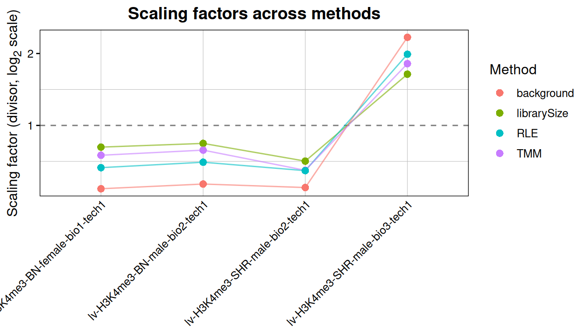

When the methods agree, the choice does not matter and any of them will
do. When they disagree, they are disagreeing about whether a global
shift is technical or biological, and no amount of statistics downstream
will resolve that. This is the moment to decide it, using what you know
about the experiment.

[`plotSetMA()`](https://sebastian-gregoricchio.github.io/RegionSetDE/reference/plotSetMA.md)
asks the same question set by set, which catches the case where one
class of regions carries a shift the others do not.

``` r

plotSetMA(counts, groupBy = "condition")
```

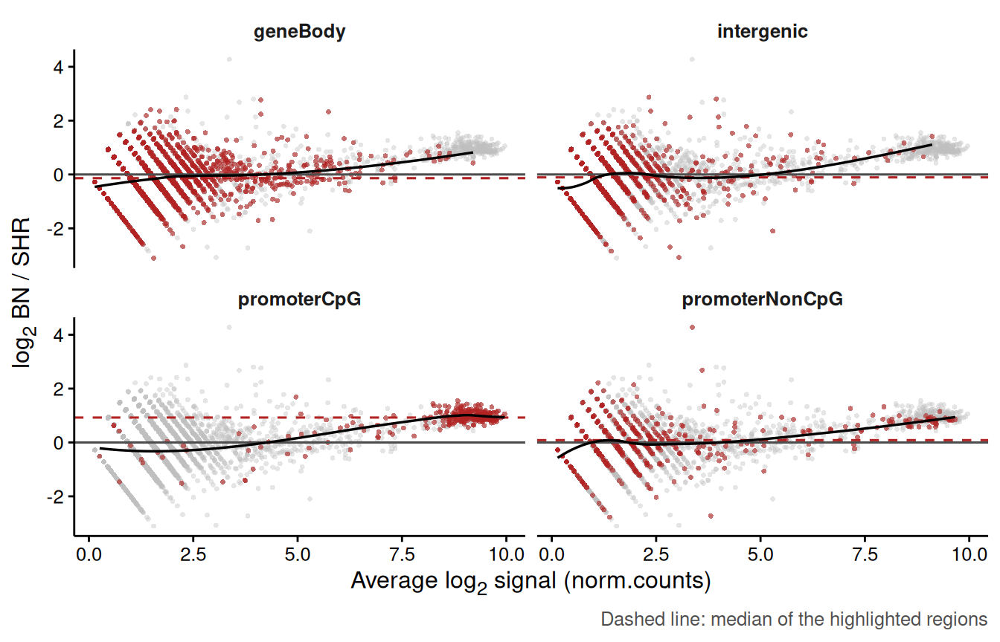

  

------------------------------------------------------------------------

## **Filtering and quality control**

[`filterRegions()`](https://sebastian-gregoricchio.github.io/RegionSetDE/reference/filterRegions.md)
drops the rows carrying too little signal to be worth testing, with the
criterion chosen among `"background"`, `"abundance"`, `"proportion"`,
`"byExpr"` and `"manual"`. The default compares each region against the
background bins and keeps what rises above them by a given fold change.

``` r
nrow(counts)
> [1] 3224

counts <- filterRegions(counts, method = "background", foldChange = 2, verbose = FALSE)

nrow(counts)
> [1] 1895

table(SummarizedExperiment::rowData(counts)$region.set)
> 
>       geneBody     intergenic    promoterCpG promoterNonCpG 
>            909            440            269            277
```

Notice what happened to the sets. The intergenic control loses most of
its rows, which is the expected behaviour and a useful sanity check: if
the low-signal set survives filtering intact, either the filter is too
permissive or the regions are not what you think they are.

Two plots are worth a look before fitting anything.

``` r

plotRegionPCA(counts, colourBy = "condition", shapeBy = "sex")
```

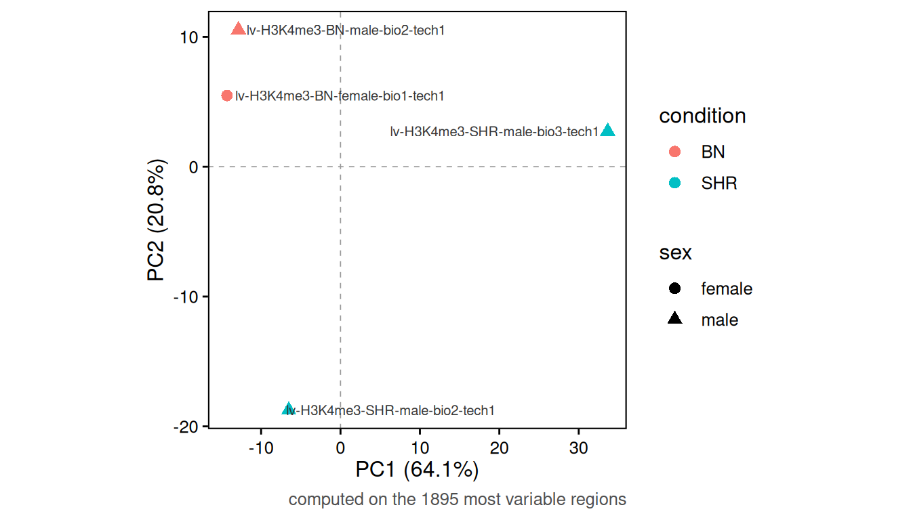

``` r

plotSampleCorrelation(counts, groupBy = "condition")
```

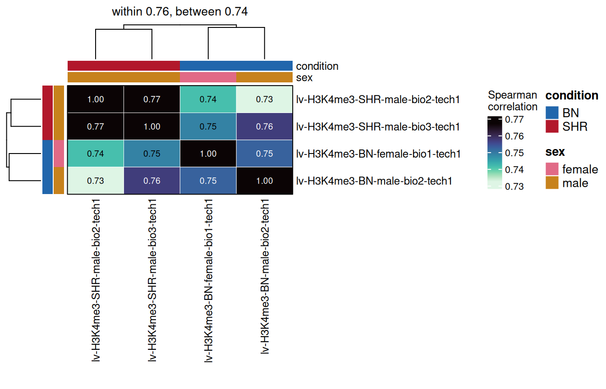

If the samples do not separate by condition here, that is not
necessarily fatal, since a real effect can be confined to a small class
of regions and be invisible in a global ordination. It does mean the
effect is not global, which is information worth having before
interpreting a set-level result. Running `plotRegionPCA(set = )` on one
set at a time is the way to find out where the structure lives.

  

------------------------------------------------------------------------

## **Fitting the model**

One fit serves both levels of testing.
[`fitRegions()`](https://sebastian-gregoricchio.github.io/RegionSetDE/reference/fitRegions.md)
takes a formula evaluated on the `colData` and an engine among `"edgeR"`
(quasi-likelihood negative binomial), `"voom"` (limma on log-CPM with
precision weights), `"dream"` (limma with random effects) and `"deseq2"`
(negative binomial Wald test).

``` r
fit <- fitRegions(counts,
                  design = ~ condition,
                  engine = "edgeR",
                  verbose = FALSE)

fit
> An object of class 'RegionSetDE.fit'
>   engine          : edgeR 
>   rows            : 1895 (region level) 
>   samples         : 4 (lv-H3K4me3-BN-female-bio1-tech1, lv-H3K4me3-BN-male-bio2-tech1, lv-H3K4me3-SHR-male-bio2-tech1, lv-H3K4me3-SHR-male-bio3-tech1) 
>   coefficients    : (Intercept), conditionSHR 
>   set universe    : otherSets (matched on width and abundance) 
>   common disp.    : 0.139 (BCV 0.373)
```

The engines are not interchangeable in the way a menu suggests.
`"edgeR"` is the default and the right choice for counts with
replicates. `"voom"` becomes preferable as the number of samples grows
and library sizes vary widely. `"dream"` is the only option when the
design carries a random effect, for instance repeated measures on the
same donor, written as `~ condition + (1|donor)`. `"deseq2"` is there
for continuity with an existing analysis rather than because it answers
a different question.

The `RegionSetDE.fit` object holds:

| Slot | Description |
|---:|:---|
| *fit* | list with the engine’s own fit object |
| *engine* | which engine produced it |
| *design* | the design matrix |
| *design.formula* | the formula it came from |
| *dispersion* | the dispersion used, and where it came from |
| *counts* | the `RegionSetDE.counts` the model was fitted on, filtering included |
| *universe* | the comparison rows for the set-level test, built once here |
| *samples* | the samples that entered the fit |

Two accessors avoid reaching into the slots:

``` r
fitCounts(fit)
> class: RegionSetDE.counts 
> dim: 1895 4 
> metadata(3): signal.type background normalization
> assays(2): counts norm.counts
> rownames(1895): promoterNonCpG|region_00012 promoterNonCpG|region_00017
>   ... promoterCpG|region_03797 promoterCpG|region_03798
> rowData names(3): region.set region.id tile.id
> colnames(4): lv-H3K4me3-BN-female-bio1-tech1
>   lv-H3K4me3-BN-male-bio2-tech1 lv-H3K4me3-SHR-male-bio2-tech1
>   lv-H3K4me3-SHR-male-bio3-tech1
> colData names(9): sample bam.file ... norm.factor scaling.factor

class(fitObject(fit))
> [1] "DGEGLM"
> attr(,"package")
> [1] "edgeR"
```

  

### The comparison universe

A competitive set test asks whether the regions of a set moved *more
than other regions did*, so it needs something to compare them against.
Taking every other row as it stands would confound the comparison with
region width and coverage, since a set of 1 kb promoters compared
against a background of long, weakly covered intergenic windows will
look different for reasons that have nothing to do with the condition.

[`fitRegions()`](https://sebastian-gregoricchio.github.io/RegionSetDE/reference/fitRegions.md)
therefore builds a matched universe by default, drawing comparison rows
with a similar width and abundance distribution.
[`plotUniverseMatching()`](https://sebastian-gregoricchio.github.io/RegionSetDE/reference/plotUniverseMatching.md)
shows whether the matching worked.

``` r

setResults <- testRegionSets(fit = fit,
                             contrast = c("condition", "SHR", "BN"),
                             verbose = FALSE)

plotUniverseMatching(object = setResults,
                     set = "promoterCpG",
                     covariate = "abundance")
```

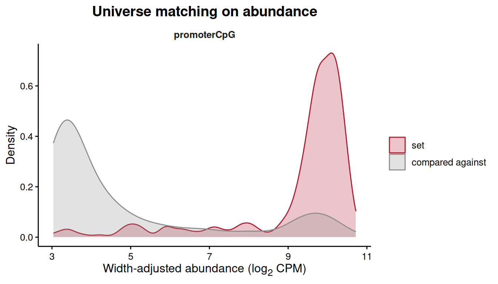

If the two distributions do not overlap, the competitive test is
comparing apples to oranges and its p-value should not be trusted.
Raising `universeRatio`, or matching on fewer covariates, usually fixes
it.

  

------------------------------------------------------------------------

## **Testing regions**

[`testRegions()`](https://sebastian-gregoricchio.github.io/RegionSetDE/reference/testRegions.md)
tests every region for a change between two groups.

``` r
results <- testRegions(fit,
                       contrast = c("condition", "SHR", "BN"),
                       verbose = FALSE)

results
> An object of class 'RegionSetDE.results'
>   contrast        : condition: SHR vs BN 
>   engine          : edgeR 
>   regions         : 1895 
>   counts carried  : 4 samples
>   thresholds      : FDR < 0.05 | |log2FC| > 0 
>   changing regions:
>     promoterNonCpG: 1 up, 2 down
>     intergenic: 2 up, 3 down
>     geneBody: 0 up, 3 down
>     promoterCpG: 0 up, 1 down
```

The three-element form of `contrast` averages the design rows of each
group and takes the difference, which gives the same answer whichever
level happens to be the reference and whether the design was written as
`~ condition` or `~ 0 + condition`. Naming a coefficient directly also
works, and is the usual source of confusion when the coefficient turns
out to be the reference level.

The results table comes out with
[`resultsTable()`](https://sebastian-gregoricchio.github.io/RegionSetDE/reference/resultsTable.md):

``` r
resultTable <- resultsTable(results)

head(resultTable, 3)
>       region.set    region.id tile.id seqnames start   end width     log2FC
> 1 promoterNonCpG region_00012      NA    chr12 26988 27987  1000 -0.4744875
> 2 promoterNonCpG region_00017      NA    chr12 39449 40448  1000 -1.6911510
> 3 promoterNonCpG region_00019      NA    chr12 44116 45115  1000  0.1328365
>   average.signal       stat   p.value       FDR diff.status
> 1       3.098695 0.16629041 0.6880013 0.9200864        null
> 2       3.141973 2.33758830 0.1429932 0.7997195        null
> 3       3.273341 0.01002874 0.9213104 0.9807286        null
```

| Column | Meaning |
|---:|:---|
| *region.set* | which set the region belongs to |
| *region.id* | region identifier, carried from the input |
| *seqnames*, *start*, *end*, *width* | coordinates |
| *log2FC* | log2 fold change of the second group over the first |
| *average.signal* | average abundance, the x axis of an MA plot |
| *stat* | the engine’s test statistic |
| *p.value* | raw p-value |
| *FDR* | adjusted p-value |
| *diff.status* | `up`, `down` or `null` from the stored thresholds |

Notice that the correction is applied over all the rows of the object,
across the sets, and `regionSets` subsets the output afterwards.
Correcting inside each set separately would make the FDR of one set
depend on how many other sets you happened to load, which is not a
property anyone wants in a result.

Other accessors reach the rest of the object:

``` r
contrastName(results)
> [1] "condition: SHR vs BN"

head(resultRanges(results), 2)
> GRanges object with 2 ranges and 9 metadata columns:
>                               seqnames      ranges strand |     region.set
>                                  <Rle>   <IRanges>  <Rle> |    <character>
>   promoterNonCpG|region_00012    chr12 26988-27987      * | promoterNonCpG
>   promoterNonCpG|region_00017    chr12 39449-40448      * | promoterNonCpG
>                                  region.id   tile.id    log2FC average.signal
>                                <character> <integer> <numeric>      <numeric>
>   promoterNonCpG|region_00012 region_00012      <NA> -0.474488        3.09870
>   promoterNonCpG|region_00017 region_00017      <NA> -1.691151        3.14197
>                                    stat   p.value       FDR diff.status
>                               <numeric> <numeric> <numeric>    <factor>
>   promoterNonCpG|region_00012   0.16629  0.688001  0.920086        null
>   promoterNonCpG|region_00017   2.33759  0.142993  0.799720        null
>   -------
>   seqinfo: 1 sequence from rn4 genome

resultCounts(results)
> class: RegionSetDE.counts 
> dim: 1895 4 
> metadata(3): signal.type background normalization
> assays(2): counts norm.counts
> rownames(1895): promoterNonCpG|region_00012 promoterNonCpG|region_00017
>   ... promoterCpG|region_03797 promoterCpG|region_03798
> rowData names(3): region.set region.id tile.id
> colnames(4): lv-H3K4me3-BN-female-bio1-tech1
>   lv-H3K4me3-BN-male-bio2-tech1 lv-H3K4me3-SHR-male-bio2-tech1
>   lv-H3K4me3-SHR-male-bio3-tech1
> colData names(9): sample bam.file ... norm.factor scaling.factor
```

[`topRegions()`](https://sebastian-gregoricchio.github.io/RegionSetDE/reference/topRegions.md)
ranks and filters in one call. With `FDR = 1` it ranks without
filtering, which is what you want when exploring or when power is
limited:

``` r
topRegions(results, n = 5, FDR = 1)
>       region.set    region.id tile.id seqnames    start      end width
> 1 promoterNonCpG region_02996      NA    chr12 36842295 36843294  1000
> 2     intergenic region_03590      NA    chr12 44174500 44175499  1000
> 3 promoterNonCpG region_00212      NA    chr12  2500829  2501828  1000
> 4       geneBody region_02435      NA    chr12 29881730 29882729  1000
> 5       geneBody region_02220      NA    chr12 27481625 27482624  1000
>      log2FC average.signal     stat      p.value          FDR diff.status
> 1 -5.203835       5.159079 84.13617 1.148685e-08 2.176757e-05        down
> 2 -2.887100       5.237329 43.04577 2.743053e-06 2.599042e-03        down
> 3 -3.222630       4.816977 34.29977 1.370844e-05 6.573186e-03        down
> 4 -2.778908       5.406565 36.15528 1.387480e-05 6.573186e-03        down
> 5 -2.281658       5.277404 29.11255 3.347081e-05 1.268544e-02        down
```

``` r
topRegions(results, n = 3, set = "promoterCpG", FDR = 1, sortBy = "log2FC")
>    region.set    region.id tile.id seqnames    start      end width    log2FC
> 1 promoterCpG region_03747      NA    chr12 46273309 46274308  1000  2.148719
> 2 promoterCpG region_01273      NA    chr12 15719347 15720346  1000 -1.771521
> 3 promoterCpG region_00824      NA    chr12 10369814 10370813  1000  1.635046
>   average.signal      stat      p.value        FDR diff.status
> 1       4.113765  4.520231 0.0472100147 0.66268873        null
> 2       5.933614 21.009851 0.0002058661 0.03901163        down
> 3       4.658080  7.080136 0.0163032446 0.45433307        null
```

  

### Tiled regions

When the counting was tiled, the p-value of a region is a Simes
combination across its tiles. That answers *does any part of this region
change* rather than *does the whole region change*, and the distinction
matters for wide domains: a long region that moves over one tile in
forty comes out with a small p-value and a small overall fold change.
The `log2FC` reported is the fold change of the most significant tile,
not an average, because that is the quantity matching the p-value.

The tile-level table stays available:

``` r

head(tileTable(tiledResults))
```

On an object counted per region there are no tiles and
[`tileTable()`](https://sebastian-gregoricchio.github.io/RegionSetDE/reference/tileTable.md)
says so rather than returning an empty table.

  

### Looking at the results

``` r

plotVolcano(results, labelTop = 3)
```

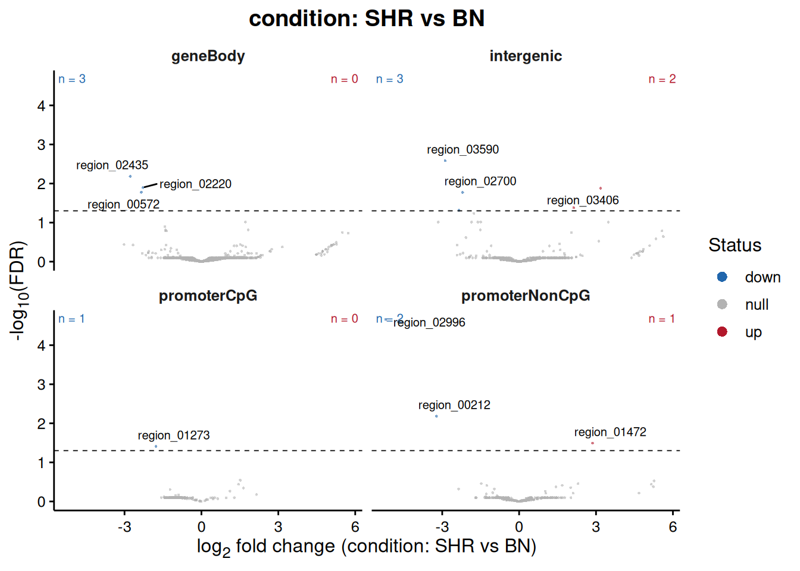

``` r

plotResultsMA(results)
```

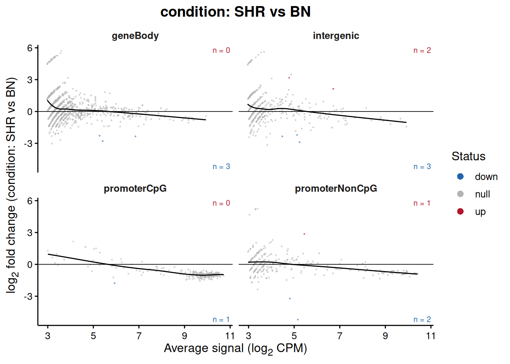

Faceting by set is the default in both, and it is the more informative
view here: a volcano split by region class shows immediately whether the
changes concentrate in one kind of element.

``` r

topRegion <- topRegions(results, n = 1, FDR = 1)$region.id

plotRegion(results, region = topRegion, groupBy = "condition")
```

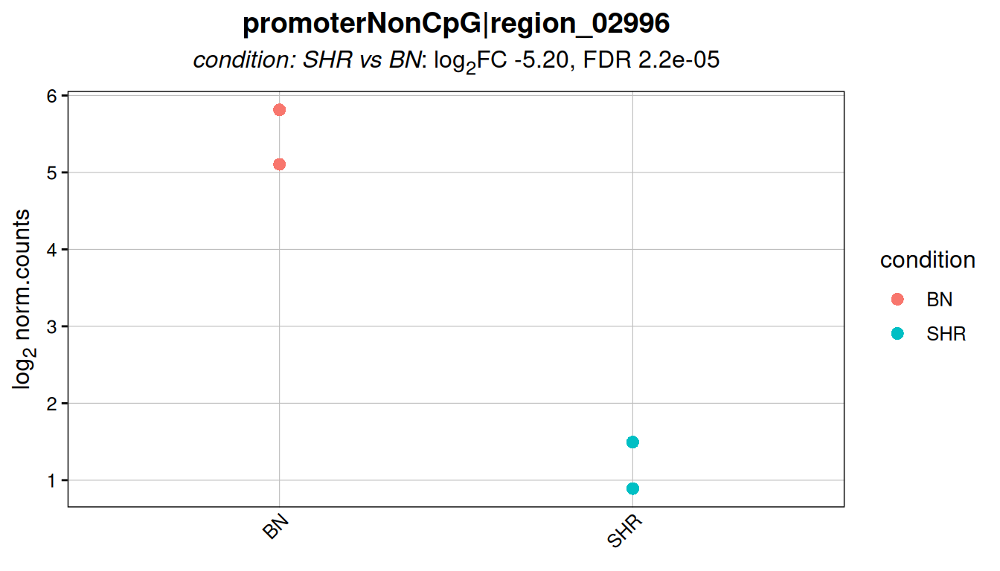

``` r

plotTopHeatmap(results, n = 20, FDR = 1)
```

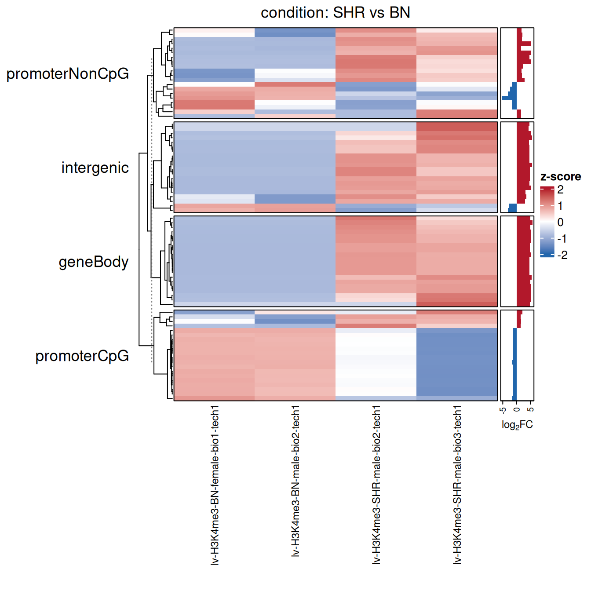

  

------------------------------------------------------------------------

## **Testing region sets**

This is the level the package was built for.
[`testRegionSets()`](https://sebastian-gregoricchio.github.io/RegionSetDE/reference/testRegionSets.md)
asks whether a whole set responded, and runs two tests that answer
genuinely different questions.

``` r
setResults <- testRegionSets(fit,
                             contrast = c("condition", "SHR", "BN"),
                             method = c("camera", "fry"),
                             verbose = FALSE)

setResults
> An object of class 'RegionSetDE.setResults'
>   test            : set 
>   contrast        : condition: SHR vs BN 
>   engine          : edgeR 
>   methods         : camera, fry 
>   universe        : otherSets (matched on width and abundance) 
> 
>      region.set n.regions mean.log2FC delta.log2FC CI.lower CI.upper camera.FDR
>     promoterCpG       269     -0.8340      -0.9310    -2.55    0.686      0.938
>        geneBody       909      0.2910       0.4070    -1.57    2.390      0.938
>      intergenic       440      0.2650       0.2060    -1.76    2.170      0.938
>  promoterNonCpG       277     -0.0209      -0.0787    -2.07    1.910      0.938
>  fry.FDR
>     0.54
>     0.54
>     0.54
>     0.54
```

``` r
setTable <- resultsTable(setResults)

setTable
>       region.set n.regions n.comparison mean.log2FC median.log2FC
> 1    promoterCpG       269          314 -0.83367077    -0.9443600
> 2       geneBody       909          986  0.29148227     0.1692341
> 3     intergenic       440         1354  0.26499294     0.1740960
> 4 promoterNonCpG       277         1378 -0.02089479    -0.1571407
>   mean.log2FC.comparison delta.log2FC  CI.lower  CI.upper inter.region.cor
> 1             0.09704300  -0.93071378 -2.547867 0.6864395        0.8583680
> 2            -0.11505923   0.40654151 -1.574041 2.3871240        0.2721337
> 3             0.05862768   0.20636526 -1.761069 2.1737990        0.2733108
> 4             0.05781212  -0.07870691 -2.067061 1.9096471        0.4433140
>   inter.region.cor.universe median.width camera.direction  camera.p
> 1                 0.3775802         1000             Down 0.3213638
> 2                 0.4530172         1000               Up 0.5187249
> 3                 0.3815880         1000               Up 0.7773973
> 4                 0.3504707         1000             Down 0.9384488
>   fry.direction     fry.p camera.FDR   fry.FDR
> 1          Down 0.2686203  0.9384488 0.5401741
> 2          Down 0.5401741  0.9384488 0.5401741
> 3          Down 0.4717232  0.9384488 0.5401741
> 4          Down 0.4613130  0.9384488 0.5401741
```

|                   Column | Meaning                                         |
|-------------------------:|:------------------------------------------------|
|             *region.set* | the set                                         |
|              *n.regions* | how many of its regions survived filtering      |
|            *mean.log2FC* | mean fold change of the set                     |
| *mean.log2FC.comparison* | mean fold change of the comparison rows         |
|           *delta.log2FC* | the difference between the two, the effect size |
|   *CI.lower*, *CI.upper* | confidence interval on `delta.log2FC`           |
|             *camera.FDR* | competitive test, adjusted                      |
|                *fry.FDR* | self-contained test, adjusted                   |

  

### Reading the output

**Read the effect size before the p-value.** A set of 30,000 promoters
tested as if its regions were independent returns a p-value below
anything a computer will print for a mean shift of 0.05 log2, which
tells you nothing about whether the shift matters. Regions inside a set
are not independent either, since neighbouring elements in the same
domain move together, so the variance of the mean is inflated by
`1 + (n - 1) * rho`, with `rho` estimated from the residuals of the fit.
The confidence interval carries that inflation. It is the number to look
at first.

**The pattern between the two tests is itself informative.** `camera` is
competitive: it asks whether the set moved more than the regions it is
compared against, and it is invariant to a scaling error affecting
everything equally. `fry` is self-contained: it asks whether the set
moved away from zero at all, which a global shift in the mark, or a
leftover normalisation error, will satisfy for every set at once.

| camera | fry | Reading |
|:---|:---|:---|
| significant | significant | the set moved, and it moved more than its comparison. The clean result. |
| significant | not | the sets redistributed signal between them, with little net change overall |
| not | significant | everything moved together. Revisit the normalisation before the biology. |
| not | not | no detectable set-level effect |

The competitive test is the one to lead with. It runs on the per-region
statistics through
[`limma::cameraPR`](https://rdrr.io/pkg/limma/man/camera.html), which
makes it behave identically across all four engines, whereas the
self-contained test is computed on the log-CPM matrix and is therefore a
transformation away from what `edgeR` and `DESeq2` actually fitted.

In the table above no set reaches significance, which is the honest
outcome for four libraries on one chromosome. The informative part is
`promoterCpG`: a `delta.log2FC` around -0.9 with an interval that only
just includes zero, in the direction H3K4me3 biology would predict, and
in the one set where a promoter effect belongs. The intergenic control
sits near zero, as it should.

  

### Plots for the set level

``` r

plotSetEffect(setResults)
```

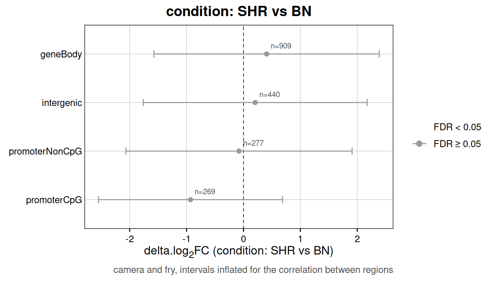

``` r

plotSetDistribution(setResults)
```

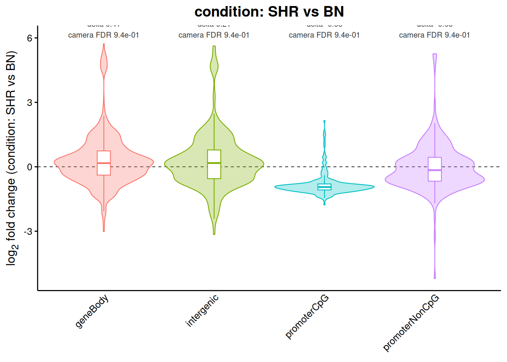

[`plotSetEffect()`](https://sebastian-gregoricchio.github.io/RegionSetDE/reference/plotSetEffect.md)
shows the effect size and its interval, which is the figure to put in a
paper.
[`plotSetDistribution()`](https://sebastian-gregoricchio.github.io/RegionSetDE/reference/plotSetDistribution.md)
shows the whole fold change distribution behind each summary, which is
where you find out that a mean of zero came from a set splitting in two
rather than from a set not moving.

``` r

plotSetSignal(setResults, groupBy = "condition")
```

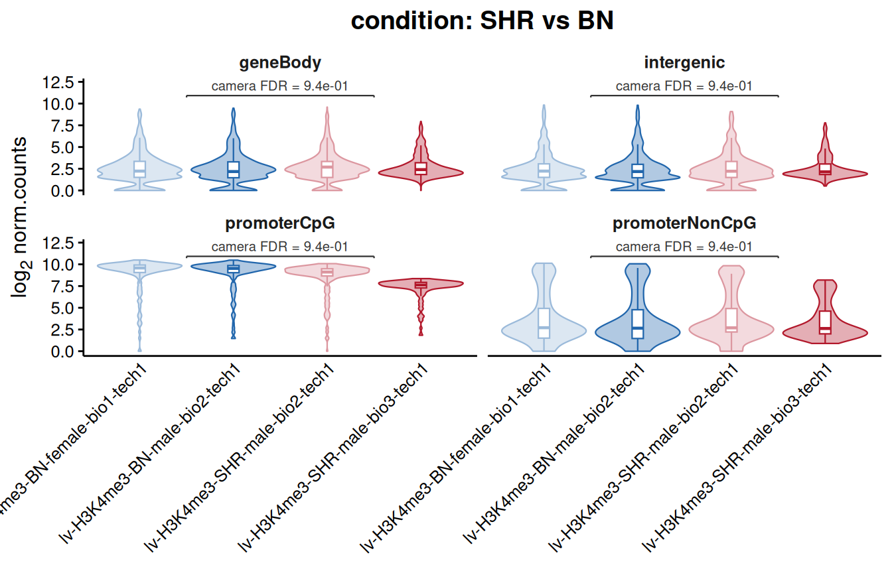

  

### Contrasting two sets directly

*Did the effect differ between CpG island promoters and everything
else?* is a different question from *did either of them change*, and
[`testSetContrast()`](https://sebastian-gregoricchio.github.io/RegionSetDE/reference/testSetContrast.md)
is the one that answers it.

``` r
setContrast <- testSetContrast(fit,
                               contrast = c("condition", "SHR", "BN"),
                               set1 = "promoterCpG",
                               set2 = "intergenic",
                               verbose = FALSE)

setContrast
> An object of class 'RegionSetDE.setResults'
>   test            : setContrast 
>   contrast        : condition: SHR vs BN 
>   engine          : edgeR 
>   methods         : camera 
>   universe        : pairedSet  
> 
>        set.1      set.2 delta.log2FC CI.lower CI.upper camera.FDR
>  promoterCpG intergenic         -1.1    -2.73    0.535      0.316
```

Use this whenever the hypothesis is comparative. Comparing two `camera`
p-values by eye is not the same test, and it is wrong in the usual way:
a difference in significance is not a significant difference.

  

------------------------------------------------------------------------

## **Checking the calibration**

A set-level result rests on the dispersion and on the null being where
you think it is, and both can be checked directly rather than assumed.

[`estimateNullDispersion()`](https://sebastian-gregoricchio.github.io/RegionSetDE/reference/estimateNullDispersion.md)
estimates the dispersion from rows that should carry no effect, which is
what makes an analysis with no replicates possible at all:

``` r
nullDispersion <-
  estimateNullDispersion(loadExampleData("counts", verbose = FALSE) |>
                           normalizeCounts(method = "background",
                                           verbose = FALSE),
                         source = "background",
                         verbose = FALSE)

nullDispersion
> $dispersion
> [1] 0.06820971
> 
> $bcv
> [1] 0.2611699
> 
> $source
> [1] "background"
> 
> $n.rows
> [1] 560
> 
> $holdout.index
>   [1]   11   27   31   37   46   48   53   55   66   87   90   92   94   97   99
>  [16]  104  106  108  111  113  115  117  119  121  123  125  127  131  133  135
>  [31]  137  139  141  143  145  163  165  167  169  171  173  175  177  180  183
>  [46]  185  187  190  195  198  200  203  207  209  211  213  215  217  219  222
>  [61]  224  226  228  230  233  235  237  239  241  243  245  247  249  251  253
>  [76]  255  258  261  263  265  267  269  271  273  275  277  279  281  283  285
>  [91]  287  290  292  294  296  299  302  304  306  308  311  318  320  322  330
> [106]  332  334  336  338  340  343  346  348  355  357  361  363  365  367  369
> [121]  372  375  377  379  381  383  386  389  392  395  397  400  402  404  408
> [136]  410  412  414  416  419  421  423  425  427  429  431  433  439  442  447
> [151]  451  455  457  459  461  463  465  467  470  472  474  477  481  483  486
> [166]  488  490  492  494  496  498  500  502  504  506  508  510  512  514  516
> [181]  518  520  522  524  526  528  530  532  535  537  540  542  544  546  548
> [196]  550  553  555  557  559  561  565  567  569  571  580  583  592  601  604
> [211]  606  609  615  617  620  662  664  666  668  670  685  687  689  691  693
> [226]  696  699  702  704  706  708  710  712  714  716  718  720  722  724  726
> [241]  728  730  733  735  737  739  741  743  745  747  750  754  756  758  760
> [256]  762  764  766  768  770  772  774  777  779  781  789  791  793  797  804
> [271]  807  811  813  816  818  821  825  827  829  831  832  834  840  842  844
> [286]  846  848  850  852  854  856  858  862  864  866  868  871  874  877  885
> [301]  894  899  903  905  907  909  911  913  915  917  919  921  923  925  928
> [316]  930  934  936  938  940  942  946  950  952  954  956  958  960  962  964
> [331]  968  971  974  978  981  990  997  999 1001 1005 1025 1028 1035 1043 1049
> [346] 1061 1067 1086 1088 1090 1092 1094 1096 1098 1100 1102 1104 1106 1108 1110
> [361] 1112 1114 1116 1118 1120 1122 1124 1126 1128 1130 1132 1134 1136 1138 1141
> [376] 1143 1145 1147 1149 1151 1153 1155 1157 1159 1161 1163 1165 1167 1169 1171
> [391] 1173 1175 1177 1179 1181 1183 1185 1187 1189 1191 1193 1195 1197 1199 1201
> [406] 1203 1205 1207 1209 1211 1213 1215 1217 1219 1221 1223 1225 1227 1230 1232
> [421] 1234 1237 1239 1242 1244 1252 1255 1257 1259 1262 1264 1266 1270 1272 1274
> [436] 1276 1278 1280 1282 1284 1288 1291 1293 1296 1298 1300 1303 1305 1307 1309
> [451] 1312 1314 1316 1319 1322 1324 1326 1328 1330 1334 1336 1338 1340 1343 1346
> [466] 1354 1356 1358 1360 1363 1365 1367 1369 1371 1374 1381 1387 1391 1395 1397
> [481] 1399 1401 1403 1405 1409 1415 1418 1420 1422 1424 1429 1431 1433 1435 1437
> [496] 1439 1441 1443 1445 1447 1449 1451 1453 1455 1457 1459 1461 1463 1465 1467
> [511] 1469 1471 1473 1475 1477 1479 1481 1483 1485 1487 1489 1491 1494 1496 1503
> [526] 1505 1507 1509 1511 1513 1515 1519 1521 1523 1525 1528 1530 1532 1534 1536
> [541] 1538 1540 1542 1544 1546 1548 1550 1552 1554 1556 1558 1561 1563 1565 1567
> [556] 1569 1571 1573 1575 1577
> 
> $samples
> [1] "lv-H3K4me3-BN-female-bio1-tech1" "lv-H3K4me3-BN-male-bio2-tech1"  
> [3] "lv-H3K4me3-SHR-male-bio2-tech1"  "lv-H3K4me3-SHR-male-bio3-tech1"
```

[`checkNullCalibration()`](https://sebastian-gregoricchio.github.io/RegionSetDE/reference/checkNullCalibration.md)
goes further and runs the actual contrast on those null rows. Under a
correctly calibrated test the p-values should be uniform.

``` r

calibration <- checkNullCalibration(fit = fit,
                                    contrast = c("condition", "SHR", "BN"),
                                    source = "background",
                                    verbose = FALSE)

plotNullCalibration(calibration)
```

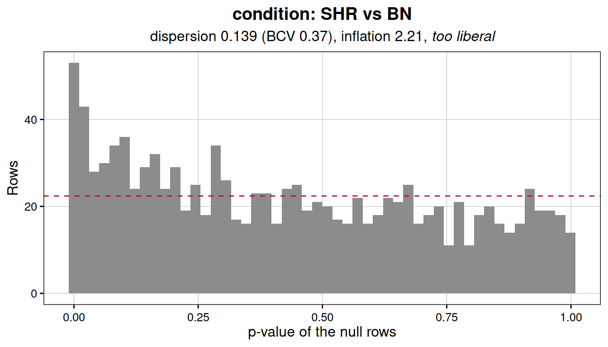

A flat histogram means the test is behaving. A peak near zero means it
is anticonservative and the FDRs downstream are optimistic, usually
because the dispersion is underestimated or because the normalisation
left a systematic difference between the groups. A peak near one means
the opposite, and the analysis is losing power it could have.

Notice that a set defined as low-signal is a poor source of null rows,
even though it sounds like the natural choice.
[`estimateNullDispersion()`](https://sebastian-gregoricchio.github.io/RegionSetDE/reference/estimateNullDispersion.md)
will refuse rather than return a dispersion estimated from rows with
almost no counts:

``` r
estimateNullDispersion(counts = counts,
                       source = "regionSet",
                       regionSets = "intergenic",
                       verbose = FALSE)
> 
[1m
[33mError
[39m:
[22m
> 
[33m!
[39m Only 89 null rows reach 10 counts, which is too few to estimate a dispersion from.
```

  

------------------------------------------------------------------------

## **Working without replicates**

One library per condition is the normal situation in CUT&Tag and in a
good deal of ChIP-seq, and it is the case every count-based method
refuses outright. The refusal is well founded: with a single sample on
each side there are no residual degrees of freedom, so a dispersion
cannot be read from the residual variation. There is none to read.

*RegionSetDE* takes the way out that the experiment already suggests.
Some rows are not expected to respond, the background bins most
obviously, and the variation across those rows is the variation that
would have been seen between replicates. Estimate the dispersion there,
hold it fixed, and the test becomes possible.

This happens on its own.
[`fitRegions()`](https://sebastian-gregoricchio.github.io/RegionSetDE/reference/fitRegions.md)
notices that the design has no residual degrees of freedom and estimates
the dispersion from the background rather than failing or, worse,
fitting a Poisson and returning confident nonsense. What follows is
mostly about seeing what it did and checking whether it was reasonable.

Notice what the approach buys and what it costs. The assumption moves
from *most regions do not change* to *these particular rows do not
change*, which is a statement you can inspect and, further down, test.
It is weaker than pretending replicates exist and stronger than having
them.

  

### Reducing the example to one sample per strain

The packaged data has two biological replicates on each side, which
makes it convenient for showing the method: the same contrast runs both
ways and the answers can be compared. Both strains have a `bio2` library
and both are male, so the subset is a clean one-versus-one with the sex
difference removed as well.

``` r
counts <- loadExampleData("counts", verbose = FALSE)

singleCounts <- selectSamples(counts = counts,
                              biologicalReplicate == "bio2",
                              verbose = FALSE)

SummarizedExperiment::colData(singleCounts)
> DataFrame with 2 rows and 7 columns
>                                                sample               bam.file
>                                           <character>            <character>
> lv-H3K4me3-BN-male-bio2-tech1  lv-H3K4me3-BN-male-b.. /home/s.gregoricchio..
> lv-H3K4me3-SHR-male-bio2-tech1 lv-H3K4me3-SHR-male-.. /home/s.gregoricchio..
>                                condition         sex biologicalReplicate
>                                 <factor> <character>         <character>
> lv-H3K4me3-BN-male-bio2-tech1        BN         male                bio2
> lv-H3K4me3-SHR-male-bio2-tech1       SHR        male                bio2
>                                paired.end library.size
>                                 <logical>    <numeric>
> lv-H3K4me3-BN-male-bio2-tech1       FALSE       400384
> lv-H3K4me3-SHR-male-bio2-tech1      FALSE       337600
```

[`selectSamples()`](https://sebastian-gregoricchio.github.io/RegionSetDE/reference/selectSamples.md)
drops the normalisation when it subsets, since scaling factors estimated
on four libraries do not describe two, so the object is renormalised and
refiltered from scratch.

``` r
singleCounts <- normalizeCounts(singleCounts,
                                method = "background",
                                verbose = FALSE)

singleCounts <- filterRegions(singleCounts, verbose = FALSE)

nrow(singleCounts)
> [1] 2598
```

  

### Fitting

Nothing about the call changes.

``` r
singleFit <- fitRegions(singleCounts,
                        design = ~ condition,
                        engine = "edgeR",
                        verbose = FALSE)

singleFit
> An object of class 'RegionSetDE.fit'
>   engine          : edgeR 
>   rows            : 2598 (region level) 
>   samples         : 2 (lv-H3K4me3-BN-male-bio2-tech1, lv-H3K4me3-SHR-male-bio2-tech1) 
>   coefficients    : (Intercept), conditionSHR 
>   set universe    : otherSets (matched on width and abundance) 
>   common disp.    : 0.0374 (BCV 0.193) fixed 
>   replicates      : none, dispersion from background
```

What changed is inside, and the fit records it rather than leaving you
to guess:

``` r
singleFit@dispersion[c("common", "fixed", "no.replicates", "source")]
> $common
> [1] 0.03737481
> 
> $fixed
> [1] TRUE
> 
> $no.replicates
> [1] TRUE
> 
> $source
> [1] "background"
```

`no.replicates` marks that the fallback was taken, `fixed` that the
dispersion was held rather than fitted, and `source` where the null rows
came from. All of it travels into the file written by
[`exportResults()`](https://sebastian-gregoricchio.github.io/RegionSetDE/reference/exportResults.md),
so the choice is recoverable from the output months later.

> **NOTE**: this only applies to `engine = "edgeR"`. The negative
> binomial fit takes the dispersion as an explicit parameter, so a value
> estimated elsewhere can be held fixed. The precision weights of
> `voom`, and the shrinkage in `dream` and `DESeq2`, are all derived
> from the sample-to-sample variation itself, which is the very thing a
> design without replicates does not have.

  

### Taking control of the estimate

The automatic path uses the background bins with the default settings.
When you want a different null, or want to see the number before
committing to it,
[`estimateNullDispersion()`](https://sebastian-gregoricchio.github.io/RegionSetDE/reference/estimateNullDispersion.md)
runs the same estimation on its own.

``` r
nullDispersion <- estimateNullDispersion(singleCounts,
                                         source = "background",
                                         holdout = 0.5,
                                         verbose = FALSE)

nullDispersion$dispersion
> [1] 0.03737481

nullDispersion$bcv
> [1] 0.1933257
```

The biological coefficient of variation is the number to read, since it
sits on the scale of a fold change rather than of a squared one. Around
0.1 is what well-behaved technical replicates give, 0.2 to 0.4 what
biological replicates of a cell line give, and above 0.6 says the two
libraries differ enough that a differential test will find very little.
The value here, close to 0.19, is unremarkable for two animals of
different strains.

The result is passed back in, which is also how you would supply a
dispersion taken from a previous experiment or from the literature:

``` r

singleFit <- fitRegions(singleCounts,
                        design = ~ condition,
                        dispersion = nullDispersion)

# Or a bare number, when it comes from somewhere else entirely
singleFit <- fitRegions(singleCounts, design = ~ condition, dispersion = 0.04)

# Or a region set believed to be invariant, rather than the background bins
singleFit <- fitRegions(singleCounts, design = ~ condition,
                        dispersion = "regionSet", nullRegionSets = "intergenic")
```

  

### Checking that the dispersion was reasonable

This step is not optional here. In a replicated analysis a poorly
estimated dispersion is a matter of degree; without replicates it is an
assumption imported from elsewhere, and this check is the only thing
between that assumption and the p-values.

The `holdout` is what makes the check meaningful. Half the null rows are
kept out of the estimate, so the calibration can be tested on rows the
dispersion was never fitted to. Checking on the same rows that produced
it would be circular and would report good calibration whatever the
truth. The held-out positions travel in the fit, so nothing has to be
recomputed:

``` r

singleCalibration <-
  checkNullCalibration(singleFit,
                       contrast = c("condition", "SHR", "BN"),
                       source = "background",
                       index = singleFit@dispersion$holdout.index,
                       verbose = FALSE)

plotNullCalibration(singleCalibration)
```

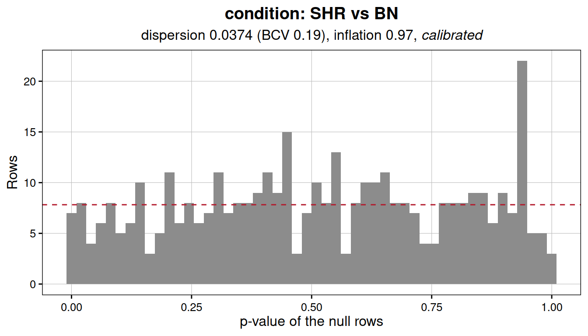

A flat histogram means the dispersion describes these two libraries
adequately. A peak near zero means it is too small, the test is
anticonservative, and every FDR downstream is optimistic. A peak near
one means the opposite and the analysis is discarding power it could
have had. In the second case the usual cause is that the null rows are
not as null as assumed, and moving `source` to a region set you trust
more is the first thing to try.

  

### Testing

From here nothing differs from the replicated case. Both levels are
available and the objects behave identically.

``` r
singleResults <- testRegions(singleFit,
                             contrast = c("condition", "SHR", "BN"),
                             verbose = FALSE)

singleSetResults <- testRegionSets(singleFit,
                                   contrast = c("condition", "SHR", "BN"),
                                   verbose = FALSE)

resultsTable(singleSetResults)
>       region.set n.regions n.comparison mean.log2FC median.log2FC
> 1    promoterCpG       273          322 -0.34574769   -0.35028835
> 2       geneBody      1178         1420  0.20023317    0.04587859
> 3 promoterNonCpG       371         1855  0.13289085    0.04333004
> 4     intergenic       776         1813  0.04786937    0.04333004
>   mean.log2FC.comparison delta.log2FC   CI.lower   CI.upper inter.region.cor
> 1            0.287725959  -0.63347365 -1.1543354 -0.1126119             0.01
> 2           -0.005591536   0.20582471 -0.4605448  0.8721942             0.01
> 3            0.071712042   0.06117881 -0.6135756  0.7359332             0.01
> 4            0.108141759  -0.06027239 -0.7616854  0.6411406             0.01
>   inter.region.cor.universe median.width camera.direction     camera.p
> 1                      0.01         1000             Down 1.650640e-12
> 2                      0.01         1000               Up 7.329599e-02
> 3                      0.01         1000               Up 4.546972e-01
> 4                      0.01         1000               Up 5.513550e-01
>     camera.FDR
> 1 6.602561e-12
> 2 1.465920e-01
> 3 5.513550e-01
> 4 5.513550e-01
```

  

### How much is lost

Since the packaged data has replicates, the same contrast can be run
both ways and the answers compared, which is the check a reader wants
before trusting the approach on data where it cannot be done.

``` r

fit <- loadExampleData("fit", verbose = FALSE)

replicatedTable <-
  resultsTable(testRegions(fit = fit,
                           contrast = c("condition", "SHR", "BN"),
                           verbose = FALSE))

singleTable <- resultsTable(singleResults)

sharedRegions <- intersect(replicatedTable$region.id, singleTable$region.id)

comparisonTable <- data.frame(
  replicated = replicatedTable$log2FC[match(sharedRegions, replicatedTable$region.id)],
  singleSample = singleTable$log2FC[match(sharedRegions, singleTable$region.id)])

correlationTest <- stats::cor.test(comparisonTable$replicated,
                                   comparisonTable$singleSample,
                                   method = "spearman",
                                   exact = FALSE)
```

  

``` r

# Below the double precision floor the exact value is meaningless
pValueLabel <- if (correlationTest$p.value < 2.2e-16) {
  "p < 2.2e-16"
} else {
  sprintf("p = %.3g", correlationTest$p.value)
}

annotationLabel <- sprintf("rho = %.3f\n%s",
                           correlationTest$estimate,
                           pValueLabel)

corr_plot <-
  ggplot(comparisonTable,
         aes(x = replicated, y = singleSample)) +
  geom_abline(slope = 1, intercept = 0,
              linetype = "dashed", colour = "gray50") +
  geom_smooth(formula = y ~ x, method = "glm",
              fill = "steelblue4", color = "navy") +
  geom_point(alpha = 0.2, size = 1.2, stroke = NA) +
  annotate(geom = "text",
           x = -Inf, y = Inf,
           hjust = -0.2, vjust = 1.3,
           label = annotationLabel, size = 3.5, lineheight = 1.1) +
  labs(x = "log2FC, two replicates per strain",
       y = "log2FC, one library per strain") +
  theme_bw(base_size = 10) +
  theme(aspect.ratio = 1,
        axis.text = element_text(color = "black"))

corr_plot
```

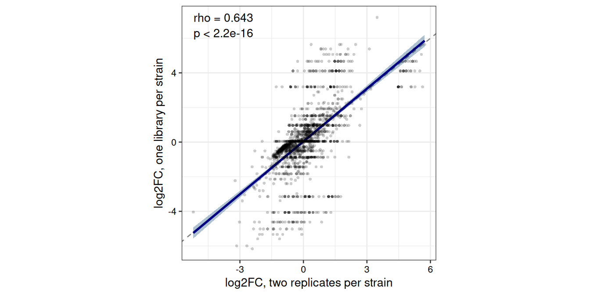

The two track each other, but not tightly, and the scatter widens toward
the extremes, which is exactly where a single library has the least to
say. Part of that is the comparison itself: the two analyses filter
independently, so the shared regions are an intersection of two
different sets rather than the same rows twice.

The fold changes are estimated from the same counts and the dispersion
does not enter the point estimate, so what the replicates buy is not the
effect size but the standard error around it, and therefore the ranking
and the FDR. The honest summary of the no-replicate mode is that it
gives you the same estimates with uncertainty resting on an assumption
you have to check rather than on data you have measured.

That is also why the set level is where this mode earns its place.
Averaging across the hundreds or thousands of regions in a set is far
less sensitive to a misjudged dispersion than the fate of any single
region, so
[`testRegionSets()`](https://sebastian-gregoricchio.github.io/RegionSetDE/reference/testRegionSets.md)
stays informative on one pair of libraries long after
[`testRegions()`](https://sebastian-gregoricchio.github.io/RegionSetDE/reference/testRegions.md)
has stopped returning anything worth reading.

  

------------------------------------------------------------------------

## **Exporting**

[`exportResults()`](https://sebastian-gregoricchio.github.io/RegionSetDE/reference/exportResults.md)
writes the tables in a form that survives leaving R.

``` r
outputDirectory <- file.path(tempdir(), "regionSetDE-vignette")
dir.create(outputDirectory, showWarnings = FALSE)

exportResults(results,
              path = outputDirectory,
              prefix = "SHR_vs_BN",
              verbose = FALSE)

list.files(outputDirectory)
> [1] "SHR_vs_BN_parameters.tsv" "SHR_vs_BN_regions.bed"   
> [3] "SHR_vs_BN_regions.tsv.gz"
```

Three kinds of file come out. The TSV holds the results table. The BED
holds the same regions with zero-based starts, as the format requires,
so its coordinates sit one lower than the TSV; with `colourByStatus` it
carries nine columns and an item colour per direction, which is what
makes a genome browser show increasing and decreasing regions apart
without a second file. The score maps `-log10(FDR)` onto the range the
format allows and saturates at the top, so 1000 means *at least that*,
not *exactly that*.

The parameters file is the one worth keeping. It flattens everything the
object carries in its `parameters` slot into one parameter per line:
counting level, normalisation method and factors, filter and threshold,
engine, design, contrast, correction, and on a fit with no replicates
the dispersion and its source.

``` r
parameterFile <- list.files(outputDirectory,
                            pattern = "parameters",
                            full.names = TRUE)

head(read.delim(parameterFile), 10)
>                   parameter                value
> 1                  contrast condition: SHR vs BN
> 2                    engine                edgeR
> 3           genome.assembly                  rn4
> 4           seqlevels.style                 UCSC
> 5            thresholds.FDR                 0.05
> 6         thresholds.log2FC                    0
> 7   thresholds.lfcThreshold                    0
> 8  thresholds.adjust.method                   BH
> 9  loadRegions.keepMetadata                 TRUE
> 10  loadRegions.sortRegions                 TRUE
```

Six months later that file is the difference between a result that can
be reproduced and one that can only be repeated.

  

------------------------------------------------------------------------

## **Which analysis for which question**

| Question | Function | Read |
|:---|:---|:---|
| Which individual regions changed? | [`testRegions()`](https://sebastian-gregoricchio.github.io/RegionSetDE/reference/testRegions.md) | `FDR` and `log2FC`, through [`topRegions()`](https://sebastian-gregoricchio.github.io/RegionSetDE/reference/topRegions.md) |
| Did this class of regions respond as a class? | [`testRegionSets()`](https://sebastian-gregoricchio.github.io/RegionSetDE/reference/testRegionSets.md) | `delta.log2FC` and its interval, then `camera.FDR` |
| Did the effect differ between two classes? | [`testSetContrast()`](https://sebastian-gregoricchio.github.io/RegionSetDE/reference/testSetContrast.md) | the contrast between the two sets |
| Did the mark redistribute rather than change globally? | [`testRegionSets()`](https://sebastian-gregoricchio.github.io/RegionSetDE/reference/testRegionSets.md) | camera significant, fry not |
| Is a global shift technical or biological? | [`plotNormComparison()`](https://sebastian-gregoricchio.github.io/RegionSetDE/reference/plotNormComparison.md), [`plotSetMA()`](https://sebastian-gregoricchio.github.io/RegionSetDE/reference/plotSetMA.md) | how far the methods disagree |
| Are my p-values trustworthy? | [`checkNullCalibration()`](https://sebastian-gregoricchio.github.io/RegionSetDE/reference/checkNullCalibration.md) | flatness of the histogram |
| Can I test without replicates? | [`estimateNullDispersion()`](https://sebastian-gregoricchio.github.io/RegionSetDE/reference/estimateNullDispersion.md) | dispersion from the background, then `fitRegions(dispersion = )` |
| Is the competitive comparison fair? | [`plotUniverseMatching()`](https://sebastian-gregoricchio.github.io/RegionSetDE/reference/plotUniverseMatching.md) | overlap of the two distributions |
| Where in the region did the change happen? | `countReads(tileWidth = )`, then [`plotRegion()`](https://sebastian-gregoricchio.github.io/RegionSetDE/reference/plotRegion.md) | the tile-level profile |
| Can I test without replicates? | [`estimateNullDispersion()`](https://sebastian-gregoricchio.github.io/RegionSetDE/reference/estimateNullDispersion.md), then `fitRegions(dispersion = )` | see [Working without replicates](#no_replicates) |

  

Two habits are worth adopting from the start. Include a set you expect
not to move, and check that it does not; the intergenic set in this
vignette costs nothing and would have caught a normalisation problem
immediately. And decide the normalisation question deliberately rather
than by default, because in chromatin data it is a biological decision
wearing technical clothing, and no test downstream can undo it.

  

------------------------------------------------------------------------

## **Session info**

``` r
sessionInfo()
> R version 4.6.1 (2026-06-24)
> Platform: x86_64-pc-linux-gnu
> Running under: Ubuntu 24.04.4 LTS
> 
> Matrix products: default
> BLAS:   /usr/lib/x86_64-linux-gnu/openblas-pthread/libblas.so.3 
> LAPACK: /usr/lib/x86_64-linux-gnu/openblas-pthread/libopenblasp-r0.3.26.so;  LAPACK version 3.12.0
> 
> locale:
>  [1] LC_CTYPE=C.UTF-8       LC_NUMERIC=C           LC_TIME=C.UTF-8       
>  [4] LC_COLLATE=C.UTF-8     LC_MONETARY=C.UTF-8    LC_MESSAGES=C.UTF-8   
>  [7] LC_PAPER=C.UTF-8       LC_NAME=C              LC_ADDRESS=C          
> [10] LC_TELEPHONE=C         LC_MEASUREMENT=C.UTF-8 LC_IDENTIFICATION=C   
> 
> time zone: UTC
> tzcode source: system (glibc)
> 
> attached base packages:
> [1] stats4    stats     graphics  grDevices utils     datasets  methods  
> [8] base     
> 
> other attached packages:
>  [1] ggplot2_4.0.3        dplyr_1.2.1          RegionSetDE_0.99.0  
>  [4] GenomicRanges_1.64.0 Seqinfo_1.2.0        IRanges_2.46.0      
>  [7] S4Vectors_0.50.2     BiocGenerics_0.58.1  generics_0.1.4      
> [10] BiocStyle_2.40.0    
> 
> loaded via a namespace (and not attached):
>   [1] bitops_1.1-0                rlang_1.3.0                
>   [3] magrittr_2.0.5              clue_0.3-68                
>   [5] GetoptLong_1.1.1            otel_0.2.0                 
>   [7] matrixStats_1.5.0           compiler_4.6.1             
>   [9] mgcv_1.9-4                  png_0.1-9                  
>  [11] systemfonts_1.3.2           vctrs_0.7.3                
>  [13] stringr_1.6.0               shape_1.4.6.1              
>  [15] pkgconfig_2.0.3             crayon_1.5.3               
>  [17] fastmap_1.2.0               XVector_0.52.0             
>  [19] labeling_0.4.3              Rsamtools_2.28.0           
>  [21] rmarkdown_2.32              markdown_2.0               
>  [23] UCSC.utils_1.8.0            ragg_1.5.2                 
>  [25] xfun_0.60                   cachem_1.1.0               
>  [27] cigarillo_1.2.1             litedown_0.11              
>  [29] GenomeInfoDb_1.48.0         jsonlite_2.0.0             
>  [31] DelayedArray_0.38.2         BiocParallel_1.46.0        
>  [33] cluster_2.1.8.2             parallel_4.6.1             
>  [35] R6_2.6.1                    bslib_0.12.0               
>  [37] stringi_1.8.9               RColorBrewer_1.1-3         
>  [39] limma_3.68.5                rtracklayer_1.72.0         
>  [41] jquerylib_0.1.4             iterators_1.0.14           
>  [43] Rcpp_1.1.2                  bookdown_0.48              
>  [45] SummarizedExperiment_1.42.0 knitr_1.51                 
>  [47] Matrix_1.7-5                splines_4.6.1              
>  [49] tidyselect_1.2.1            abind_1.4-8                
>  [51] yaml_2.3.12                 doParallel_1.0.17          
>  [53] ggtext_0.2.0                codetools_0.2-20           
>  [55] curl_8.0.0                  lattice_0.22-9             
>  [57] tibble_3.3.1                Biobase_2.72.0             
>  [59] withr_3.0.3                 S7_0.2.2                   
>  [61] csaw_1.46.0                 evaluate_1.0.5             
>  [63] desc_1.4.3                  xml2_1.6.0                 
>  [65] circlize_0.4.18             Biostrings_2.80.1          
>  [67] pillar_1.11.1               BiocManager_1.30.27        
>  [69] MatrixGenerics_1.24.0       foreach_1.5.2              
>  [71] RCurl_1.98-1.20             commonmark_2.0.0           
>  [73] scales_1.4.0                glue_1.8.1                 
>  [75] metapod_1.20.0              tools_4.6.1                
>  [77] BiocIO_1.22.0               locfit_1.5-9.12            
>  [79] GenomicAlignments_1.48.0    fs_2.1.0                   
>  [81] XML_3.99-0.24               grid_4.6.1                 
>  [83] colorspace_2.1-3            edgeR_4.10.4               
>  [85] nlme_3.1-169                restfulr_0.0.17            
>  [87] cli_3.6.6                   textshaping_1.0.5          
>  [89] S4Arrays_1.12.0             viridisLite_0.4.3          
>  [91] ComplexHeatmap_2.28.0       gtable_0.3.6               
>  [93] sass_0.4.10                 digest_0.6.39              
>  [95] SparseArray_1.12.2          ggrepel_0.9.8              
>  [97] rjson_0.2.23                htmlwidgets_1.6.4          
>  [99] farver_2.1.2                htmltools_0.5.9            
> [101] pkgdown_2.2.1               lifecycle_1.0.5            
> [103] httr_1.4.9                  GlobalOptions_0.1.4        
> [105] statmod_1.5.2               gridtext_0.1.6
```
