# \*RegionSetDE\*: from peak calls to differential binding

------------------------------------------------------------------------

## **Introduction**

The [main
vignette](https://sebastian-gregoricchio.github.io/RegionSetDE/articles/RegionSetDE.vignette.md)
starts from regions you already have and asks whether the signal over
them changes. This one starts a step earlier, from the output of a peak
caller, and covers the path that *DiffBind* users will recognise: a
sample sheet, a consensus of the peak calls, a count matrix over that
consensus, and a differential test.

The two differ in what they take as given. When the regions come from an
annotation, they are the same in every sample and the question is only
about signal. When they come from peak calls, the regions themselves
carry information: a site called in one condition and not in the other
is a fact about the experiment, and it is worth keeping next to the
statistics rather than discarding it once the consensus is built.
Everything below keeps track of which samples and which groups called a
peak on each region, and the occupancy stays attached through the
counting, the fit and the results table.

  

------------------------------------------------------------------------

## **The example dataset**

Androgen receptor (AR) ChIP-seq in LNCaP prostate cancer cells, from
[GSE284522](https://www.ncbi.nlm.nih.gov/geo/query/acc.cgi?acc=GSE284522)
([Eickhoff *et al.*, *Communications Biology* **8**, 1043,
2025](https://doi.org/10.1038/s42003-025-08449-2)). The cells were
hormone deprived and then treated with DMSO, or with the synthetic
androgen R1881 for four or twenty-four hours, three biological
replicates each, with one input library. Peaks were called with MACS2 in
`BAMPE` mode through
[SPACCa](https://github.com/sebastian-gregoricchio/SPACCa), on GRCh38.

AR sits in the cytoplasm until it binds a ligand, so this is an
experiment where the number of bound sites goes up several fold rather
than shifting between locations. That makes it a good illustration and a
good trap, for reasons the normalisation section gets to.

The alignments shipped here are a slice: a window of chromosome 19,
subsampled to 12 % of the read pairs, with the sequences, the qualities
and the read names removed. Counting needs the position and the CIGAR
and nothing else, so the counts are the real ones scaled by a known
factor and every ratio is preserved. The peaks, on the other hand, are
the calls of the complete libraries, filtered to the same window, so
they carry the depth the caller actually had.
`system.file("extdata", "lncapAR", "SOURCES.md", package = "RegionSetDE")`
records exactly what was done, and `inst/scripts/make-example-bams.sh`
holds the commands.

  

------------------------------------------------------------------------

## **The sample sheet**

Everything starts from a table with one row per library.
[`loadSampleSheet()`](https://sebastian-gregoricchio.github.io/RegionSetDE/reference/loadSampleSheet.md)
reads it, recognises the columns whatever they are called, and turns the
relative paths into absolute ones, resolved against the folder of the
sheet.

``` r
sampleSheet <- loadExampleData("peakSheet")

sampleSheet %>%
  dplyr::select(sample, condition, treatment, time, replicate)
>            sample condition treatment time replicate
> 1      AR_DMSO_r1      DMSO      DMSO   4h        r1
> 2      AR_DMSO_r2      DMSO      DMSO   4h        r2
> 3      AR_DMSO_r3      DMSO      DMSO   4h        r3
> 4  AR_R1881_4h_r1  R1881_4h     R1881   4h        r1
> 5  AR_R1881_4h_r2  R1881_4h     R1881   4h        r2
> 6  AR_R1881_4h_r3  R1881_4h     R1881   4h        r3
> 7 AR_R1881_24h_r1 R1881_24h     R1881  24h        r1
> 8 AR_R1881_24h_r2 R1881_24h     R1881  24h        r2
> 9 AR_R1881_24h_r3 R1881_24h     R1881  24h        r3
```

The `sample`, `bam`, `peaks` and `input` columns are the ones the
package looks for. Names used by *DiffBind* are understood as well, so a
sheet written for it can be read without editing: `bamReads` is taken as
`bam` and `bamControl` as `input`. Anything else in the table is
metadata, kept as it is and available later to the design formula and to
the annotations of the plots.

``` r
colnames(sampleSheet)
> [1] "sample"    "bam"       "peaks"     "input"     "input.id"  "condition"
> [7] "treatment" "time"      "replicate"
```

A sheet carrying only peaks is enough to build a consensus. The BAM
files are needed from the counting onwards, and every one of them must
be indexed; a BAI or a CSI index both work.

  

### Paired-end, single-end, or both

Nothing has to be declared about the layout.
[`countReads()`](https://sebastian-gregoricchio.github.io/RegionSetDE/reference/countReads.md)
takes `pairedEnd = "auto"` by default and reads the flags of the first
records of every file, so each library is counted the way it was
sequenced. A paired-end fragment is rebuilt from the first mate of each
proper pair and counts once; a single-end read is extended to the
fragment length of its library, 150 bp unless said otherwise, and counts
once as well.

Libraries of both kinds can therefore sit in the same analysis. Each one
ends up with one count per sequenced fragment, which is the scale the
model needs, and the layout the counting settled on is stored in the
`paired.end` column of the sample table so that it can be checked
afterwards. The two mistakes this avoids are worth knowing, because they
fail in opposite directions: a paired-end file forced through the
single-end path counts each mate on its own and almost doubles its
values, while a single-end file forced through the paired-end path finds
no pair and returns a column of zeros. A test of the package counts one
of the libraries below next to a single-end copy of itself, and the two
agree to within one per cent.

  

### Fragment length of single-end libraries

A single-end read tells where a fragment starts and not how long it is,
so the counting has to be told how far to extend it. A single value for
every library is rarely right: fragment sizes change with the sonication
and the size selection of each library, and a read extended too far
spills into the neighbouring regions while one extended too little
misses the centre of its own. `fragmentLength` therefore takes one value
per sample, in three ways: a vector, a column of the sample sheet, or
`"auto"`.

A pipeline that already estimated the fragment length, with
phantompeakqualtools for instance, can write it in the sheet, and the
column is then named in the counting:

``` r

# A 'fragmentLength' column in the sheet, one value per library
counts <- countReads(consensus,
                     sampleSheet = sampleSheet,
                     fragmentLength = "fragmentLength")
```

`"auto"` estimates it from the reads with
[`estimateFragmentLength()`](https://sebastian-gregoricchio.github.io/RegionSetDE/reference/estimateFragmentLength.md),
which can also be run on its own to look at what it finds. Every
fragment leaves a read on the forward strand at its left end and one on
the reverse strand at its right end, so the distance between the ends of
forward and reverse reads piles up at the fragment length. The libraries
here are paired-end and need none of this, but read as single-end, each
mate on its own, they show what the estimate does and can be checked
against the insert sizes the pairs give directly:

``` r
fragmentEstimate <- estimateFragmentLength(sampleSheet = sampleSheet,
                                           pairedEnd = FALSE,
                                           verbose = FALSE)

insertSizes <- estimateFragmentLength(sampleSheet = sampleSheet,
                                      verbose = FALSE)

data.frame(sample = fragmentEstimate$table$sample,
           crossCorrelation = fragmentEstimate$table$fragment.length,
           insertSize = insertSizes$table$fragment.length)
>            sample crossCorrelation insertSize
> 1      AR_DMSO_r1              155        189
> 2      AR_DMSO_r2              159        207
> 3      AR_DMSO_r3              180        207
> 4  AR_R1881_4h_r1              196        200
> 5  AR_R1881_4h_r2              198        203
> 6  AR_R1881_4h_r3              169        206
> 7 AR_R1881_24h_r1              194        195
> 8 AR_R1881_24h_r2              196        202
> 9 AR_R1881_24h_r3              183        198

fragmentEstimate$plot
```

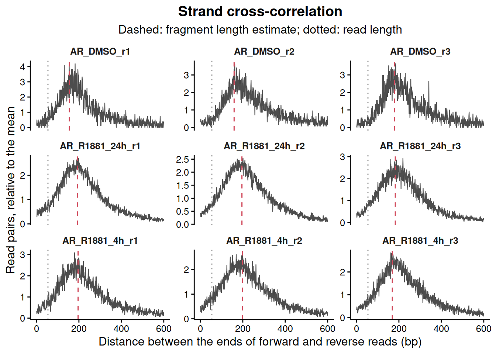

Five of the six treated libraries land within 15 bp of their median
insert size. The DMSO ones come out 27 to 48 bp shorter, and the plot
says why: with thirteen peaks in the window there are few fragments
piled anywhere, and the cross-correlation is mostly background. The
estimate needs enrichment to work on, which is why `"auto"` in
[`countReads()`](https://sebastian-gregoricchio.github.io/RegionSetDE/reference/countReads.md)
reads the regions being counted rather than the whole genome. A second,
narrow peak sits at the read length on most libraries; it comes from the
parts of the genome where reads cannot be mapped on either strand, and
the search starts past it.

The lengths used end up in the `fragment.length` column of the sample
table, `NA` for the paired-end samples, and
[`countBackground()`](https://sebastian-gregoricchio.github.io/RegionSetDE/reference/countBackground.md)
and
[`countGreenlist()`](https://sebastian-gregoricchio.github.io/RegionSetDE/reference/countGreenlist.md)
reuse them sample by sample.

  

------------------------------------------------------------------------

## **Artefact regions**

Some stretches of the genome collect reads in every experiment whatever
the antibody: satellites, collapsed repeats, the ends of chromosomes,
regions whose copy number the cell line has multiplied. A peak called
there is real in the sense that the reads are there, and meaningless in
every other sense. Two kinds of list take them out.

  

### Blacklist

A blacklist is a fixed list per assembly, the same for every experiment.
The ENCODE lists for the common assemblies are installed with the
package, together with the exclusion set of T2T-CHM13 and the CUT&RUN
and CUT&Tag lists of de Mello *et al.*, so no download and no hub are
needed.

``` r
availableRegionLists(genome = "hg38")
>        type genome  assay  source version n.regions covered.bp
> 1 blacklist   hg38    any  ENCODE      v2       636  227162400
> 2 blacklist   hg38 cutrun deMello      v1       832   10133493
> 3 blacklist   hg38 cuttag deMello      v1      2020    9183890
> 4 greenlist   hg38 cutrun deMello      v1       869    1725126
> 5 greenlist   hg38 cuttag deMello      v1      2767    3811775
>                                           reference
> 1  Amemiya, Kundaje and Boyle (2019) Sci Rep 9:9354
> 2 de Mello et al. (2024) Brief Bioinform 25:bbad538
> 3 de Mello et al. (2024) Brief Bioinform 25:bbad538
> 4 de Mello et al. (2024) Brief Bioinform 25:bbad538
> 5 de Mello et al. (2024) Brief Bioinform 25:bbad538
```

``` r
blacklist <- loadBlacklist("hg38", seqlevelsStyle = "Ensembl")
blacklist
> GRanges object with 636 ranges and 1 metadata column:
>         seqnames            ranges strand |               name
>            <Rle>         <IRanges>  <Rle> |        <character>
>     [1]       10           1-45700      * |    Low Mappability
>     [2]       10 38481301-38596500      * | High Signal Region
>     [3]       10 38782601-38967900      * | High Signal Region
>     [4]       10 39901301-41712900      * | High Signal Region
>     [5]       10 41838901-42107300      * | High Signal Region
>     ...      ...               ...    ... .                ...
>   [632]        Y   4343801-4345800      * | High Signal Region
>   [633]        Y 10246201-11041200      * | High Signal Region
>   [634]        Y 11072101-11335300      * | High Signal Region
>   [635]        Y 11486601-11757800      * | High Signal Region
>   [636]        Y 26637301-57227400      * | High Signal Region
>   -------
>   seqinfo: 24 sequences from hg38 genome; no seqlengths
```

`seqlevelsStyle = "Ensembl"` names the chromosomes the way the peaks and
the alignments do. The package would reconcile the two styles on its own
when the list is applied, but loading it in the right style from the
start keeps what you look at identical to what gets used.

  

### Greylist

A greylist is specific to one experiment. It comes from the input
library, and flags the places where the input carries far more fragments
than the rest of its own genome leads to expect: amplifications of the
cell line, repeats the assembly collapsed, regions that stick to any
immunoprecipitation. Those are artefacts of this sample rather than of
the assembly, so no fixed list catches them.
[`makeGreylist()`](https://sebastian-gregoricchio.github.io/RegionSetDE/reference/makeGreylist.md)
follows GreyListChIP, the procedure *DiffBind* uses: the genome is cut
into overlapping windows, a negative binomial is fitted to the counts of
the input, and the windows above its 99th percentile are flagged and
merged.

``` r
greylist <- makeGreylist(sampleSheet)

S4Vectors::metadata(greylist)$thresholds
>   input
> 1 input
>                                                                               file
> 1 /tmp/RtmpN5DVVW/temp_libpath2f26716997ab3a/RegionSetDE/extdata/lncapAR/input.bam
>   fragments       mean      size threshold windows flagged.windows regions
> 1      5353 0.09351198 0.1836287         2  114488             362     161
>   greylisted.bp
> 1       1054720
```

This is where the example earns its place. The input shipped here is a
subsampled slice, about five thousand fragments spread over 12 Mb, so a
1 kb window holds 0.09 fragments on average and the threshold the fit
arrives at is **2**. Any window with two fragments is flagged, and about
9 % of the region is thrown out, including several genuine AR sites. The
greylist is estimated from the depth of the input, and an input this
shallow has no depth to estimate it from. The `thresholds` table is the
place to catch it, and the fix is a window wide enough to hold a few
fragments each.

``` r
greylist <- makeGreylist(sampleSheet, binSize = 10000)

S4Vectors::metadata(greylist)$thresholds %>%
  dplyr::select(input, fragments, mean, threshold, regions, greylisted.bp)
>   input fragments      mean threshold regions greylisted.bp
> 1 input      5353 0.9131696        15       2         25000
```

On a complete input library the default windows are the right choice.
What transfers from this example is the habit: look at the threshold
before trusting the list.

  

### Taking them out

The two lists go in separately, before the consensus is built, through
the `blacklist` and `greylist` arguments of
[`loadConsensusPeaks()`](https://sebastian-gregoricchio.github.io/RegionSetDE/reference/loadConsensusPeaks.md)
below. Removing the peaks first is better than removing the consensus
regions afterwards: an artefact next to a genuine peak would otherwise
be merged with it into one region, and the region would then be either
kept with the artefact inside or thrown away with the peak.

They are kept apart because they say different things, the blacklist
about the assembly and the greylist about the inputs of this experiment,
and the object records them the same way
[`applyBlacklist()`](https://sebastian-gregoricchio.github.io/RegionSetDE/reference/applyBlacklist.md)
and
[`applyGreylist()`](https://sebastian-gregoricchio.github.io/RegionSetDE/reference/applyGreylist.md)
would: the blacklist in its `blacklist` slot and the greylist in its
`greylist` slot, which follow the regions into the counts and the
results, and the peaks each of them removed from every sample in the
filtering log.
[`countReads()`](https://sebastian-gregoricchio.github.io/RegionSetDE/reference/countReads.md)
reads the two slots to leave the reads lying on the lists out of the
library sizes. Once the regions are built,
[`applyBlacklist()`](https://sebastian-gregoricchio.github.io/RegionSetDE/reference/applyBlacklist.md),
[`applyWhitelist()`](https://sebastian-gregoricchio.github.io/RegionSetDE/reference/applyWhitelist.md)
and
[`applyGreylist()`](https://sebastian-gregoricchio.github.io/RegionSetDE/reference/applyGreylist.md)
do the same job on the region set itself.

  

------------------------------------------------------------------------

## **From peak calls to a consensus**

[`loadConsensusPeaks()`](https://sebastian-gregoricchio.github.io/RegionSetDE/reference/loadConsensusPeaks.md)
reads the peak files, removes the peaks in the artefact regions, builds
a consensus inside every group, and pools the groups into one region
set.

``` r
consensus <- loadConsensusPeaks(sampleSheet,
                                groupBy = "condition",
                                blacklist = blacklist,
                                greylist = greylist,
                                seqlevelsStyle = "Ensembl",
                                nThreads = 1)

consensus
> ### RegionSetDE object ###
> Genome assembly:   not declared
> Chromosome style:  Ensembl
> Region sets:       1
> 
>   consensus  109 regions  (54,721 bp)
> 
> Blacklist:  applied (636 regions)
> Greylist:   applied (2 regions)
> Whitelist:  not applied
> 
> Filtering steps: blacklist, greylist
> (see the 'filtering.log' slot for the details)
> 
> Consensus:  9 samples in 3 groups (consensus mode), 109 regions in the total consensus
> (see consensusData() for the details)
```

In this window neither list touches a peak, which is what one hopes; the
`n.blacklist` and `n.greylist` columns below say so for every sample,
and
[`filteringLog()`](https://sebastian-gregoricchio.github.io/RegionSetDE/reference/filteringLog.md)
gives the same numbers as a record of the steps, one row per sample and
list:

``` r
filteringLog(consensus) %>% head(3)
>        step       region.set n.before n.after n.removed
> 1 blacklist AR_DMSO_r1 peaks       13      13         0
> 2 blacklist AR_DMSO_r2 peaks       13      13         0
> 3 blacklist AR_DMSO_r3 peaks       13      13         0
```

`consensusData(consensus)$removed` holds the peaks taken out, with the
sample they came from and the list that removed them, empty here. On a
whole genome the blacklist alone typically takes a few per cent of the
peaks of a transcription factor; the greylist built with the default 1
kb windows [above](#artefacts) would have taken 61 peak calls across the
nine samples, genuine AR sites among them, which is the kind of loss
this table is there to catch.

`groupBy` names the column that decides which samples have to agree with
each other. Choosing it is the one decision that matters here: a
consensus built over all nine samples at once would demand agreement
between conditions that are not supposed to agree, and a site bound only
after treatment would be thrown away before the test ever saw it.
Grouping by condition asks for reproducibility between replicates and
nothing more, and the union of the groups is what gets counted.

  

### The rule a peak has to pass

The consensus inside each group is built by
[*consensusRegions*](https://github.com/sebastian-gregoricchio/consensusRegions),
and it is not a plain overlap count. Every peak is first placed in one
of three classes by its p-value: stringent below `stringencyThreshold`
(1e-8), weak up to `weakThreshold` (1e-4), background above it. A peak
then needs overlapping peaks in enough of the other replicates, and the
evidence of all of them, combined by Stouffer’s method, has to clear a
threshold. Two consequences follow. A weak peak can be rescued by strong
support in the other replicates, which a plain intersection would lose;
and a peak present in two replicates out of three can still be dropped
when the evidence in both is poor.

How many replicates must hold the peak is `minReplicates`, which counts
the replicate the peak came from. The default asks for one supporting
replicate, so **two out of three** here. It takes a count, a proportion
or a percentage:

``` r
strictConsensus <- loadConsensusPeaks(sampleSheet,
                                      groupBy = "condition",
                                      blacklist = blacklist,
                                      greylist = greylist,
                                      seqlevelsStyle = "Ensembl",
                                      minReplicates = 3,
                                      nThreads = 1,
                                      verbose = FALSE)

data.frame(group = names(consensusData(consensus)$groups),
           twoOfThree = lengths(consensusData(consensus)$groups),
           threeOfThree = lengths(consensusData(strictConsensus)$groups))
>               group twoOfThree threeOfThree
> DMSO           DMSO         12            9
> R1881_4h   R1881_4h         70           53
> R1881_24h R1881_24h        101           77
```

Asking for all three replicates drops about a quarter of the sites in
every group. `minReplicates = 0.66` or `"66%"` write the same thing as a
share, which is the more natural way to put it when the groups differ in
size. One replicate alone is refused: a peak nobody else confirms is not
a consensus. Any other argument of
[`consensusRegions::buildConsensus()`](https://rdrr.io/pkg/consensusRegions/man/buildConsensus.html)
is passed through the same way, for instance `stringencyThreshold`,
`combinationMethod`, `minOverlapFraction` or `mergeMethod`, and
[`?consensusRegions::buildConsensus`](https://rdrr.io/pkg/consensusRegions/man/buildConsensus.html)
describes them.

The rescue of weak peaks needs weak peaks to work with. The calls
shipped here were made at the MACS2 default of *q* \< 0.05, and 96 % of
them are already stringent, so moving the thresholds changes nothing on
this dataset. *consensusRegions* is designed for permissive input,
around *p* \< 1e-3, and on calls made that way the thresholds matter.

  

### Chromosome names

`seqlevelsStyle` is worth setting deliberately. The peak files here name
the chromosome `19`, the way Ensembl does, and so do the BAM files, so
`"Ensembl"` leaves everything alone. `NULL` does the same by keeping
whatever the files hold. Asking for `"UCSC"` renames the peaks and the
consensus to `chr19` together.

Mixing the two styles is the classic silent failure of this kind of
analysis: an overlap between `chr19` and `19` is not an error, it is
simply empty, so a blacklist removes nothing and an occupancy column
counts nobody. The package reconciles the styles at every junction
instead of trusting them to agree, and stops when it cannot. The names
are settled chromosome by chromosome, so files or ranges written half in
one style and half in the other are handled like uniform ones:

| Meeting | What happens |
|:---|:---|
| regions and BAM or bigWig files | the regions are converted to the style of the files for the counting; the object returned keeps its own |
| BAM or bigWig files naming the chromosomes differently | each file is read under its own names, those of the first file standing for all of them; BAM files giving different lengths to a chromosome are on different assemblies and are refused |
| samples and their inputs | the inputs are read under their own names, over the same rows |
| regions and a blacklist, whitelist or greylist | the list is converted to the names of the regions, whether the regions declare a style or not, and a list sharing no chromosome is refused |
| peaks and the consensus built from them | both follow `seqlevelsStyle` |
| greenlist and BAM files | the greenlist is converted to the style of the files |
| background bins and the counted regions | the bins follow the regions |
| `excludeChromosomes` | read in either style, with a warning when a name reaches no chromosome |
| regions and a count table read by [`loadCounts()`](https://sebastian-gregoricchio.github.io/RegionSetDE/reference/loadCounts.md) | the chromosomes of the table are read under the names of the regions |

Assemblies are checked separately and more strictly: a list built for
another genome is refused rather than overlapped, since rat chr1 and
human chr1 share a name and nothing else.

  

### What the object holds

``` r
consensusInfo <- consensusData(consensus)

consensusInfo$samples %>%
  dplyr::select(sample, group, n.peaks, n.blacklist, n.greylist)
>            sample     group n.peaks n.blacklist n.greylist
> 1      AR_DMSO_r1      DMSO      13           0          0
> 2      AR_DMSO_r2      DMSO      13           0          0
> 3      AR_DMSO_r3      DMSO      13           0          0
> 4  AR_R1881_4h_r1  R1881_4h      67           0          0
> 5  AR_R1881_4h_r2  R1881_4h      80           0          0
> 6  AR_R1881_4h_r3  R1881_4h      68           0          0
> 7 AR_R1881_24h_r1 R1881_24h     101           0          0
> 8 AR_R1881_24h_r2 R1881_24h     117           0          0
> 9 AR_R1881_24h_r3 R1881_24h      97           0          0
```

Thirteen peaks without ligand against roughly a hundred after a day of
it: the treatment is doing what a nuclear receptor agonist does, and the
experiment would be hard to interpret if it were not.

The per-group consensus and the peaks of each sample are kept as well,
so nothing has to be recomputed to look at where the groups agree.

``` r
lengths(consensusInfo$groups)           # the consensus of every group
>      DMSO  R1881_4h R1881_24h 
>        12        70       101
length(consensusInfo$total)             # the pooled region set that will be counted
> [1] 109
```

[`consensusGroupList()`](https://sebastian-gregoricchio.github.io/RegionSetDE/reference/consensusGroupList.md)
returns the consensus of every group as a named list of `GRanges`, the
form the functions of *ChIPseeker* take for several peak sets, so the
groups can be annotated one by one and compared.
`seqlevelsStyle = "UCSC"` renames the chromosomes to match a UCSC
`TxDb`, which would otherwise find no gene next to any region named
`19`:

``` r

groupList <- consensusGroupList(consensus, seqlevelsStyle = "UCSC")

annotationList <- lapply(groupList,
                         ChIPseeker::annotatePeak,
                         TxDb = TxDb.Hsapiens.UCSC.hg38.knownGene::TxDb.Hsapiens.UCSC.hg38.knownGene)

ChIPseeker::plotAnnoBar(annotationList)
```

Every region carries one logical column per group, plus the number of
groups and of samples that called a peak on it.

``` r
as.data.frame(S4Vectors::mcols(regionRanges(consensus)$consensus)) %>%
  dplyr::select(dplyr::starts_with("peak.")) %>%
  head(4)
>   peak.DMSO peak.R1881_4h peak.R1881_24h peak.groups peak.samples
> 1     FALSE          TRUE           TRUE           2            5
> 2     FALSE          TRUE          FALSE           1            2
> 3     FALSE          TRUE           TRUE           2            6
> 4     FALSE          TRUE           TRUE           2            5
```

[`plotPeakUpset()`](https://sebastian-gregoricchio.github.io/RegionSetDE/reference/plotPeakUpset.md)
shows how the groups overlap before any counting happens.

``` r

plotPeakUpset(consensus)
```

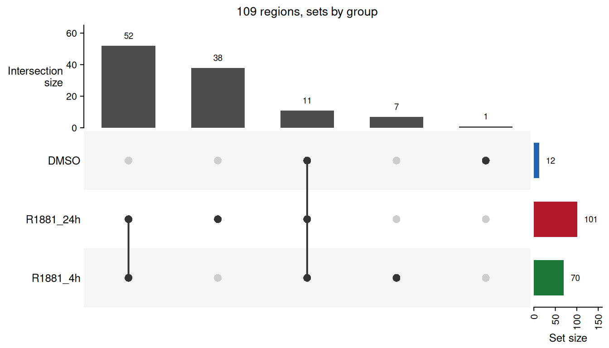

Most of the sites are shared by the two R1881 time points, and nearly
all of those found without ligand are found with it too. Only one region
is specific to DMSO.

  

### How similar the peak sets are

The UpSet plot counts regions by group.
[`plotSampleCorrelation()`](https://sebastian-gregoricchio.github.io/RegionSetDE/reference/plotSampleCorrelation.md)
with `method = "jaccard"` compares the samples themselves on where their
peaks were called, before any read is counted, the occupancy heatmap
*DiffBind* draws right after reading the peaks. The Jaccard index of two
samples is the number of places where both called a peak over the number
where either did, from zero for nothing in common to one for identical
peak sets, and the samples are clustered on one minus it.

``` r

plotSampleCorrelation(consensus,
                      method = "jaccard",
                      groupBy = "condition",
                      annotationColumns = c("condition", "replicate"))
```

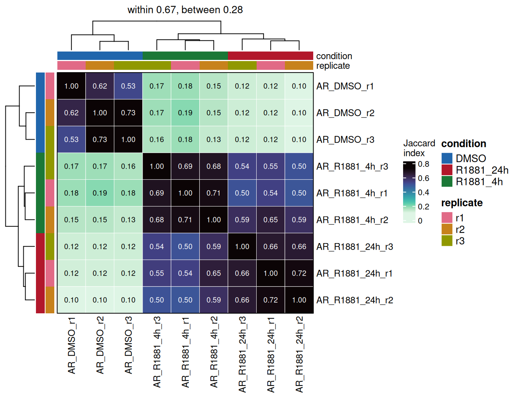

The places are the regions of the union of all the peaks, so a broad
peak and a narrow one on the same site count as a match.
`jaccardLevel = "basepair"` counts the bases covered instead, as
`bedtools jaccard` does, and then two samples calling the same sites
with different widths come out less similar.

The replicates of each condition share between half and three quarters
of their peaks, and the two time points of R1881 overlap almost as much,
0.50 to 0.65. DMSO stands apart from both, at 0.10 to 0.19, which is
mostly a matter of numbers: thirteen peaks against a hundred cannot
overlap much, even when, as here, nearly all of the thirteen are among
the hundred. A sample with far fewer peaks than its replicates looks
dissimilar to all of them for the same reason, and
`consensusData(consensus)$samples` gives the number of peaks to read the
index against.

  

------------------------------------------------------------------------

## **Counting**

[`countReads()`](https://sebastian-gregoricchio.github.io/RegionSetDE/reference/countReads.md)
counts fragments over the consensus. Given the sheet it finds the BAM
files itself, and takes the sample names and the metadata from the same
table.

``` r
counts <- countReads(consensus,
                     sampleSheet = sampleSheet)

counts
> class: RegionSetDE.counts 
> dim: 109 9 
> metadata(3): signal.type count.like discard.regions
> assays(2): counts input
> rownames(109): consensus|19:46089709-46090037
>   consensus|19:46182368-46182658 ... consensus|19:57823636-57824055
>   consensus|19:57840011-57840689
> rowData names(8): region.set region.id ... peak.groups peak.samples
> colnames(9): AR_DMSO_r1 AR_DMSO_r2 ... AR_R1881_24h_r2 AR_R1881_24h_r3
> colData names(14): sample bam.file ... discarded.reads
>   input.library.size
```

The sheet names an input for every sample, so the input is counted as
well, over the same regions and with the same filters, into an assay of
its own beside the counts. Each input file is read once, whatever the
number of samples pointing to it, and every sample gets the counts of
its own input in its column; a sample without input gets `NA`. Nothing
subtracts the input from the counts, which stay the reads of the sample
as the model needs them. The input is there to judge the enrichment of
the regions, and to check that a change between conditions does not show
in the input too, which would point to copy number rather than to
binding. `countInput = FALSE` leaves it out.

``` r
countTable(counts, input = TRUE, format = "matrix")[1:3, 1:3]
>                                AR_DMSO_r1 AR_DMSO_r2 AR_DMSO_r3
> consensus|19:46089709-46090037          0          0          0
> consensus|19:46182368-46182658          0          0          0
> consensus|19:46300807-46301375          1          1          1
```

Duplicates are dropped and reads below `MAPQ` 20 are ignored, both of
which can be changed through `removeDuplicates` and `minMapq`.
`excludeChromosomes` leaves chromosomes out of the library sizes, the
mitochondrial genome in ATAC-seq above all, and accepts the names in
either style. The files are read one after the other here, the slices
being small; on whole-genome BAMs `nThreads` spreads them over several
workers.

  

Every region is counted whole here, one row per region, which is the
right choice for a transcription factor whose peaks are a few hundred
base pairs wide and change as a block. Counting in tiles, and recentring
the regions on the summits as *DiffBind* does, are the two alternatives,
and [their own section](#tiles) says when each is worth it.

  

### The count table

[`countTable()`](https://sebastian-gregoricchio.github.io/RegionSetDE/reference/countTable.md)
pulls the values out of any counts, fit or results object, raw or
normalised, in three shapes.

``` r
countTable(counts) %>%
  head(3)
>                                region.set            region.id seqnames
> consensus|19:46089709-46090037  consensus 19:46089709-46090037       19
> consensus|19:46182368-46182658  consensus 19:46182368-46182658       19
> consensus|19:46300807-46301375  consensus 19:46300807-46301375       19
>                                   start      end width peak.DMSO peak.R1881_4h
> consensus|19:46089709-46090037 46089709 46090037   329     FALSE          TRUE
> consensus|19:46182368-46182658 46182368 46182658   291     FALSE          TRUE
> consensus|19:46300807-46301375 46300807 46301375   569     FALSE          TRUE
>                                peak.R1881_24h peak.groups peak.samples
> consensus|19:46089709-46090037           TRUE           2            5
> consensus|19:46182368-46182658          FALSE           1            2
> consensus|19:46300807-46301375           TRUE           2            6
>                                AR_DMSO_r1 AR_DMSO_r2 AR_DMSO_r3 AR_R1881_4h_r1
> consensus|19:46089709-46090037          0          0          0              1
> consensus|19:46182368-46182658          0          0          0              2
> consensus|19:46300807-46301375          0          1          0              2
>                                AR_R1881_4h_r2 AR_R1881_4h_r3 AR_R1881_24h_r1
> consensus|19:46089709-46090037              4              2               0
> consensus|19:46182368-46182658              3              1               1
> consensus|19:46300807-46301375              6              7              13
>                                AR_R1881_24h_r2 AR_R1881_24h_r3
> consensus|19:46089709-46090037               3               3
> consensus|19:46182368-46182658               1               2
> consensus|19:46300807-46301375              20              21
```

The wide format gives the coordinates, the occupancy of every region,
and one column per sample. `format = "matrix"` keeps the values only,
with the regions as row names, which is what `ComplexHeatmap` or any
other tool expects:

``` r
countTable(counts, format = "matrix")[1:3, 1:4]
>                                AR_DMSO_r1 AR_DMSO_r2 AR_DMSO_r3 AR_R1881_4h_r1
> consensus|19:46089709-46090037          0          0          0              1
> consensus|19:46182368-46182658          0          0          0              2
> consensus|19:46300807-46301375          0          1          0              2
```

`format = "long"` gives one row per region and sample with the sample
annotation attached, ready for `ggplot2`:

``` r
countTable(counts, format = "long") %>%
  dplyr::select(region.id, sample, condition, counts) %>%
  head(4)
>              region.id     sample condition counts
> 1 19:46089709-46090037 AR_DMSO_r1      DMSO      0
> 2 19:46182368-46182658 AR_DMSO_r1      DMSO      0
> 3 19:46300807-46301375 AR_DMSO_r1      DMSO      0
> 4 19:46313848-46314455 AR_DMSO_r1      DMSO      2
```

On a tiled object `level` chooses between one row per tile and the tiles
summed back into their regions. The same function returns the normalised
values, once the normalisation has been run,
[below](#normalised_counts).

  

### Library summary

[`libInfo()`](https://sebastian-gregoricchio.github.io/RegionSetDE/reference/libInfo.md)
puts the reads of every file next to the ones in the regions.

``` r
libInfo(counts, annotationColumns = "condition")
>            sample condition paired.end fragment.length bam.reads bam.mapped
> 1      AR_DMSO_r1      DMSO       TRUE              NA      7913       7913
> 2      AR_DMSO_r2      DMSO       TRUE              NA     12038      12038
> 3      AR_DMSO_r3      DMSO       TRUE              NA      9185       9185
> 4  AR_R1881_4h_r1  R1881_4h       TRUE              NA      7836       7836
> 5  AR_R1881_4h_r2  R1881_4h       TRUE              NA     11205      11205
> 6  AR_R1881_4h_r3  R1881_4h       TRUE              NA     12693      12693
> 7 AR_R1881_24h_r1 R1881_24h       TRUE              NA     14080      14080
> 8 AR_R1881_24h_r2 R1881_24h       TRUE              NA     10793      10793
> 9 AR_R1881_24h_r3 R1881_24h       TRUE              NA     10332      10332
>   library.size discarded.reads reads.in.regions   FRiP input.id
> 1         3570              18              147 0.0412    input
> 2         5443              26              187 0.0344    input
> 3         4158              25              150 0.0361    input
> 4         3562              20              605 0.1698    input
> 5         5096              25              931 0.1827    input
> 6         5779              27              751 0.1300    input
> 7         6295              31             1149 0.1825    input
> 8         4871              18             1197 0.2457    input
> 9         4623              28              872 0.1886    input
>   input.library.size input.in.regions input.FRiP
> 1               5306               38     0.0072
> 2               5306               38     0.0072
> 3               5306               38     0.0072
> 4               5306               38     0.0072
> 5               5306               38     0.0072
> 6               5306               38     0.0072
> 7               5306               38     0.0072
> 8               5306               38     0.0072
> 9               5306               38     0.0072
```

The columns measure different things and are not expected to agree.
`bam.reads` and `bam.mapped` come from the index of each file, so they
cost nothing to read, and they count alignment records: a paired-end
fragment is two of them. `library.size` is the number of fragments that
went through the filters of the counting, each fragment once, which on
paired-end data makes it about half of `bam.mapped`, less the duplicates
and the reads of low mapping quality. `reads.in.regions` counts the
fragments falling in the consensus, and the FRiP is its share of
`library.size`.

Three to four per cent of the fragments fall in the consensus without
ligand, against thirteen to twenty-five per cent after it. This is the
enrichment the experiment produced, and holding on to it through the
normalisation is the whole difficulty of the next section.

The input columns give the same numbers for the input of each sample.
The input puts 0.7 % of its fragments in the consensus, which is what
the regions collect with no enrichment at all, so even the samples
without ligand are about five times enriched over it, and the treated
ones eighteen to thirty-five times. A sample whose FRiP sits close to
the one of its input carries little signal in the regions, however deep
it was sequenced. `fragment.length` is empty here because every library
is paired-end.

  

### Background bins

[`countBackground()`](https://sebastian-gregoricchio.github.io/RegionSetDE/reference/countBackground.md)
counts the same libraries over wide bins covering everything, and stores
the result inside the counts object. It is needed for background
normalisation and for the diagnostics that compare one normalisation
against another.

``` r

counts <- countBackground(counts, binSize = 10000)
```

  

------------------------------------------------------------------------

## **Normalisation**

This is the section that matters for this dataset.

The methods that come from RNA-seq, TMM, RLE and upper quartile, rest on
one assumption: most features do not change, so the middle of the
distribution of ratios between two samples is the technical difference
between them and can be divided out. Across a transcriptome that usually
holds. Here it does not. The ligand brings the receptor to chromatin,
the number of bound sites goes up several fold, and most regions really
did change in the same direction. Handing that distribution to TMM means
telling it that the biology is a loading artefact.

[`plotNormComparison()`](https://sebastian-gregoricchio.github.io/RegionSetDE/reference/plotNormComparison.md)
puts the methods side by side before any of them is committed to.

``` r

plotNormComparison(counts,
                   methods = c("librarySize", "background", "TMM", "readsInRegions"))
```

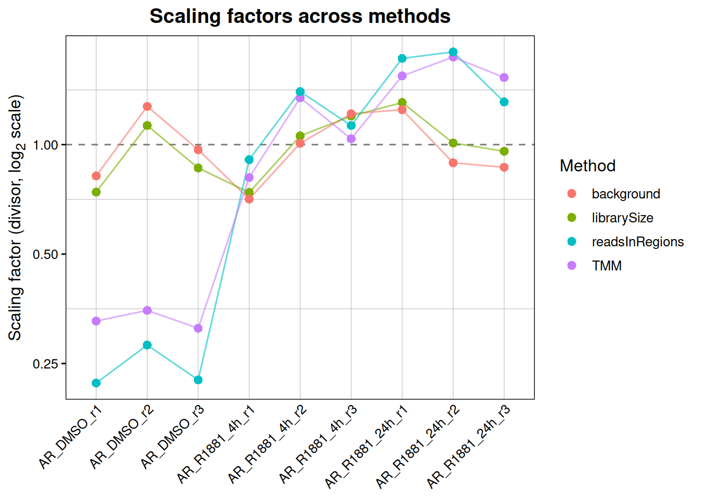

The consequence is easiest to see by running the same test several times
and changing nothing but the normalisation.

``` r
normalisationEffect <-
  lapply(c("librarySize", "background", "TMM", "RLE", "readsInRegions"),
         function(method) {
           normalised <- normalizeCounts(counts, method = method, verbose = FALSE)
           fitted <- fitRegions(normalised, design = ~ condition, engine = "edgeR", verbose = FALSE)
           tested <- resultsTable(testRegions(fitted,
                                              contrast = c("condition", "R1881_24h", "DMSO"),
                                              verbose = FALSE))

           data.frame(method = method,
                      up = sum(tested$diff.status == "up"),
                      down = sum(tested$diff.status == "down"),
                      median.log2FC = round(median(tested$log2FC), 2))
         })

dplyr::bind_rows(normalisationEffect)
>           method up down median.log2FC
> 1    librarySize 78    2          2.55
> 2     background 86    2          2.81
> 3            TMM  8    3          0.77
> 4            RLE  8    4          0.60
> 5 readsInRegions  3    5          0.34
```

Same counts, same design, same engine. Library size and background
normalisation find the androgen response. TMM and RLE remove most of it.
`readsInRegions`, which scales every library by the reads falling inside
the consensus, removes it entirely and turns it upside down: that is the
scheme that starts by declaring the total signal in the peaks to be
equal in every sample, which is precisely the quantity this experiment
changed.

The rule this dataset illustrates is worth stating plainly. **If the
treatment is expected to change the global amount of binding, the
normalisation must not be computed from the bound regions.** What is
comparable between the samples is the background, so that is where the
factors should come from. When there is no reason to expect a global
change, the RNA-seq methods are fine and often better, because they are
less sensitive to differences in signal-to-noise between libraries. The
point is not that TMM is bad; it is that the assumption behind it is a
statement about the experiment, and it should be checked rather than
inherited from a default.

  

### Greenlist normalisation

This dataset is ChIP-seq and is normalised on its background below. The
greenlist is for the case where that is not possible, and the code of
this section is shown, not run.

**What a greenlist is.** A set of genomic bins whose background is
consistent across CUT&RUN or CUT&Tag experiments, whatever the antibody:
regions of steady, low noise, kept at least 5 kb away from genes so that
no target is expected to bind there. Since the reads over them do not
depend on the target, the differences between samples over them are
technical, which makes them a reference built into every library. The
lists come from de Mello *et al.* ([*Briefings in Bioinformatics*
**25**, bbad538, 2024](https://doi.org/10.1093/bib/bbad538)), who picked
the bins by their Shannon entropy across hundreds of public libraries.

**When to use it.** CUT&RUN and CUT&Tag without a spike-in, or with a
spike-in that cannot be trusted. Those assays have almost no background,
so the wide bins `"background"` normalisation is estimated from hold
only a handful of reads, and the region-based methods, TMM or RLE, carry
the same assumption that fails in the example above: no global change.
The greenlist sits away from the regions of interest and keeps its noise
whatever the treatment does to the target, so it holds up when the
target changes globally. It is not meant for ChIP-seq, where the
background is abundant and does the same job with far more reads behind
it.

**How.** Three steps: load the list for the assembly and the assay,
count the libraries over it with the same filters as the regions, and
normalise.

``` r

greenlist <- loadGreenlist("hg38", assay = "cuttag")

counts <- countGreenlist(counts, greenlist = greenlist)
counts <- normalizeCounts(counts, method = "greenlist")
```

Lists are installed for hg38 CUT&RUN and CUT&Tag and for mm39 CUT&RUN,
and `availableRegionLists(type = "greenlist")` prints them.
[`countGreenlist()`](https://sebastian-gregoricchio.github.io/RegionSetDE/reference/countGreenlist.md)
stores its counts inside the object, where
[`normalizeCounts()`](https://sebastian-gregoricchio.github.io/RegionSetDE/reference/normalizeCounts.md)
finds them. The fragments are counted once each, at their centre, which
is how the paper counted them with `multiBamSummary --centerReads`. By
default the factors are the median of ratios, the size factor DESeq2
computes and the one the greenlist paper used;
`greenlistEstimator = "TMM"` or `"sum"` change that. Counts collected
with another tool go in through `greenlistCounts`, as a total per sample
or a matrix.

[`countGreenlist()`](https://sebastian-gregoricchio.github.io/RegionSetDE/reference/countGreenlist.md)
holds the libraries to the conditions the lists were built under. The
greenlist regions were kept at least 5 kb from genes so that no target
binds there, and a greenlist region that one of the regions of the study
falls on says the target does bind there in these cells: those are left
out, and how many were is reported, unless `excludeCounted = FALSE`. A
library below the depth the authors required of a library to enter the
construction of the list, 1.5 million reads for human CUT&RUN, 1 million
for mouse CUT&RUN and 500,000 for human CUT&Tag, raises a warning, and
so does a library reaching fewer than half as many greenlist regions as
the median one.
[`normalizeCounts()`](https://sebastian-gregoricchio.github.io/RegionSetDE/reference/normalizeCounts.md)
then says how many regions carry reads in every sample, which is what
the median of ratios rests on, as it does in DESeq2. The paper sets no
rule per group of samples; the number of regions shared by every library
is the one that decides how steady the factors are.

What each library holds over the list is kept beside the counts:

``` r

SummarizedExperiment::colData(S4Vectors::metadata(counts)$greenlist)
```

`totals` is the number of fragments on the list, `regions.covered` the
regions holding at least one of them, and `library.fraction` their share
of the library. The factor of a library is only as steady as the number
of fragments behind it. A library holding a handful, which happens on
shallow libraries or with a list built for another assay, gets a factor
that is mostly noise, and one holding none gets no factor at all.

  

### Factors from elsewhere

When the factors come from outside the data, a spike-in counted with
another pipeline, deepTools, or a previous analysis, `method = "manual"`
takes them as they are. `factorType` says how they apply: `"division"`
for size factors the counts are divided by, as DESeq2 writes them,
`"multiplication"` for scale factors the counts are multiplied by, as
deepTools and most spike-in protocols write them. Named factors are
matched to the samples by name and may cover samples absent from the
object.

``` r
backgroundCounts <- normalizeCounts(counts, method = "background", verbose = FALSE)

backgroundFactors <- setNames(sampleInfo(backgroundCounts)$scaling.factor,
                              colnames(backgroundCounts))
round(backgroundFactors, 2)
>      AR_DMSO_r1      AR_DMSO_r2      AR_DMSO_r3  AR_R1881_4h_r1  AR_R1881_4h_r2 
>            0.82            1.27            0.97            0.71            1.01 
>  AR_R1881_4h_r3 AR_R1881_24h_r1 AR_R1881_24h_r2 AR_R1881_24h_r3 
>            1.22            1.25            0.89            0.87

manualCounts <- normalizeCounts(counts,
                                method = "manual",
                                scalingFactors = backgroundFactors,
                                factorType = "division",
                                verbose = FALSE)

all.equal(countTable(manualCounts, normalized = TRUE, format = "matrix"),
          countTable(backgroundCounts, normalized = TRUE, format = "matrix"))
> [1] TRUE
```

The factors of the background normalisation, handed back by hand, give
the same normalised values. Getting `factorType` backwards inverts every
factor, which on a spike-in experiment turns the largest global change
into the smallest; the direction the source writes its factors in is
worth checking before anything else.

When the spike-in was aligned separately, `method = "spikeIn"` takes the
number of reads each sample put on the exogenous genome, through
`spikeInCounts`, and turns them into factors itself.

  

### The choice for this dataset

``` r

counts <- normalizeCounts(counts, method = "background")
```

  

### Normalised counts

The factors are stored in the sample table of the object, and the
normalised values next to the raw ones.
[`sampleInfo()`](https://sebastian-gregoricchio.github.io/RegionSetDE/reference/sampleInfo.md)
returns the sample table, the annotation of the sheet together with what
the package added to it, from a counts object, a fit or the results
alike; `columns` keeps only the ones named.

``` r
sampleInfo(counts, columns = c("sample", "condition", "library.size", "scaling.factor"))
>            sample condition library.size scaling.factor
> 1      AR_DMSO_r1      DMSO         3570      0.8202212
> 2      AR_DMSO_r2      DMSO         5443      1.2742403
> 3      AR_DMSO_r3      DMSO         4158      0.9680969
> 4  AR_R1881_4h_r1  R1881_4h         3562      0.7082455
> 5  AR_R1881_4h_r2  R1881_4h         5096      1.0084424
> 6  AR_R1881_4h_r3  R1881_4h         5779      1.2155428
> 7 AR_R1881_24h_r1 R1881_24h         6295      1.2480119
> 8 AR_R1881_24h_r2 R1881_24h         4871      0.8910149
> 9 AR_R1881_24h_r3 R1881_24h         4623      0.8661840
```

[`countTable()`](https://sebastian-gregoricchio.github.io/RegionSetDE/reference/countTable.md)
returns the normalised values with `normalized = TRUE`, in any of its
three formats.

``` r
countTable(counts, normalized = TRUE) %>%
  head(3)
>                                region.set            region.id seqnames
> consensus|19:46089709-46090037  consensus 19:46089709-46090037       19
> consensus|19:46182368-46182658  consensus 19:46182368-46182658       19
> consensus|19:46300807-46301375  consensus 19:46300807-46301375       19
>                                   start      end width peak.DMSO peak.R1881_4h
> consensus|19:46089709-46090037 46089709 46090037   329     FALSE          TRUE
> consensus|19:46182368-46182658 46182368 46182658   291     FALSE          TRUE
> consensus|19:46300807-46301375 46300807 46301375   569     FALSE          TRUE
>                                peak.R1881_24h peak.groups peak.samples
> consensus|19:46089709-46090037           TRUE           2            5
> consensus|19:46182368-46182658          FALSE           1            2
> consensus|19:46300807-46301375           TRUE           2            6
>                                AR_DMSO_r1 AR_DMSO_r2 AR_DMSO_r3 AR_R1881_4h_r1
> consensus|19:46089709-46090037          0  0.0000000          0       1.411940
> consensus|19:46182368-46182658          0  0.0000000          0       2.823879
> consensus|19:46300807-46301375          0  0.7847813          0       2.823879
>                                AR_R1881_4h_r2 AR_R1881_4h_r3 AR_R1881_24h_r1
> consensus|19:46089709-46090037       3.966513      1.6453554       0.0000000
> consensus|19:46182368-46182658       2.974885      0.8226777       0.8012744
> consensus|19:46300807-46301375       5.949770      5.7587440      10.4165671
>                                AR_R1881_24h_r2 AR_R1881_24h_r3
> consensus|19:46089709-46090037        3.366947        3.463467
> consensus|19:46182368-46182658        1.122316        2.308978
> consensus|19:46300807-46301375       22.446314       24.244272
```

A normalised value is the raw count divided by the scaling factor of its
sample, so it stays on the scale of counts rather than of counts per
million. `format = "matrix"` gives the values alone, for a heatmap or
any other tool, and `format = "long"` puts them in a `norm.counts`
column next to the sample annotation. The fit and the results carry the
same object, so `countTable(fit, normalized = TRUE)` and
`countTable(results$R1881_24h_vs_DMSO, normalized = TRUE)` return the
same values later on; the second needs the results to have been built
with `carryCounts = TRUE`, which is the default.

What is used for the test is not this table. The model is fitted on the
raw counts with the factors as offsets, which keeps the count nature of
the data that the negative binomial relies on. The normalised table is
for looking at, plotting and exporting.

  

------------------------------------------------------------------------

## **Quality control**

Two questions, asked once the normalisation is in place: do the
replicates look like each other, and does the structure of the data
match the design. They come after the normalisation because an
ordination reads distances between samples, and a factor per sample
moves every one of those distances; a PCA on raw counts shows the depth
of each library as much as its biology. Both functions use the
normalised values by default, and `useOffsets = FALSE` switches to the
raw ones for comparison.

``` r

plotRegionPCA(counts, colourBy = "condition", shapeBy = "time")
```

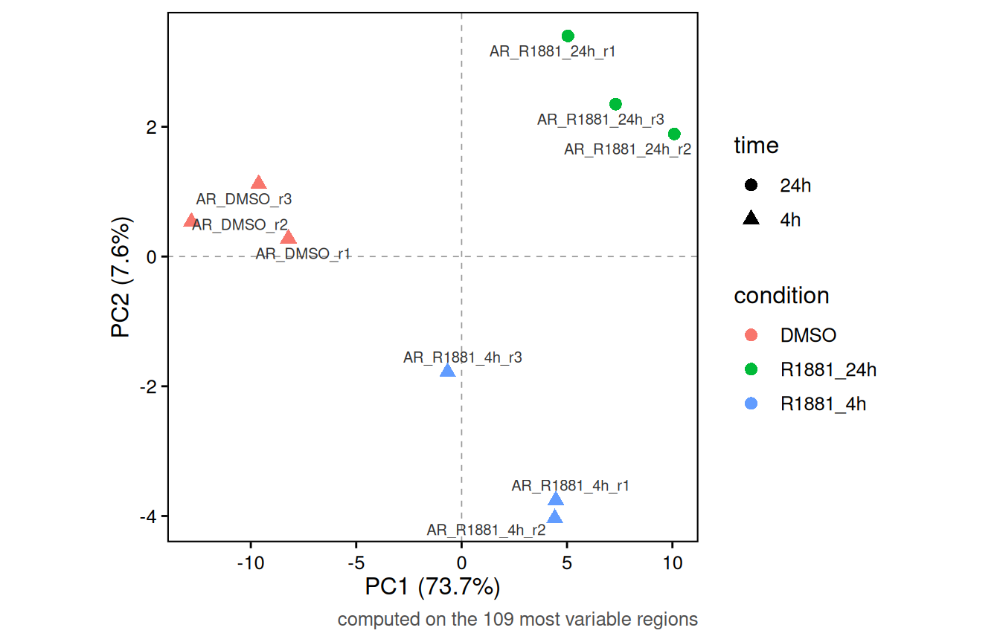

The first component carries most of the variance and separates treated
from untreated; the second separates the two durations. Replicates sit
together. A component that lines up with the batch instead, or a
replicate landing in the wrong group, is worth knowing about before it
turns into a dispersion estimate.

`samples` restricts either figure to some of the libraries, by name, by
position or with a logical vector, which is how a difference hidden
behind the largest one is brought out. The normalisation of the whole
analysis is kept, so the values are the ones the model sees.

``` r

plotRegionPCA(counts,
              samples = sampleInfo(counts)$treatment == "R1881",
              colourBy = "condition")
```

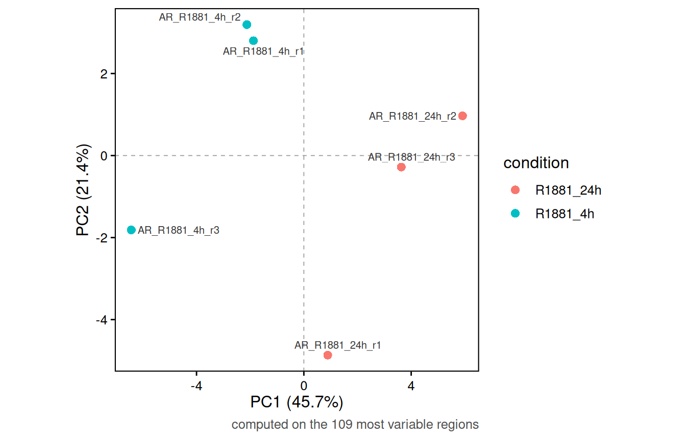

Without DMSO the two durations separate along the first component, which
now carries 45 % of the variance, with one replicate of four hours
further out than the others.

``` r

plotSampleCorrelation(counts,
                      annotationColumns = c("condition", "replicate"),
                      method = "spearman")
```

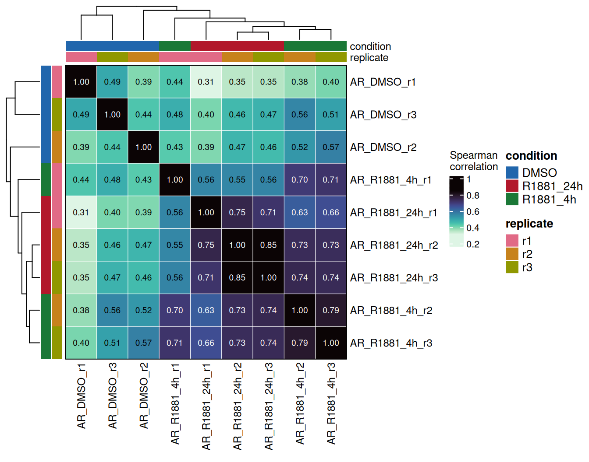

Any column of the sheet can annotate the heatmap, and the dendrogram is
built on one minus the correlation. Rank correlations barely move with
the normalisation, since a single factor per sample cannot change the
order of the regions within it; the PCA is the one that needs it.

  

------------------------------------------------------------------------

## **Differential binding**

The design is an ordinary formula over the columns of the sheet.

``` r

fit <- fitRegions(counts, design = ~ condition, engine = "edgeR")
```

`engine` takes `"edgeR"`, `"DESeq2"` or `"limma"`. The scaling factors
computed above enter the fit as offsets, so the model sees the raw
counts with the normalisation applied where it belongs rather than a
matrix of adjusted values.

  

### One contrast

A single comparison is written as a vector of three strings: the column
of the sample table, the group of interest, and the group it is compared
against.

``` r
resultsEarly <- testRegions(fit,
                            contrast = c("condition", "R1881_4h", "DMSO"),
                            FDR = 0.05,
                            log2FC = 1)

resultsEarly
> An object of class 'RegionSetDE.results'
>   contrast        : condition: R1881_4h vs DMSO 
>   engine          : edgeR 
>   regions         : 109 
>   counts carried  : 9 samples
>   thresholds      : FDR < 0.05 | |log2FC| > 1 
>   changing regions:
>     consensus: 57 up, 0 down
```

The fold changes read as the second element over the third, so a
positive `log2FC` means more signal after four hours of R1881 than in
DMSO; swapping the two groups flips every sign and changes nothing else.
The groups are written as they appear in the column, and the design does
not need to have been set up with either of them as the reference.

  

### Every contrast at once

Three conditions give three pairwise comparisons, and they come from the
same fit.
[`pairwiseContrasts()`](https://sebastian-gregoricchio.github.io/RegionSetDE/reference/pairwiseContrasts.md)
writes them out from a column of the sample table.

``` r
contrasts <- pairwiseContrasts(fit, column = "condition")
contrasts
> $R1881_4h_vs_DMSO
> [1] "condition" "R1881_4h"  "DMSO"     
> 
> $R1881_24h_vs_DMSO
> [1] "condition" "R1881_24h" "DMSO"     
> 
> $R1881_24h_vs_R1881_4h
> [1] "condition" "R1881_24h" "R1881_4h"
```

Each level is compared against the ones before it, in the order they
appear in the sheet, so DMSO is the reference whenever it is involved
and the fold changes read as gains under treatment. `levels` changes the
order, and `reference = "DMSO"` would write only the two comparisons
against the vehicle. A named list of contrasts runs all of them in one
call:

``` r
results <- testRegions(fit,
                       contrast = contrasts,
                       FDR = 0.05,
                       log2FC = 1,
                       carryCounts = TRUE)

results
> An object of class 'RegionSetDE.resultsList'
>   contrasts       : 3 
> 
>                   name                         contrast n.regions up down
>       R1881_4h_vs_DMSO      condition: R1881_4h vs DMSO       109 57    0
>      R1881_24h_vs_DMSO     condition: R1881_24h vs DMSO       109 86    2
>  R1881_24h_vs_R1881_4h condition: R1881_24h vs R1881_4h       109  7    1
```

`FDR` and `log2FC` set the cut-offs a region has to pass to be labelled
`up` or `down`: an adjusted p-value below 0.05 and a fold change beyond
two in either direction. They label the regions and do not touch the
test, so
[`updateThresholds()`](https://sebastian-gregoricchio.github.io/RegionSetDE/reference/updateThresholds.md)
can change them later without testing again, for every contrast of the
list or for the ones named in `contrast`; `lfcThreshold` is the argument
that moves the fold change inside the test itself. `carryCounts = TRUE`
keeps the counts inside the results, which is what lets the plots below
draw signal without being handed the counts object again. The multiple
testing correction is applied within each contrast, never across them,
so every added contrast adds its own share of false positives.

Four hours of androgen already recruit AR to most of its sites, and the
second day adds a few more and loses one. The rest of this section uses
the twenty-four hour comparison, and shows how to reach the others.

  

### The results table

One contrast is taken out of the list by name, and
[`resultsTable()`](https://sebastian-gregoricchio.github.io/RegionSetDE/reference/resultsTable.md)
returns its table:

``` r
resultsLate <- results$R1881_24h_vs_DMSO

resultsTable(resultsLate) %>%
  head(3)
>   region.set            region.id tile.id seqnames    start      end width
> 1  consensus 19:46089709-46090037      NA       19 46089709 46090037   329
> 2  consensus 19:46182368-46182658      NA       19 46182368 46182658   291
> 3  consensus 19:46300807-46301375      NA       19 46300807 46301375   569
>     log2FC average.signal average.signal.DMSO average.signal.R1881_4h
> 1 4.101975       9.480236            8.830140                9.810520
> 2 3.546862       9.334321            8.830140                9.705637
> 3 5.367161      10.970159            9.047782               10.491821
>   average.signal.R1881_24h      stat stat.distribution df1 df2      p.value
> 1                 9.583728  6.740346                 f   1 654 9.637352e-03
> 2                 9.310149  4.448564                 f   1 654 3.531011e-02
> 3                11.921445 48.857859                 f   1 654 6.803781e-12
>            FDR diff.status peak.DMSO peak.R1881_4h peak.R1881_24h peak.groups
> 1 1.458988e-02          up     FALSE          TRUE           TRUE           2
> 2 4.423910e-02          up     FALSE          TRUE          FALSE           1
> 3 1.059446e-10          up     FALSE          TRUE           TRUE           2
>   peak.samples
> 1            5
> 2            2
> 3            6
```

| Column | Content |
|:---|:---|
| `region.set`, `region.id` | the set the region belongs to, and its identifier |
| `seqnames`, `start`, `end`, `width` | its coordinates |
| `log2FC` | the log2 fold change, first level of the contrast over the second |
| `average.signal` | the average abundance of the region over all the samples; for edgeR the log2 counts per million |
| `average.signal.<level>` | the same, over the samples of one condition only |
| `stat` | the test statistic of the engine: the quasi-likelihood F for edgeR |
| `stat.distribution`, `df1`, `df2` | the distribution `stat` follows under the null, and its degrees of freedom |
| `p.value`, `FDR` | the p-value, and its adjustment across all the regions of the contrast |
| `diff.status` | `up`, `down` or `null`, from the `FDR` and `log2FC` cut-offs of [`testRegions()`](https://sebastian-gregoricchio.github.io/RegionSetDE/reference/testRegions.md) |
| `peak.<group>`, `peak.groups`, `peak.samples` | the occupancy, carried over from the consensus |

The per-condition averages come for every level of the column the
contrast compares, all three of them here, so every contrast of the list
has the same columns and the stacked table below lines up. `signalBy`
names another column of the sample table to average over instead, and
`signalBy = FALSE` leaves them out. Read side by side, they say what a
fold change is made of: the same log2FC of 3 can be a site going from
absent to present, or from bound to more bound, and the averages tell
the two apart.

[`resultsTable()`](https://sebastian-gregoricchio.github.io/RegionSetDE/reference/resultsTable.md)
on the whole list stacks the contrasts, which is the form to filter with
`dplyr`. The `contrast` column in front holds the same names the other
functions take, and `contrast.description` says what each one compares:

``` r
resultsTable(results) %>%
  dplyr::filter(diff.status != "null") %>%
  dplyr::count(contrast, diff.status)
>                contrast diff.status  n
> 1     R1881_24h_vs_DMSO        down  2
> 2     R1881_24h_vs_DMSO          up 86
> 3 R1881_24h_vs_R1881_4h        down  1
> 4 R1881_24h_vs_R1881_4h          up  7
> 5      R1881_4h_vs_DMSO          up 57
```

[`topRegions()`](https://sebastian-gregoricchio.github.io/RegionSetDE/reference/topRegions.md)
sorts and trims, and takes the contrast by name:

``` r
topRegions(results, contrast = "R1881_24h_vs_R1881_4h", n = 5) %>%
  dplyr::select(region.id, log2FC, FDR, peak.R1881_4h, peak.R1881_24h)
>              region.id    log2FC          FDR peak.R1881_4h peak.R1881_24h
> 1 19:55670391-55670922 -4.679189 2.298771e-09          TRUE          FALSE
> 2 19:52645106-52645397  5.332455 3.877685e-03         FALSE           TRUE
> 3 19:46300807-46301375  1.837375 3.877685e-03          TRUE           TRUE
> 4 19:50010024-50010865  1.702553 3.877685e-03          TRUE           TRUE
> 5 19:48582156-48582622  2.441680 1.751699e-02          TRUE           TRUE
```

The strongest change between the two time points is a loss: a site bound
after four hours and released by twenty-four, which the comparisons
against DMSO alone would not have shown.

  

### For a power analysis

The statistic, its distribution and its degrees of freedom are in the
table so that the test can be carried further, into a power or sample
size calculation with
[power4peaks](https://github.com/sebastian-gregoricchio/power4peaks) for
instance.
[`contrastInfo()`](https://sebastian-gregoricchio.github.io/RegionSetDE/reference/contrastInfo.md)
gathers the rest of what such a calculation needs, one row per contrast:
the engine, the two groups and how many samples each holds, and the
degrees of freedom summarised over the regions.

``` r
contrastInfo(results)
>                contrast             contrast.description engine    column
> 1      R1881_4h_vs_DMSO      condition: R1881_4h vs DMSO  edgeR condition
> 2     R1881_24h_vs_DMSO     condition: R1881_24h vs DMSO  edgeR condition
> 3 R1881_24h_vs_R1881_4h condition: R1881_24h vs R1881_4h  edgeR condition
>      group1   group2 n.group1 n.group2 stat.distribution df1 df2 n.regions
> 1  R1881_4h     DMSO        3        3                 f   1 654       109
> 2 R1881_24h     DMSO        3        3                 f   1 654       109
> 3 R1881_24h R1881_4h        3        3                 f   1 654       109
```

The statistics themselves are the `stat` column of each contrast,
`resultsTable(results$R1881_24h_vs_DMSO)$stat`. The distribution is the
one of the engine: an F with `df1` and `df2` degrees of freedom for
edgeR, a chi-squared with `df1` when the dispersion was fixed, a t with
`df1` for limma, voom and dream, a standard normal for DESeq2. The
degrees of freedom of 654 here are not a mistake: on these regions edgeR
estimates an infinite prior, every region borrowing all its variability
from the others, and caps the total at the residual degrees of freedom
of all the regions together, 109 regions times 6.

  

### Volcano and MA plots

Every plot takes the contrast by name, and asks for one when the object
holds several. The dashed lines mark the cut-offs given to
[`testRegions()`](https://sebastian-gregoricchio.github.io/RegionSetDE/reference/testRegions.md):
the horizontal one the FDR, the two vertical ones the fold change on
either side of zero.

``` r

plotVolcano(results, contrast = "R1881_24h_vs_DMSO", labelTop = 5)
```

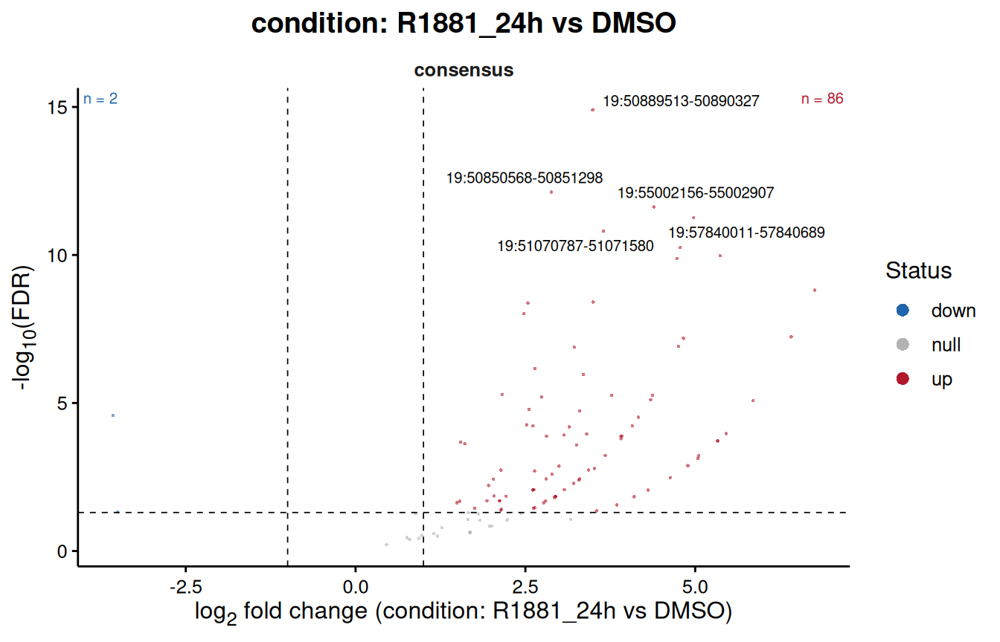

``` r

plotVolcano(results, contrast = "R1881_24h_vs_R1881_4h", labelTop = 5)
```

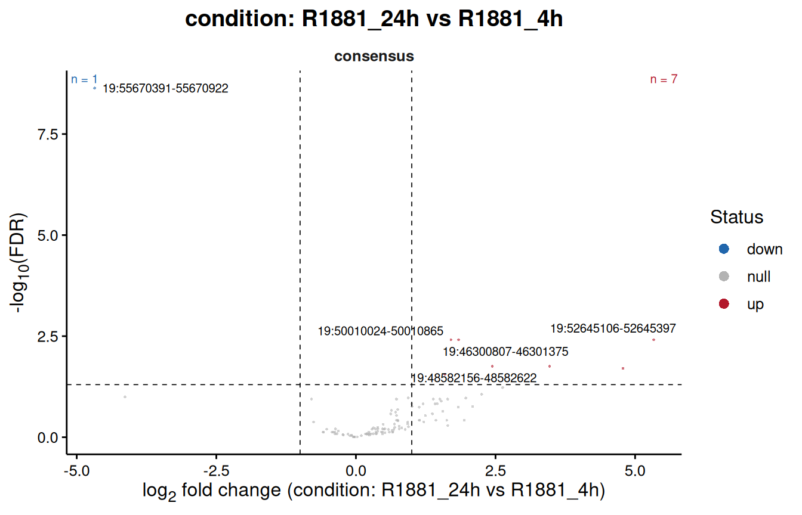

The MA plot puts the fold change against the average abundance, which
the volcano hides. It is the place to look for a trend: a cloud leaning
up or down with abundance means the normalisation left an
intensity-dependent bias behind, and a result sitting on such a trend
says more about the normalisation than about the biology.

``` r

plotResultsMA(results, contrast = "R1881_24h_vs_DMSO")
```

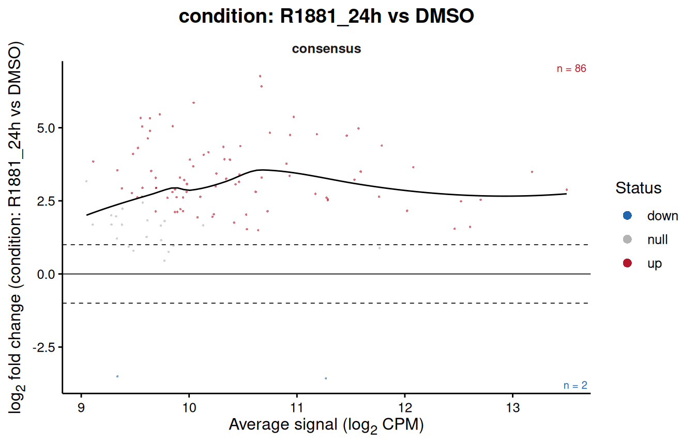

The same fold change cut-off appears here as two dashed horizontal
lines.

The whole cloud sits above zero, as it should after a ligand that
recruits its receptor genome-wide, and it does so at every abundance.
The same plot after TMM would have been centred on zero by construction.

``` r

plotTopHeatmap(results, contrast = "R1881_24h_vs_DMSO", n = 30, annotationColumns = "condition")
```

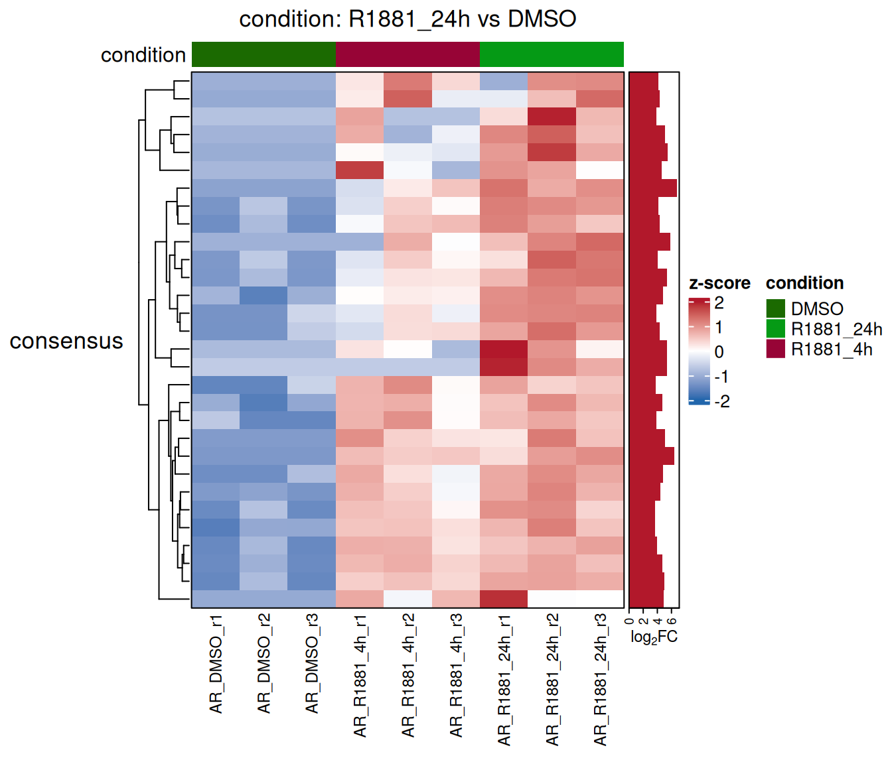

  

### Signal around the regions

A fold change is a single number per region.
[`plotProfile()`](https://sebastian-gregoricchio.github.io/RegionSetDE/reference/plotProfile.md)
shows the reads behind it, in bins around the centre of every region
that changed, as `dba.plotProfile()` does in *DiffBind*: one heatmap per
condition, the regions going up and those going down as two groups of
rows, and their mean profile on top.

``` r

plotProfile(results,
            contrast = "R1881_24h_vs_DMSO",
            groupBy = "condition")
```

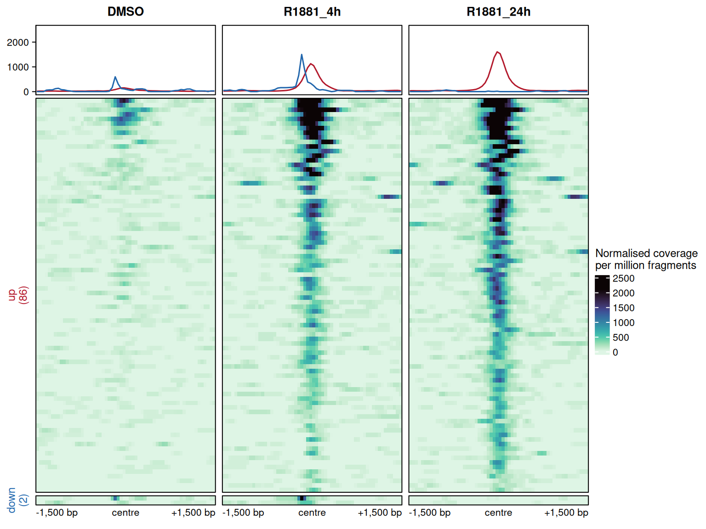

The signal comes from the BAM files the counts were made from, with the
same filters, and is scaled by the factors of the normalisation above,
so the panels compare the way the normalised counts do. The rows are
sorted by their mean signal and keep the same order in every panel, and
the colour scale is shared, so a row read from left to right is one
region gaining or losing receptor. Here the 82 regions going up are
nearly empty in DMSO and already bound after four hours, with the pile
centred on the region; the single region going down is the one site AR
leaves.

What the plot guards against is a change spread over the whole window
rather than centred on the site, which points to background rather than
binding, and a pile sitting away from the centre, which says the regions
were not aligned on the signal. The centre here is the midpoint of each
consensus region; counted with `summits`, [below](#summits), the regions
carry their summit and the profiles are aligned on it.

[`plotProfile()`](https://sebastian-gregoricchio.github.io/RegionSetDE/reference/plotProfile.md)
does two things in one call: it reads the signal through
[`computeProfiles()`](https://sebastian-gregoricchio.github.io/RegionSetDE/reference/computeProfiles.md),
and draws it. Reading is the slow part, since every BAM file is opened
again, so when the same profiles are drawn more than once, or used for
something else, it pays to compute them once and hand the result to
[`plotProfile()`](https://sebastian-gregoricchio.github.io/RegionSetDE/reference/plotProfile.md):

``` r
profileData <- computeProfiles(results,
                               contrast = "R1881_24h_vs_DMSO",
                               groupBy = "condition")

names(profileData$profiles)
> [1] "DMSO"      "R1881_4h"  "R1881_24h"
dim(profileData$profiles$DMSO)
> [1] 88 60
```

`profiles` holds one matrix per condition, or per sample without
`groupBy`, with one row per region and one column per bin; `regions`
holds the window drawn for every row and the group it belongs to, and
`bins` the distance of every bin from the centre. The arguments choosing
the regions, the samples and the window all belong to
[`computeProfiles()`](https://sebastian-gregoricchio.github.io/RegionSetDE/reference/computeProfiles.md),
and
[`plotProfile()`](https://sebastian-gregoricchio.github.io/RegionSetDE/reference/plotProfile.md)
passes them on when it is given an object rather than the profiles.
`style = "lines"` draws the mean profiles alone, with their standard
error:

``` r

plotProfile(profileData, style = "lines")
```

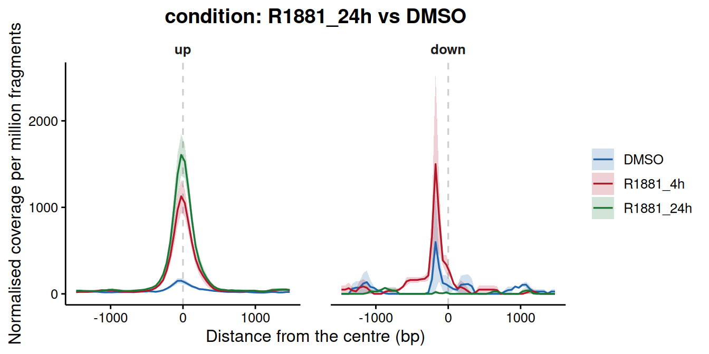

The regions need not come from the test. `regions` takes any `GRanges`,
a named list of them, one group of rows each, or a region set, and the
object only supplies the reads and the normalisation. The consensus
split by occupancy, for instance, the sites already bound without ligand
against those found only after it:

``` r

consensusRanges <- regionRanges(consensus)$consensus

plotProfile(counts,
            regions = list(boundInDMSO = consensusRanges[consensusRanges$peak.DMSO],
                           newWithR1881 = consensusRanges[!consensusRanges$peak.DMSO]),
            groupBy = "condition",
            style = "lines")
```

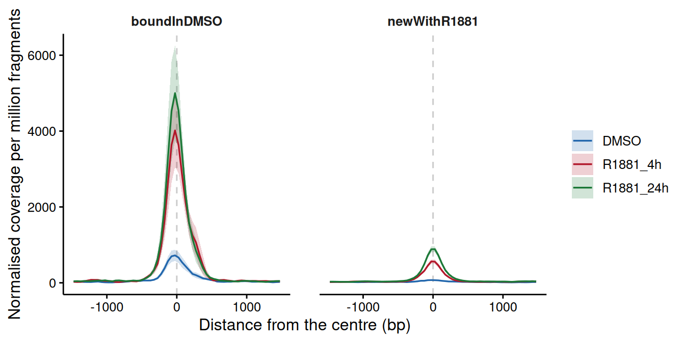

`blacklist` leaves out the rows whose drawn window touches the list,
`TRUE` taking the blacklist stored in the object, since a clean region
can sit next to an artefact that the window then shows; `whitelist`
keeps the regions overlapping a list, promoters for instance; `samples`
draws some of the libraries only.

A bigWig file per sample can take the place of the BAM files, through a
`bigwig` column of the sample sheet or `signalFiles`; its signal is then
drawn as it is, so it has to be normalised already.

  

### Occupancy and the test, read together

The point of keeping the peak calls around is to ask whether the two
agree.
[`peakOccupancyTable()`](https://sebastian-gregoricchio.github.io/RegionSetDE/reference/peakOccupancyTable.md)
cross-tabulates the result of the test against which groups called a
peak.

``` r
peakOccupancyTable(results, contrast = "R1881_24h_vs_DMSO")
>        occupancy n.regions down null up percent.changed
> 1         shared        11    0    1 10            90.9
> 2 R1881_24h only        90    0   17 73            81.1
> 3      DMSO only         1    1    0  0           100.0
> 4           none         7    1    3  3            57.1
```

``` r

plotPeakOccupancy(results, contrast = "R1881_24h_vs_DMSO")
```

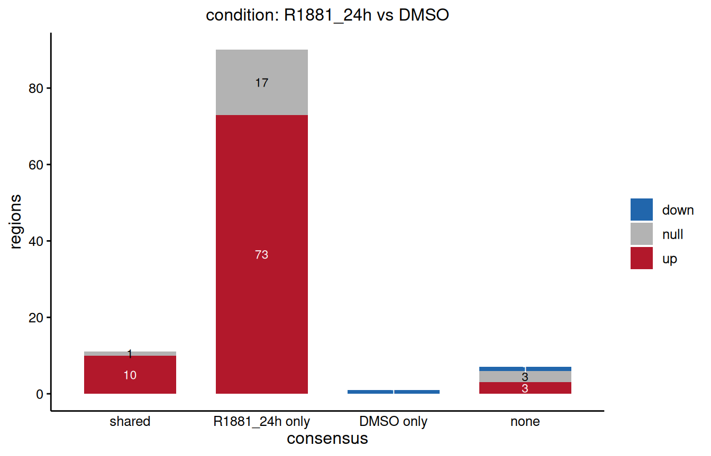

Three kinds of region show up here. Those called in both groups and
still changing are sites that were already bound and got more receptor.
Those called only after treatment and significant are new sites, the
ones the experiment is about. Those called in one group but not changing
are the interesting residue: either the caller was near its threshold in
the other group, or the difference is real but below the power available
in the window. Peak calling is a threshold on a continuum, and a region
that fails it is not a region with no signal.

The reverse case deserves its own look. A region called in both
conditions and significantly different is invisible to any analysis that
works from the peak lists alone, which is the argument for counting
rather than intersecting.

  

### Writing the results out

``` r

exportResults(results,
              path = "results",
              onlyChanging = TRUE,
              splitByDirection = TRUE)
```

One table and one BED file per contrast, the BED coloured by direction
so it can be dropped into a genome browser as it is, and a record of
every parameter the analysis ran with.

  

------------------------------------------------------------------------

## **Whole regions, tiles or summits**

The analysis above counts every consensus region whole. That is the
classic choice and the right one for this dataset, but it is not the
only way to turn a set of peaks into rows of a count matrix, and the
other two are worth knowing about.

  

### Whole regions

One row per region, one number per sample. The test asks whether the
region as a whole gained or lost signal. This suits transcription
factors and ATAC-seq, whose peaks are a few hundred base pairs wide and
change as a block, and *DiffBind* did it this way before version 3.0.
Its weak point is the width of the regions: a consensus merges
overlapping peaks, so the regions come out uneven, from 242 bp to 1.3 kb
in this dataset, and a wide region collects more background around the
same site than a narrow one.

  

### Tiles

`tileWidth` cuts every region into tiles of that width, and each tile
becomes a row of its own. The code of this part is shown, not run.

``` r

tiledCounts <- countReads(consensus,
                          sampleSheet = sampleSheet,
                          tileWidth = 200)
```

From there the steps are the usual ones, background, normalisation and
fit, and
[`testRegions()`](https://sebastian-gregoricchio.github.io/RegionSetDE/reference/testRegions.md)
recognises the tiled object. Every tile is tested on its own and the
p-values are then combined back into one per region, so the results keep
one row per region and the region stays the unit of inference.

``` r

tiledCounts <- countBackground(tiledCounts, binSize = 10000)
tiledCounts <- normalizeCounts(tiledCounts, method = "background")

tiledFit <- fitRegions(tiledCounts, design = ~ condition, engine = "edgeR")

tiledResults <- testRegions(tiledFit,
                            contrast = c("condition", "R1881_24h", "DMSO"),
                            combineMethod = "simes")

resultsTable(tiledResults)     # one row per region
tileTable(tiledResults)        # one row per tile
```

Tiles are worth it when the shape of a region matters and not only its
total:

- **Broad domains.** H3K27me3, H3K36me3 or H3K9me3 cover tens of
  kilobases, and a change can be confined to one end. Counted whole, a
  domain that gains signal on one flank and loses it on the other can
  come out flat.
- **Partial changes.** A super-enhancer where one constituent gains
  binding, or a promoter where the signal moves downstream into the gene
  body.
- **Regions of very different width.** Tiles give every row the same
  width, so a 20 kb domain and a 500 bp peak are tested on the same
  scale.

How the tiles of a region are put together is a choice about the
question. `combineMethod = "simes"`, the default, asks whether any part
of the region changed, and one strong tile is enough. `"holm-min"` asks
several tiles to change together, three or 40 % of the region, whichever
is more, which suits broad domains where a single tile moving on its own
is more often noise than biology. The results table then reports
`n.tiles`, and `n.tiles.up` and `n.tiles.down`, the tiles changing
significantly in each direction within the region. The `log2FC` of a
tiled region is the one of the tile carrying the p-value, not an
average, since that is the quantity the p-value is about.
`mean.tile.log2FC` gives the average over the tiles of the region,
weighted by their width, for when the region as a whole is what is being
described.

For a transcription factor like AR, tiles add rows without adding
information: a peak of 400 bp cut into 200 bp tiles gives two tiles that
nearly always move together, and a test with more rows and the same
answer.

  

### Recentring on the summits

The other answer to uneven widths goes the opposite way: instead of
cutting the regions, rebuild them at a fixed width around the summit of
the signal. This is what *DiffBind* has done by default since version
3.0, with windows of 401 bp, and `summits` in
[`countReads()`](https://sebastian-gregoricchio.github.io/RegionSetDE/reference/countReads.md)
does the same: every region becomes a window of `2 * summits + 1` bp
centred on its summit.

``` r
summitCounts <- countReads(consensus,
                           sampleSheet = sampleSheet,
                           summits = 200,
                           verbose = FALSE)

head(SummarizedExperiment::rowRanges(summitCounts)[, c("region.id", "summit")], 3)
> GRanges object with 3 ranges and 2 metadata columns:
>                                  seqnames            ranges strand |
>                                     <Rle>         <IRanges>  <Rle> |
>   consensus|19:46089709-46090037       19 46089703-46090103      * |
>   consensus|19:46182368-46182658       19 46182400-46182800      * |
>   consensus|19:46300807-46301375       19 46300862-46301262      * |
>                                             region.id    summit
>                                           <character> <integer>
>   consensus|19:46089709-46090037 19:46089709-46090037  46089903
>   consensus|19:46182368-46182658 19:46182368-46182658  46182600
>   consensus|19:46300807-46301375 19:46300807-46301375  46301062
>   -------
>   seqinfo: 1 sequence from an unspecified genome; no seqlengths

table(BiocGenerics::width(SummarizedExperiment::rowRanges(summitCounts)))
> 
> 401 
> 109
```

The summit is found in the reads, as *DiffBind* finds it: the highest
point of the fragment pileup of each sample, averaged over the samples
with weights proportional to the height of their pileup over their
depth, so that the samples carrying the signal decide where it sits. A
region with no fragment keeps its midpoint. `region.id` still holds the
coordinates of the consensus region each window came from, and `summit`
where it was centred. The inputs are counted over the same windows.

`summitSource = "peaks"` takes the summits the peak caller wrote in the
tenth column of the narrowPeak files instead, averaged over the peaks
overlapping the region with weights proportional to their significance.
It needs no BAM file, and on this dataset the two place the summits a
median of 26 bp apart. `summits = 0` locates the summits and leaves the
regions alone, which keeps the counts of whole regions while letting
[`plotProfile()`](https://sebastian-gregoricchio.github.io/RegionSetDE/reference/plotProfile.md)
align them on the signal.

That puts every site on the same footing and centres the count on where
the protein sits, which is what a transcription factor or ATAC-seq
analysis usually wants. Widths between 200 and 500 bp suit most factors.
It is wrong for broad marks, whose summit is an arbitrary point in a
domain: collapsing the domain to a point throws away the thing being
measured, and tiles are the tool there.

On this dataset the summits sit a median of 32 bp from the midpoints of
the consensus regions, and 236 bp at most, and none of the windows
overlap. The test comes out the same as on whole regions, 82 regions up
and one down against DMSO, which is what one expects from a factor whose
peaks are narrow and centred already; on a consensus of wide merged
regions the two can differ more.

`consensusRegions` offers a recentring of its own, `recentre = TRUE`,
which
[`loadConsensusPeaks()`](https://sebastian-gregoricchio.github.io/RegionSetDE/reference/loadConsensusPeaks.md)
passes through. It works inside each group, on the summit of the most
significant peak of every consensus region, before the groups are
pooled; when the summits of two groups sit a few base pairs apart their
windows overlap and are merged back, so the pooled regions are close to
the width asked for rather than equal to it, and the package says so
with a warning. `summits` in
[`countReads()`](https://sebastian-gregoricchio.github.io/RegionSetDE/reference/countReads.md)
works on the pooled regions and gives them all the same width.

  

------------------------------------------------------------------------

## **Where to go next**

The consensus built here is an ordinary region set, so everything in the
main vignette applies to it unchanged.
[`loadConsensusPeaks()`](https://sebastian-gregoricchio.github.io/RegionSetDE/reference/loadConsensusPeaks.md)
takes a `regionSets` argument that splits the consensus by overlap with
an annotation, so the peaks can be divided into promoters, enhancers and
the rest at the moment they are loaded. The set then becomes the unit of
the test through
[`testRegionSets()`](https://sebastian-gregoricchio.github.io/RegionSetDE/reference/testRegionSets.md),
which asks whether a whole class of elements moved instead of counting
how many of its members passed a threshold.

  

------------------------------------------------------------------------

## **Session info**

``` r
sessionInfo()
> R version 4.6.1 (2026-06-24)
> Platform: x86_64-pc-linux-gnu
> Running under: Ubuntu 24.04.5 LTS
> 
> Matrix products: default
> BLAS:   /usr/lib/x86_64-linux-gnu/openblas-pthread/libblas.so.3 
> LAPACK: /usr/lib/x86_64-linux-gnu/openblas-pthread/libopenblasp-r0.3.26.so;  LAPACK version 3.12.0
> 
> locale:
>  [1] LC_CTYPE=en_US.UTF-8       LC_NUMERIC=C              
>  [3] LC_TIME=en_US.UTF-8        LC_COLLATE=en_US.UTF-8    
>  [5] LC_MONETARY=en_US.UTF-8    LC_MESSAGES=en_US.UTF-8   
>  [7] LC_PAPER=en_US.UTF-8       LC_NAME=C                 
>  [9] LC_ADDRESS=C               LC_TELEPHONE=C            
> [11] LC_MEASUREMENT=en_US.UTF-8 LC_IDENTIFICATION=C       
> 
> time zone: Europe/Amsterdam
> tzcode source: system (glibc)
> 
> attached base packages:
> [1] stats4    stats     graphics  grDevices utils     datasets  methods  
> [8] base     
> 
> other attached packages:
>  [1] ggplot2_4.0.3        dplyr_1.2.1          RegionSetDE_0.99.0  
>  [4] GenomicRanges_1.64.0 Seqinfo_1.2.0        IRanges_2.46.0      
>  [7] S4Vectors_0.50.3     BiocGenerics_0.58.1  generics_0.1.4      
> [10] BiocStyle_2.40.0    
> 
> loaded via a namespace (and not attached):
>   [1] RColorBrewer_1.1-3          rstudioapi_0.19.0          
>   [3] jsonlite_2.0.0              shape_1.4.6.1              
>   [5] magrittr_2.0.5              magick_2.9.1               
>   [7] farver_2.1.2                rmarkdown_2.32             
>   [9] GlobalOptions_0.1.4         fs_2.1.0                   
>  [11] BiocIO_1.22.0               ragg_1.5.2                 
>  [13] vctrs_0.7.3                 Cairo_1.7-0                
>  [15] Rsamtools_2.28.0            RCurl_1.98-1.20            
>  [17] htmltools_0.5.9             S4Arrays_1.12.1            
>  [19] curl_8.0.0                  SparseArray_1.12.3         
>  [21] sass_0.4.10                 consensusRegions_0.99.0    
>  [23] bslib_0.12.0                htmlwidgets_1.6.4          
>  [25] desc_1.4.3                  cachem_1.1.0               
>  [27] GenomicAlignments_1.48.0    commonmark_2.0.0           
>  [29] lifecycle_1.0.5             iterators_1.0.14           
>  [31] pkgconfig_2.0.3             Matrix_1.7-6               
>  [33] R6_2.6.1                    fastmap_1.2.0              
>  [35] MatrixGenerics_1.24.0       clue_0.3-68                
>  [37] digest_0.6.39               colorspace_2.1-3           
>  [39] textshaping_1.0.5           labeling_0.4.3             
>  [41] httr_1.4.9                  abind_1.4-8                
>  [43] mgcv_1.9-4                  compiler_4.6.1             
>  [45] withr_3.0.3                 doParallel_1.0.17          
>  [47] csaw_1.46.0                 S7_0.2.2                   
>  [49] BiocParallel_1.46.0         DelayedArray_0.38.2        
>  [51] rjson_0.2.23                tools_4.6.1                
>  [53] otel_0.2.0                  glue_1.8.1                 
>  [55] restfulr_0.0.17             nlme_3.1-171               
>  [57] gridtext_0.1.6              grid_4.6.1                 
>  [59] cluster_2.1.8.3             gtable_0.3.6               
>  [61] tidyr_1.3.2                 metapod_1.20.0             
>  [63] xml2_1.6.0                  XVector_0.52.0             
>  [65] ggrepel_0.9.8               foreach_1.5.2              
>  [67] pillar_1.11.1               markdown_2.0               
>  [69] stringr_1.6.0               limma_3.68.5               
>  [71] circlize_0.4.18             splines_4.6.1              
>  [73] ggtext_0.2.0                lattice_0.23-1             
>  [75] rtracklayer_1.72.0          tidyselect_1.2.1           
>  [77] ComplexHeatmap_2.28.0       locfit_1.5-9.12            
>  [79] Biostrings_2.80.2           knitr_1.52                 
>  [81] bookdown_0.48               litedown_0.11              
>  [83] edgeR_4.10.5                SummarizedExperiment_1.42.0
>  [85] xfun_0.61                   Biobase_2.72.0             
>  [87] statmod_1.5.2               matrixStats_1.5.0          
>  [89] stringi_1.8.9               UCSC.utils_1.8.0           
>  [91] yaml_2.3.12                 evaluate_1.0.5             
>  [93] codetools_0.2-20            cigarillo_1.2.1            
>  [95] tibble_3.3.1                BiocManager_1.30.27        
>  [97] cli_3.6.6                   systemfonts_1.3.2          
>  [99] jquerylib_0.1.4             dichromat_2.0-1            
> [101] Rcpp_1.1.2                  GenomeInfoDb_1.48.0        
> [103] png_0.1-9                   XML_3.99-0.25              
> [105] parallel_4.6.1              pkgdown_2.2.1              
> [107] bitops_1.1-0                viridisLite_0.4.3          
> [109] scales_1.4.0                purrr_1.2.2                
> [111] crayon_1.5.3                GetoptLong_1.1.1           
> [113] rlang_1.3.0
```
